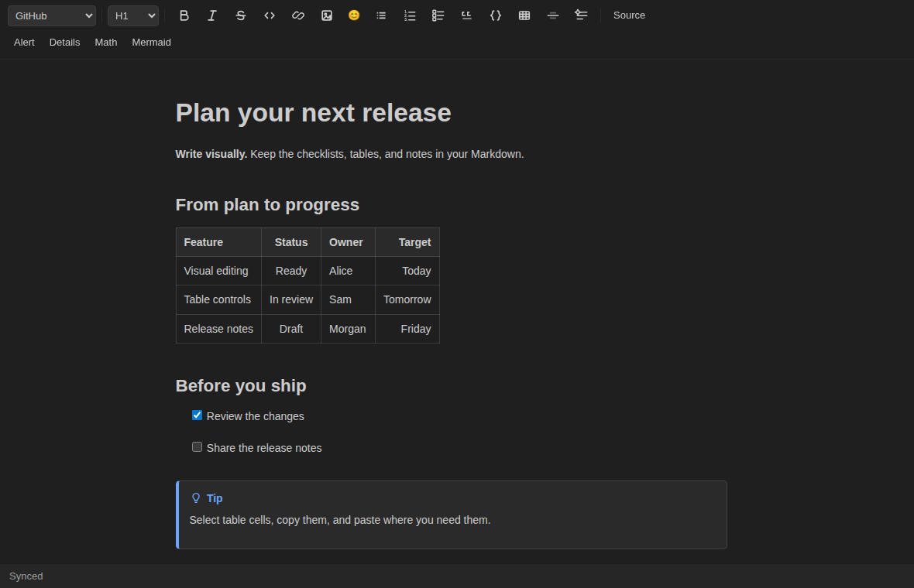
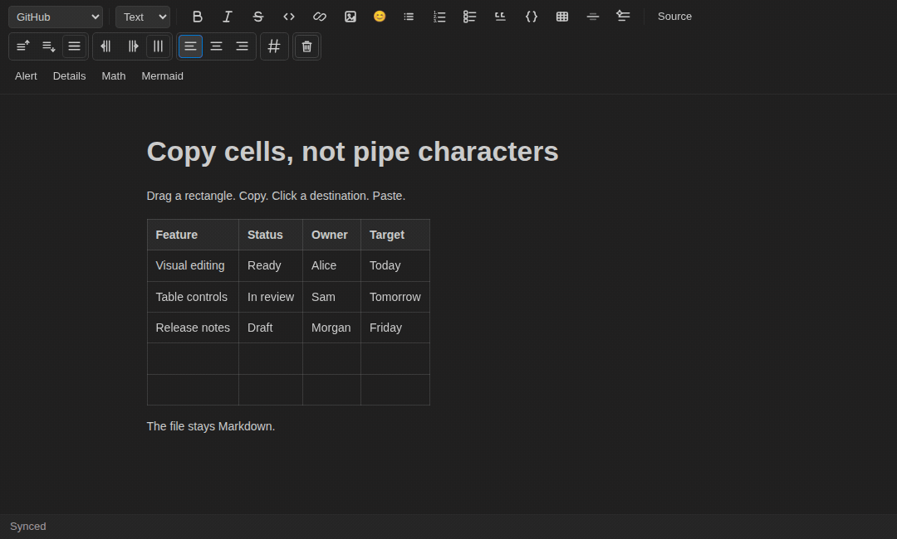
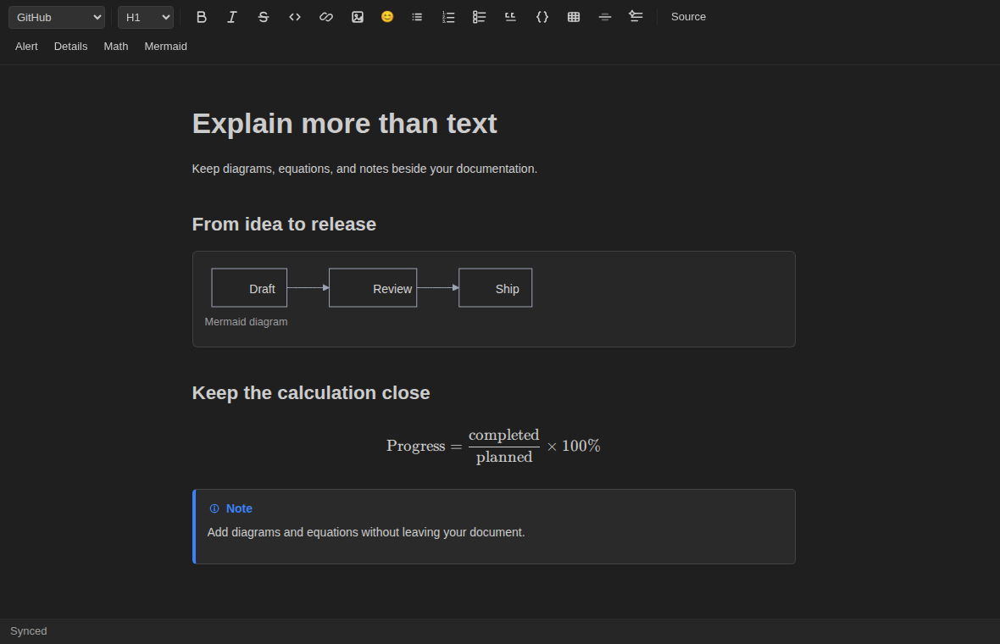

# Markdown Mint

**Write visually. Stay in Markdown.**

A visual Markdown editor for VS Code. Format with buttons, work directly with tables, and keep your document as a Markdown file.

## Copy cells, not pipe characters

Drag to select a rectangle of cells. Copy it, click a destination, and paste. Add or remove rows and columns, change alignment, or add a numbered column without editing table syntax.

**Mouse when it helps. Keyboard when it is faster.** Use Ctrl/Cmd+C and Ctrl/Cmd+V for cell ranges, Tab to move between cells, and Ctrl/Cmd+Z to undo.

## Keep diagrams and equations with your words

Insert Mermaid diagrams, math, alerts, and collapsible sections from the toolbar. Choose a GitHub or GitLab profile to get the relevant controls; GitLab also adds a table of contents, description lists, and inline diff markers.

## A writing surface, not another file format

**Format without the markup.** Select words to make them bold, italic, or strikethrough. Add headings, lists, links, and images from the toolbar.

**Your source is one click away.** Select **Source** to return to VS Code's normal text editor. Markdown Mint edits the same Markdown document, not a separate proprietary copy.

**Tidy the Markdown when you choose.** Use the **Format** button for on-demand formatting, or enable **Markdown Mint: Format On Save** in Settings. Automatic formatting is off by default.

## Start writing

1. Install **Markdown Mint** by **masa-ryu** from VS Code's Extensions view.
2. Open a Markdown file and click **Open in Markdown Mint** above its first line.
3. Start editing. Use **Source** whenever you need the raw Markdown.

You can also run **Markdown Mint: Open in Markdown Mint** from the Command Palette or use **Reopen Editor With → Markdown Mint** from the editor tab. Installing the extension does not replace your default Markdown editor.

Requires VS Code 1.90.0 or later. Supports `.md`, `.markdown`, and `.mdown` files in desktop VS Code. Extension ID: `masa-ryu.markdown-mint`.

<strong>Keyboard shortcuts</strong>

These shortcuts apply while the rich editor has focus.

| Action                              | Windows / Linux       | macOS               |
| ----------------------------------- | --------------------- | ------------------- |
| Bold                                | Ctrl+B                | Cmd+B               |
| Italic                              | Ctrl+I                | Cmd+I               |
| Strikethrough (GitHub / GitLab)       | Ctrl+Shift+X          | Cmd+Shift+X         |
| Save                                | Ctrl+S                | Cmd+S               |
| Undo / redo                         | Ctrl+Z / Ctrl+Shift+Z  | Cmd+Z / Cmd+Shift+Z  |
| Next / previous table cell          | Tab / Shift+Tab       | Tab / Shift+Tab     |
| Indent / outdent a list item         | Tab / Shift+Tab       | Tab / Shift+Tab     |
| Focus the selection formatting menu | Alt+F10               | Alt+F10             |

<strong>Profiles, previews, and compatibility</strong>

Choose **GitHub**, **GitLab**, or **CommonMark** in the profile dropdown. GitHub is the default. The profiles support selected platform syntax; they do not reproduce every GitHub or GitLab feature or promise identical pixels on those websites.

For a separate preview, run **Markdown Mint: Open Dedicated Preview**. Mint also adds rendering support and document styles to VS Code's built-in Markdown preview. Other preview extensions, custom styles, and pane widths can affect the result.

Some syntax, including raw HTML and front matter, needs **Source** editing. Remote and Web workspaces are not currently supported. Keep important documents under version control, especially when testing new syntax or formatting options.

## Feedback

Questions or a reproducible problem? Use the **Q & A** tab on the Markdown Mint Marketplace page. Include a small Markdown example, the selected profile, your extension and VS Code versions, and your operating system. Remove sensitive information before sharing.

MIT licensed.
