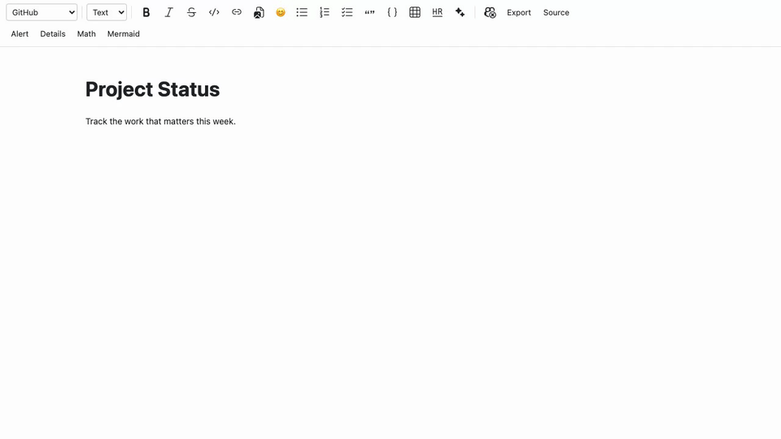
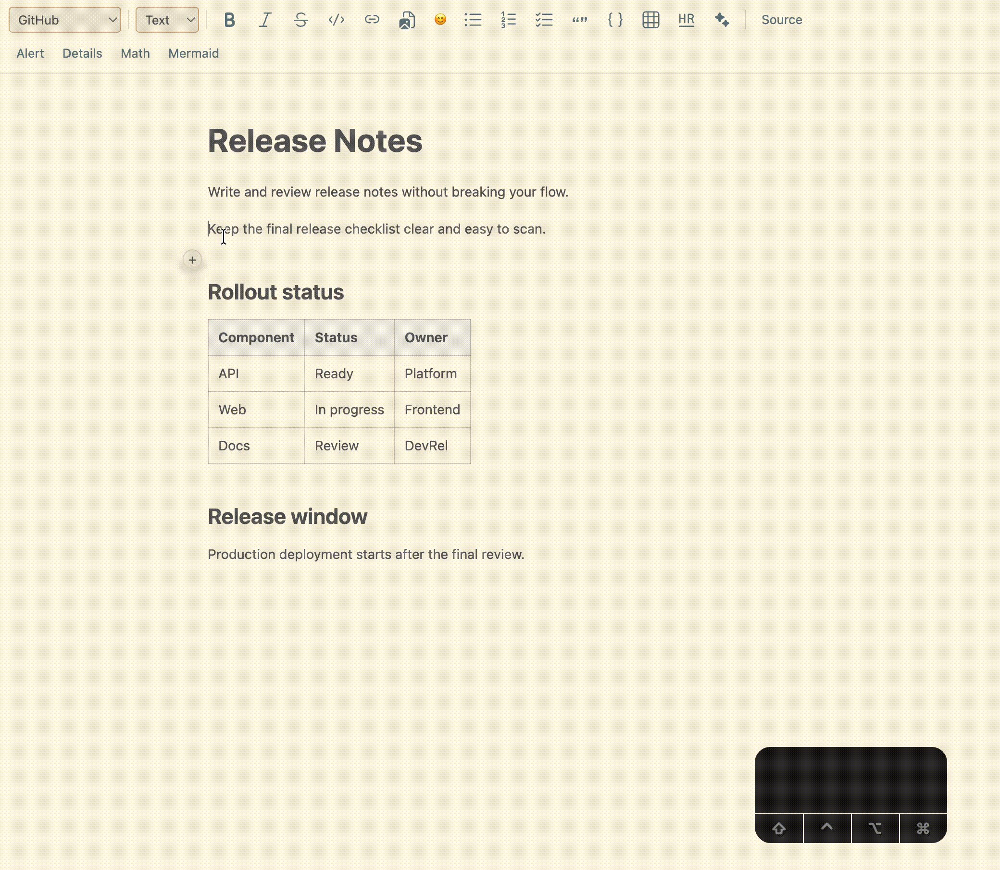
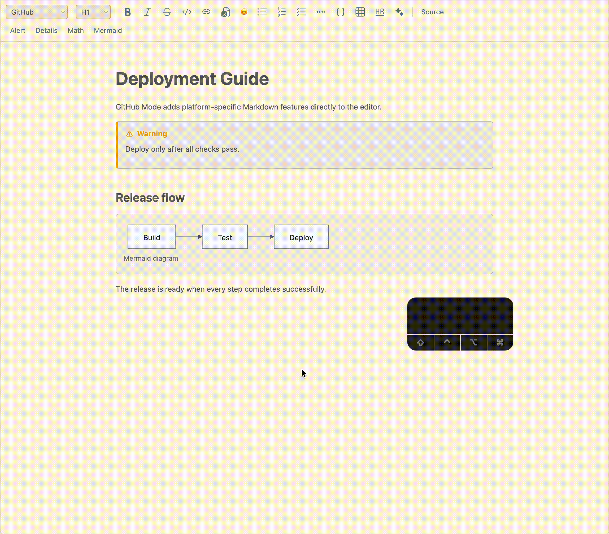
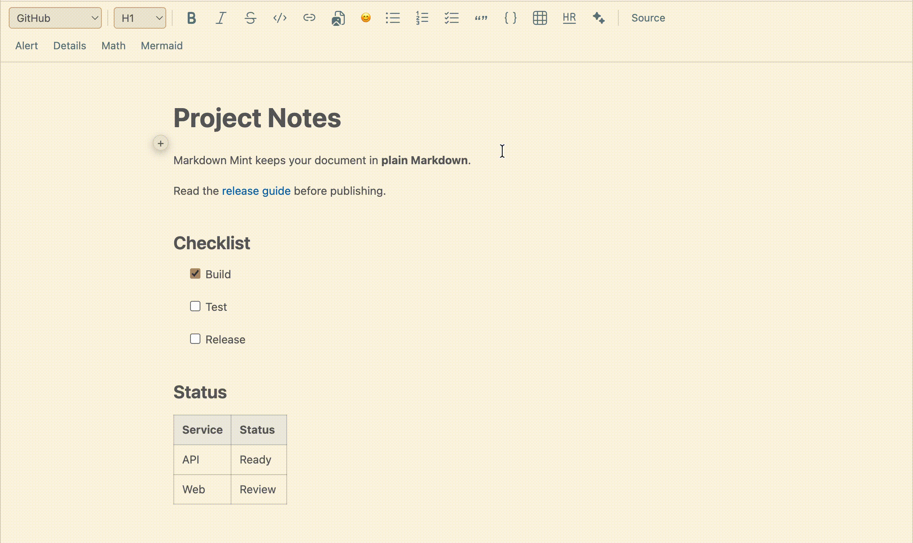
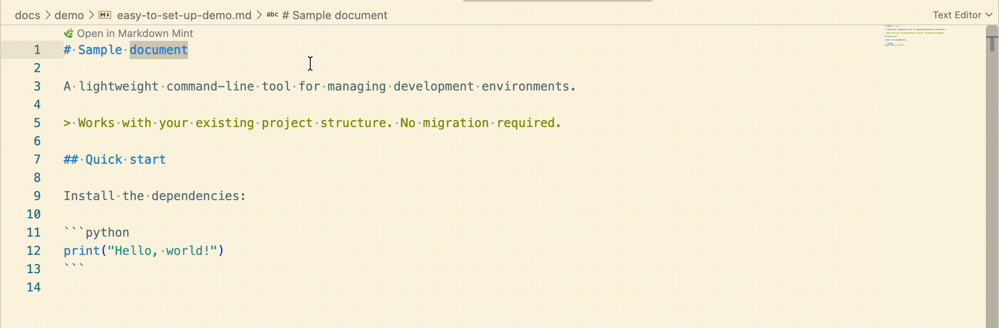

**English** | [简体中文](docs/i18n/README.zh-CN.md) | [繁體中文](docs/i18n/README.zh-TW.md) | [Español](docs/i18n/README.es.md) | [Français](docs/i18n/README.fr.md) | [Português (Brasil)](docs/i18n/README.pt-BR.md) | [Русский](docs/i18n/README.ru.md) | [Deutsch](docs/i18n/README.de.md) | [日本語](docs/i18n/README.ja.md) | [Türkçe](docs/i18n/README.tr.md) | [한국어](docs/i18n/README.ko.md) | [Italiano](docs/i18n/README.it.md) | [Polski](docs/i18n/README.pl.md) | [Čeština](docs/i18n/README.cs.md)

# Markdown Mint

## **Write visually. Stay in Markdown.**

A visual WYSIWYG Markdown editor for VS Code.

Edit text, tables, checklists, and technical documentation directly in a visual editor—then switch to the Markdown source whenever you need precise control.

No migration required. Just open the Markdown files you already have and start writing.

## Focus on writing

Markdown Mint is designed to keep formatting out of your way so you can focus on the content.

Use **slash commands** `/` to quickly insert blocks and elements without reaching for Markdown syntax\.

Select text to bring up a contextual toolbar with the formatting options you need, right where you need them.

Keyboard navigation is built in too. Use the **Tab key** to move through selectable elements and keep your hands on the keyboard.

Working with tables is just as simple. Copy and paste table content directly without manually editing Markdown syntax.

## Platform-specific Markdown support

Markdown Mint supports Markdown features provided by platforms such as GitHub and GitLab.

With **GitHub Mode**, you can use GitHub-specific features such as **Alerts** and **Mermaid diagrams** directly in the visual editor.

In GitHub and GitLab modes, choose from 13 Mermaid templates by their finished
diagram, then select **Next: Edit code** to edit the candidate beside a live
preview. A new diagram without selected code opens the template picker first;
**← Templates** returns from the code editor to the picker. Existing diagrams
and selected code open directly in the code editor. Replacing the current code
requires confirmation; only **Insert diagram** or **Update diagram** changes
your Markdown.

Pressing **Escape** follows the dialog's Cancel behavior: a clean draft closes,
while an edited draft asks before discarding it. During IME composition, Escape
cancels the composition first.

## More built-in features

Markdown Mint includes additional tools for working with real-world Markdown documents:

✅Add automatic numbering to tables\.

✅Copy cells from Excel or Google Sheets and paste them directly into a Markdown table\.

✅Drag and drop images from outside VS Code to insert them into your document\.

✅Quickly create image references, URLs, and internal links with automatic suggestions and search\.

✅Export Markdown as standalone HTML or A4 PDF from the current document\.

## Copilot prose suggestions

Markdown Mint uses GitHub's official `@github/copilot-language-server` 1.551.2
over `textDocument/inlineCompletion`; it does not select a chat model or send a
Mint-authored chat prompt. The fixed-version native server binary is bundled in
the platform VSIX, so Mint launches it directly instead of invoking `node`,
`npm`, or `npx` from `PATH`. The pinned server binary is MIT licensed; each
VSIX includes the matching upstream license text and third-party notice.

With a Markdown Mint Rich Editor active, run **Markdown Mint: Sign in to GitHub
Copilot** when setup is needed. The server supplies its device sign-in code and
opens the official GitHub flow after the user confirms. Then type normally to
see suggestions when `markdownMint.aiSuggestions.autoTrigger` is enabled, or
run **Markdown Mint: Suggest Continuation** for a manual request. There is no
model picker or default shortcut. The setting is user-scoped, initially
**false**, and has no toolbar toggle. Manual suggestions remain available when
automatic suggestions are off. If server status reports an authentication or
availability problem, the status item and manual command report it. When the
server can reuse its saved authorization after VS Code restarts, automatic
suggestions resume without a second setup command.

Suggestions can appear in the middle or at the end of ordinary prose,
headings, and list items, including a contextually empty paragraph. Links in a
paragraph do not exclude neighboring prose; link destinations, inline-code
contents, tables, code blocks, Mermaid, math, raw HTML editor regions, selected
text, Source, Preview, and modal fields are not completion targets. The
candidate is transient until **Tab** accepts it; **Esc** dismisses it. Mint
converts the server's replacement range to an insertion only when the original
prefix and suffix are both preserved. A displayed candidate does not change
Markdown, dirty/recovery state, clipboard, preview/export, or Undo history.

Mint sends the complete current unsaved Markdown document to the local
Language Server using its real file URI and version. Code, tables, and other
non-target regions in that same document are included in this synchronization.
The extension synchronizes only the active Rich Editor document and does not
scan or synchronize other documents, terminals, clipboard contents, or Git
changes itself. The Language Server receives the workspace folder and may use
its own repository context; Mint has not independently verified every source
the service may consult, the exact service-side content-exclusion behavior, or
all provider-side data processing. Organization policies and service-side
exclusions are not bypassed. Mint configures optional SDK telemetry off; this
does not mean that service operations involve no data processing. Suggestions
can consume **Copilot usage**. Mint does not log or persist document text or
completion contents.

The native server packages are prepared for macOS, Linux, and Windows on x64
and arm64. The current runtime gate enables AI only in a trusted, desktop,
macOS arm64 Extension Host; Remote, Web, and other unverified Extension Host
environments keep ordinary Markdown editing available without AI. Real Copilot acceptance and the no-Node/PATH, Japanese
installation-path, restart, and process-shutdown checks are still required
before claiming those behaviors verified.

## Markdown stays Markdown

Markdown Mint does not introduce a proprietary document format.

Your `.md` file remains the single source of truth.

Edit visually when it is convenient, then switch to **Source** whenever you want to inspect or edit the underlying Markdown directly.

Everything you create in the visual editor is still Markdown.

## Easy to set up

You can start using Markdown Mint with any existing Markdown file.

When a Markdown file is open in the standard VS Code editor, click the **Markdown Mint** button to open it in the visual editor.

If you prefer, you can also set Markdown Mint as the default editor for Markdown files so they automatically open in Mint.

