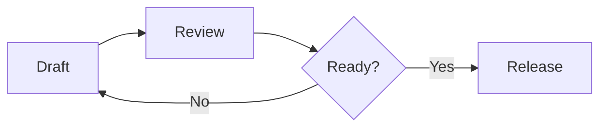

# 🌿Markdown Mint

**Write visually. Stay in Markdown.**

Markdown Mint is a visual Markdown editor for VS Code.

Write **bold text**, *emphasize an idea*, ~~remove what you no longer need~~, add `inline code`, create [links](https://example.com), and keep everything as ordinary Markdown.

> [!TIP]
> Markdown Mint lets you work with the document itself instead of constantly editing Markdown syntax.

## Write naturally

Create headings, lists, checklists, quotes, links, images, code blocks, and more from the same editing surface.

A release note can simply look like this:

- [x] Finish the feature
- [x] Review the documentation
- [ ] Publish the extension

And nested content stays readable:

1. Prepare the release
   - Check the Markdown
   - Review the preview
2. Publish
3. Celebrate 🎉

## Tables that behave like tables

Instead of carefully editing pipes and spaces, work directly with cells.

| Feature | Status | Owner |
| :--- | :---: | ---: |
| Visual editing | ✅ Ready | Alice |
| Table controls | 🚧 Review | Sam |
| GitHub profile | ✅ Ready | Morgan |

Select several cells with the mouse, copy them, click another cell, and paste the whole rectangular range.

Rows and columns can be added, removed, aligned, and edited without manually rebuilding the Markdown table.

## GitHub, GitLab, or CommonMark

Markdown Mint can adapt the editing experience to where the document will be used.

| Profile | Typical use |
| --- | --- |
| **GitHub** | GFM tables, task lists, Alerts, Mermaid, math |
| **GitLab** | GitLab Markdown plus TOC, description lists, and diff text |
| **CommonMark** | Portable Markdown with fewer platform-specific extensions |

The Markdown file remains the same kind of `.md` file you already use.

## Diagrams inside the document

Documentation does not have to stop at text.



A diagram can live beside the explanation instead of in another tool.

## Math stays readable too

Inline math such as $E = mc^2$ can stay inside a sentence.

Larger equations can stand on their own:

$$
\mathrm{Progress}
=
\frac{\mathrm{completed}}{\mathrm{planned}}
\times 100\%
$$


## Code belongs beside the explanation

```typescript
const document = {
  format: "Markdown",
  editor: "Markdown Mint",
  visual: true,
};
```

Choose the language and keep syntax-highlighted code together with the rest of the document.

## Keep advanced content out of the way

<details>
<summary><strong>More details</strong></summary>

Collapsible sections can keep long explanations available without making the main document noisy.

The same document can still contain **formatted text**, lists, code, and links.

</details>

## Markdown stays Markdown

Markdown Mint does not introduce a proprietary document format.

The visual editor works on the same Markdown document, and the raw source is always available when you need exact control.

> [!NOTE]
> Some platform-specific or advanced syntax may still require source editing.

That is the main idea:

**a richer editing experience without giving up Markdown.**