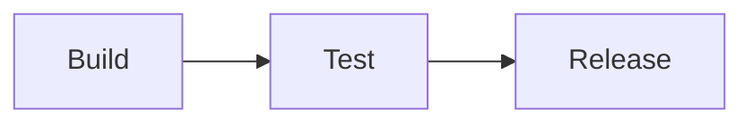

# Deployment Guide

GitHub Mode adds platform-specific Markdown features directly to the editor.

> [!IMPORTANT]
> Deploy after all checks pass.

## Release flow

The release is ready when every step completes successfully.
