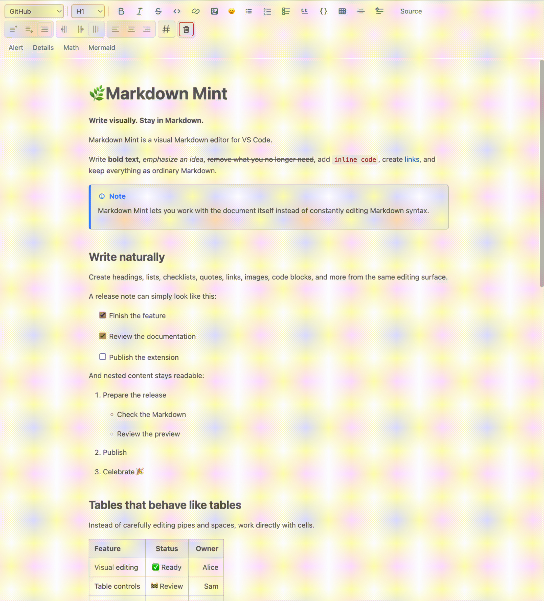
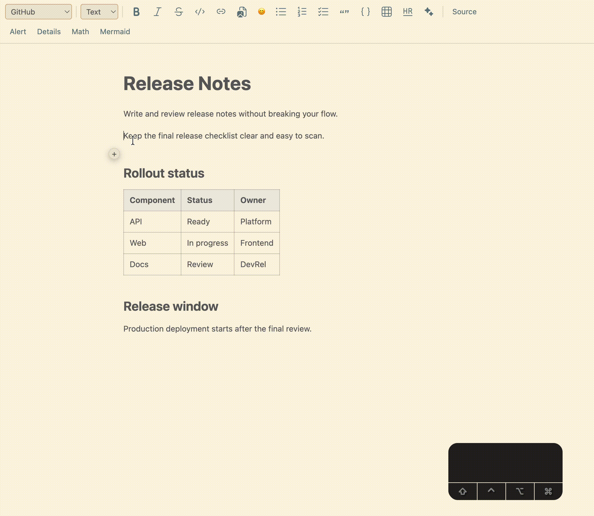
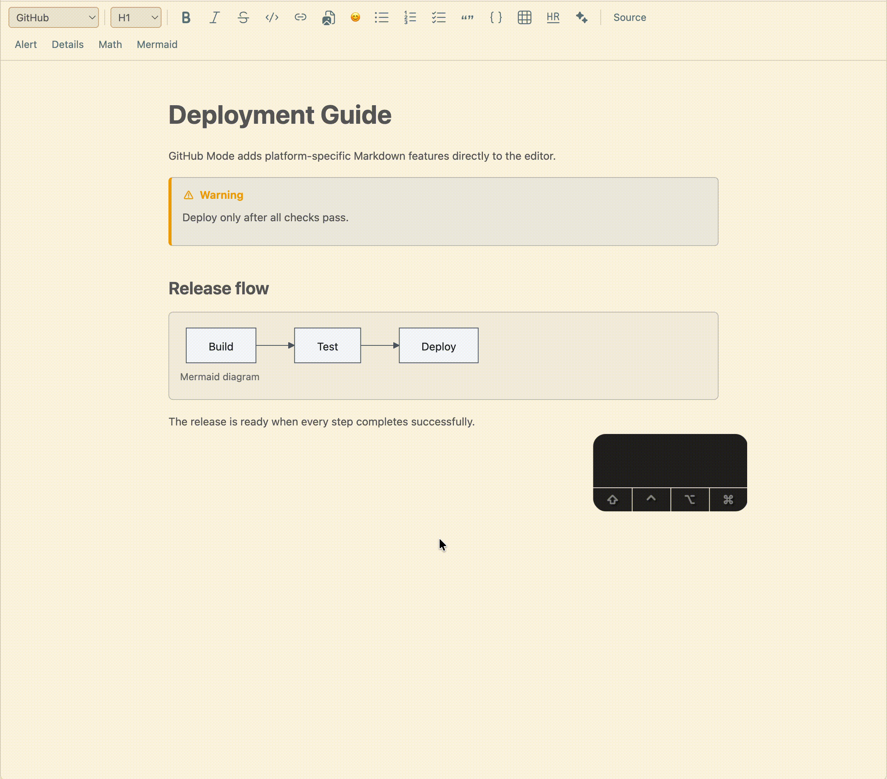
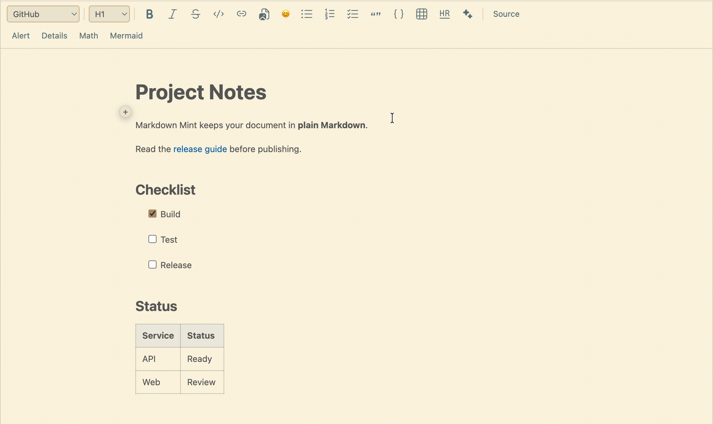
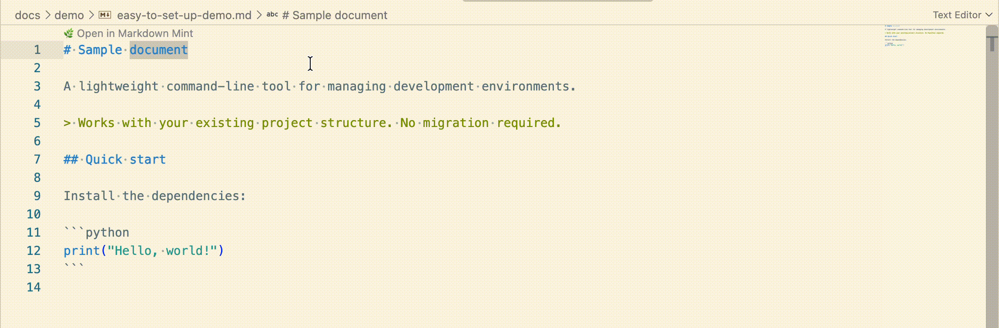

[English](../../README.md) | [简体中文](README.zh-CN.md) | [繁體中文](README.zh-TW.md) | [Español](README.es.md) | [Français](README.fr.md) | [Português (Brasil)](README.pt-BR.md) | [Русский](README.ru.md) | [Deutsch](README.de.md) | **日本語** | [Türkçe](README.tr.md) | [한국어](README.ko.md) | [Italiano](README.it.md) | [Polski](README.pl.md) | [Čeština](README.cs.md)

# Markdown Mint

## **見たまま書ける。Markdown のままで。**

VS Code 向けのビジュアル WYSIWYG Markdown エディターです。

文章、表、チェックリスト、技術文書をビジュアルエディターで直接編集できます。細かく調整したくなったら、いつでも Markdown ソースに切り替えられます。

移行は不要です。お使いの Markdown ファイルを開くだけで、すぐに書き始められます。

## 書くことに集中

Markdown Mint は、書式設定に気を取られず、内容に集中できるように設計されています。

**スラッシュコマンド** `/` を使えば、Markdown の構文を入力せずに、ブロックや要素をすばやく挿入できます。

文字を選択すると、その場で必要な書式設定を選べるコンテキストツールバーが表示されます。

キーボード操作にも対応しています。**Tab キー**で選択可能な要素を移動できるので、キーボードから手を離す必要がありません。

表の操作も簡単です。Markdown の構文を手作業で編集することなく、表の内容を直接コピー＆ペーストできます。

## プラットフォーム固有の Markdown に対応

Markdown Mint は、GitHub や GitLab などのプラットフォームが提供する Markdown 機能に対応しています。

**GitHub Mode**（GitHub モード）では、**Alerts**（アラート）や **Mermaid 図**など、GitHub 固有の機能をビジュアルエディターで直接利用できます。

## ほかにも便利な機能を搭載

Markdown Mint には、実際の Markdown 文書の編集に役立つツールも備わっています。

✅表に自動ナンバリングを追加できます。

✅Excel や Google Sheets のセルをコピーして、Markdown の表に直接貼り付けられます。

✅VS Code の外から画像をドラッグ＆ドロップして、文書に挿入できます。

✅自動候補表示と検索を使って、画像参照、URL、内部リンクをすばやく作成できます。

## Markdown は Markdown のまま

Markdown Mint は、独自の文書形式を導入しません。

`.md` ファイルが、引き続き唯一の正本です。

ビジュアル編集を使いながら、元の Markdown を直接確認・編集したくなったら、いつでも **Source** に切り替えられます。

ビジュアルエディターで作成したものは、すべて Markdown のままです。

## 簡単に使い始められる

既存の Markdown ファイルで、そのまま Markdown Mint を使い始められます。

VS Code の標準エディターで Markdown ファイルを開き、**Markdown Mint** ボタンをクリックすると、ビジュアルエディターで開けます。

Markdown Mint を Markdown ファイルの既定のエディターに設定して、ファイルを自動的に Mint で開くこともできます。

