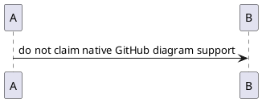

# GitHub Negative and Boundary Tests

この文書は**正しく特殊表示されないことも合格になる**入力です。正常例と混同しないでください。基準はGitHub.comのリポジトリ内Markdownです。

以下の期待値は [GFM仕様](https://github.github.com/gfm/) と [GitHubの後処理](https://github.com/github/markup) に基づきます。実画面との差を確認した場合は、確認日・環境を添えて記録してください。

## NEG-01 — ヘッダーと区切り行の列数が違う

期待: 表として認識しない。エディターが勝手に列を補って正常な表へ変換しない。

| A | B | C |
| --- | --- |
| X | Y | Z |

## NEG-02 — データ行の列数が違う

期待: GFMでは不足セルは空セルとなり、超過セルは表示上無視される。ただし、リッチ編集で未操作のソースにある`EXTRA-PRESERVE`を黙って消してよいという意味ではない。

| A | B |
| --- | --- |
| ONLY-A |
| A2 | B2 | EXTRA-PRESERVE |

## NEG-03 — コード内でもパイプをエスケープしなかった場合

期待: この例を「パイプを含む一セル」の正常例として扱わない。`RIGHT-PRESERVE`が表示上失われ得るため、正常例との差を検知する。

| A | B |
| --- | --- |
| `left|right` | RIGHT-PRESERVE |

## NEG-04 — 表を終了させる空行

期待: 空行より後の行は、元の表の続きではない。

| A | B |
| --- | --- |
| 1 | 2 |

| 3 | 4 |

## NEG-05 — ヘッダーのようでも表ではない

期待: 区切り行がないため、通常のテキストとして扱う。

| A | B |
| text | text |

## NEG-06 — タスクのような通常文字

期待: GFMの有効なチェックボックスを勝手に追加しない。単独のセル内マーカーはリスト項目ではない。

- [~] GitLab式であってGitHubの通常タスクマーカーではない
- [v] チェックの代替文字ではない
- [] 空白を省略した形

| Marker | Description |
| --- | --- |
| [x] | これはタスクリスト項目ではない |
| [ ] | これも通常のセル文字列 |

## NEG-07 — GitHubの5種類に含まれないAlert

期待: `[!DANGER]`を対応済みAlertとして保証しない。下は通常の引用として保持する対象。

> [!DANGER]
> 非対応タイプの本文。

## NEG-08 — 他の要素に入れ子にしたAlert

期待: ネストしたAlertを対応済みの正常例にしない。GitHub Docsは他の要素内へのネストを非対応としている。細かなフォールバック外観は実画面で記録する。

> 外側の引用。
>
> > [!NOTE]
> > 引用内に入れ子にしたAlert。

- リスト項目

  > [!WARNING]
  > リスト内に入れ子にしたAlert。

## NEG-09 — 他サービスや別方言の記法

期待: GitHubの独自機能として有効化しない。これらを変更・削除せずに往復させる。

[[_TOC_]]

[TOC]

Term
: Description

{-removed-}{+added+}

{width=50%}



```blockdiag
blockdiag { A -> B; }
```

## NEG-10 — 終了したタスク管理ブロックとの混同

期待: 現在の通常の `- [ ]` と、廃止されたtasklist blocksを混同しない。このフェンスを現行GitHubのタスク管理UIになると約束しない。

```tasklist
- [ ] fixture task
```

## NEG-11 — インラインCSS・class・id

期待: GitHubで任意のstyle/class/idがそのまま有効になると仮定しない。文字内容は保持する。ローカルプレビューがこれらの装飾を無条件に採用すると、GitHubとの見た目がずれる可能性がある。

<span style="font-size: 72px; color: red" class="fixture-only-class" id="fixture-only-id">STYLE-SANITIZATION-CONTENT</span>

## NEG-12 — 無害なscriptタグのサニタイズ試料

期待: 実行可能なscriptとしてDOMに残さない。スクリプトにはコメントしかなく、通信・データ取得・ファイル変更を行う内容はない。これは網羅的なXSS検査ではない。

<script>/* inert fixture: intentionally contains no executable statements */</script>

SCRIPT-AFTER-SENTINEL

## NEG-13 — 未定義の参照

期待: 存在しないリンク先や脚注を捏造しない。ソースを保持する。未解決参照の最終外観はGitHubと比較する。

[undefined-reference]

[visible label][undefined-target]

未定義の脚注[^undefined-footnote]。

## NEG-14 — フェンスを閉じない例は別ファイル

`edge-cases/unclosed-fence.md` に隔離している。未閉鎖フェンスはMarkdownの仕様上EOFまでコードとして扱えるため、「構文エラーになるはず」とは判定しない。

**END-OF-NEGATIVE-FIXTURE**
