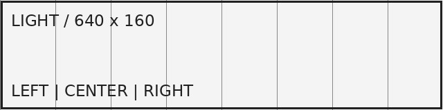
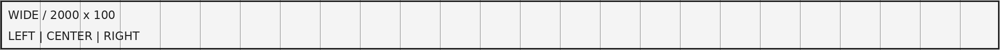
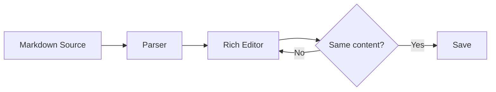
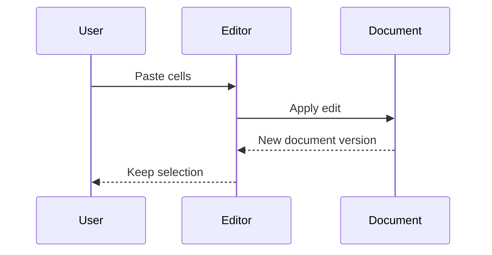
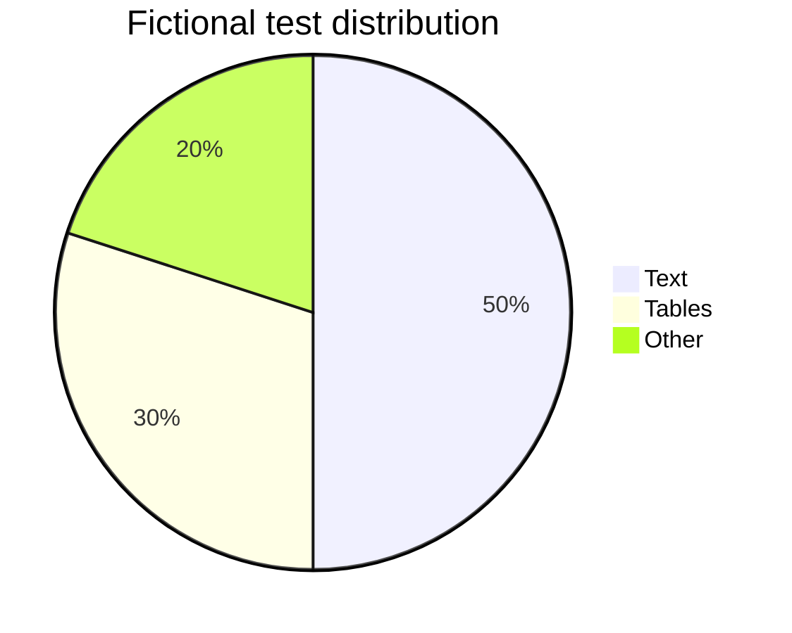

# GitHub Markdown Compatibility Test

確認日: 2026-09-11。対象は **GitHub.comのリポジトリ内にあるMarkdownファイルの表示**です。GitHub Pages、Wiki、Issue・PR・Discussionは同じ表示条件とは扱いません。

この文書は公式仕様に基づくテスト入力であり、GitHub実画面での全項目合格を記録したものではありません。判定条件と未確認範囲は [README](./README.md) にあります。

画像・相対リンクを試す場合は `assets/` も同じ場所に置いてください。すべての通常画像は同梱済みです。地図の背景取得など、GitHub側の外部機能は別途オンライン環境を要します。

通常表示用の例と、意図的に壊した例は分離しています。異常系は [github-negative-test.md](./github-negative-test.md)、会話欄向けは [github-context-test.md](./github-context-test.md) を使用します。

手動ナビゲーション: [文字装飾](#case-gh-text-01) / [長い表](#case-gh-table-06) / [横長の表](#case-gh-table-07) / [セル選択](#case-gh-table-08) / [数式](#case-gh-math-01) / [独自アンカー](#fixture-custom-anchor)

<a name="case-gh-text-01"></a>

## GH-TEXT-01 — 文字装飾

期待結果: 装飾の開始・終了位置を保持する。単一チルダは現行GitHub Docs掲載の打ち消し線も確認する。kbdの細かな外観はGitHubとの比較観察対象。

根拠: [Basic writing and formatting syntax](https://docs.github.com/en/get-started/writing-on-github/getting-started-with-writing-and-formatting-on-github/basic-writing-and-formatting-syntax) / [GitHub Flavored Markdown Spec](https://github.github.com/gfm/)

通常の文章に **太字**、__別記法の太字__、*斜体*、_別記法の斜体_、***太字と斜体*** を混在させます。

~~二重チルダの打ち消し線~~ と ~単一チルダの打ち消し線~。

**太字の中に _斜体_ と `inline code` と [明示リンク](https://example.com/)**。

~~取り消し線の中の **太字** と *斜体*~~。

H<sub>2</sub>O、x<sup>2</sup>、<ins>下線の付いた文章</ins>。

日本語**太字**日本語。ASCIIの単語内アンダースコア: file_name_with_underscores。

<kbd>Ctrl</kbd> + <kbd>C</kbd> と <kbd>Cmd</kbd> + <kbd>V</kbd>。

---

<a name="case-gh-head-01"></a>

## GH-HEAD-01 — 見出しと重複アンカー

期待結果: H1〜H6、Setext見出し、重複見出しと独自アンカーを区別する。GitHubのOutlineはサイトUIであり本文への自動TOC挿入とは別。

根拠: [Basic writing and formatting syntax](https://docs.github.com/en/get-started/writing-on-github/getting-started-with-writing-and-formatting-on-github/basic-writing-and-formatting-syntax) / [GitHub Flavored Markdown Spec](https://github.github.com/gfm/)

# Heading Level One

## Heading Level Two

### Heading Level Three

#### Heading Level Four

##### Heading Level Five

###### Heading Level Six

Setext Level One
===============

Setext Level Two
---------------

### Duplicate Heading

一つ目。自動アンカーは `duplicate-heading`。

### Duplicate Heading

二つ目。自動アンカーは `duplicate-heading-1`。

### 日本語の見出し

日本語の見出しにも移動できることを確認します。

[一つ目へ](#duplicate-heading) / [二つ目へ](#duplicate-heading-1) / [日本語へ](#日本語の見出し)

<a name="fixture-custom-anchor"></a>

見出しではない独自アンカーの到達点です。

---

<a name="case-gh-break-01"></a>

## GH-BREAK-01 — 改行と水平線

期待結果: .mdでは通常のソース改行は強制改行ではない。行末二スペース・バックスラッシュ・brは改行として扱う。末尾空白を整形で消す場合は同じ意味を保つ代替記法が必要。

根拠: [Basic writing and formatting syntax](https://docs.github.com/en/get-started/writing-on-github/getting-started-with-writing-and-formatting-on-github/basic-writing-and-formatting-syntax) / [GitHub Flavored Markdown Spec](https://github.github.com/gfm/)

ソフト改行の一行目。
ソフト改行の二行目。狭い画面での自然な折り返しとは区別します。

行末に半角スペースを二個置いた一行目。  
これは明示的な改行の後です。

行末バックスラッシュの一行目。\
これは明示的な改行の後です。

HTMLの改行。<br>
これはbrの後です。

段落Aです。

段落Bです。

---

水平線の後A。

***

水平線の後B。

___

水平線の後C。

---

<a name="case-gh-link-01"></a>

## GH-LINK-01 — リンクと参照定義

期待結果: 明示リンク・標準URL自動リンク・メール・相対リンク・参照形式を確認する。Issue番号の自動解決とは別。参照定義を未使用の不要テキストと誤認して消さない。

根拠: [Basic writing and formatting syntax](https://docs.github.com/en/get-started/writing-on-github/getting-started-with-writing-and-formatting-on-github/basic-writing-and-formatting-syntax) / [Autolinked references and URLs](https://docs.github.com/en/get-started/writing-on-github/working-with-advanced-formatting/autolinked-references-and-urls) / [GitHub Flavored Markdown Spec](https://github.github.com/gfm/)

[通常リンク](https://example.com/ "リンクのタイトル")

[クエリとフラグメント](https://example.com/path?q=markdown&lang=ja#section)

[括弧を含むURL](https://example.com/a_(b))

<https://example.com/explicit-autolink>

https://example.com/bare-url?x=1&y=2

www.example.com

<fixture@example.com>

fixture@example.com

[同梱ファイル](./assets/target.md#target-heading)

[空白を含むファイル名](./assets/sample%20space.png)

[参照形式のリンク][fixture-reference]

[大文字でも同じ参照][FIXTURE-REFERENCE]

[fixture-shortcut][] と [fixture-shortcut]。

[リンクラベルに **太字** と `code`](https://example.com/rich-label)

[fixture-reference]: https://example.com/reference "参照形式タイトル"
[fixture-shortcut]: https://example.com/shortcut

---

<a name="case-gh-image-01"></a>

## GH-IMAGE-01 — 画像と相対パス

期待結果: 同梱画像が表示され、相対パス・alt・title・画像リンクを保存後も保持する。寸法と折り返しは同一幅のGitHub表示と比較する。

根拠: [Basic writing and formatting syntax](https://docs.github.com/en/get-started/writing-on-github/getting-started-with-writing-and-formatting-on-github/basic-writing-and-formatting-syntax) / [Attaching files](https://docs.github.com/en/get-started/writing-on-github/working-with-advanced-formatting/attaching-files)





[](./assets/target.md)

![参照形式画像][fixture-image]




[fixture-image]: ./assets/sample.png "参照画像"

---

<a name="case-gh-image-02"></a>

## GH-IMAGE-02 — pictureと画像のHTML属性

期待結果: picture要素を消さない。テーマ選択とwidth/height属性の実効値はGitHubのテーマ設定・サニタイズ後の表示で比較する。GitLab式の後置属性とは混同しない。

根拠: [Basic writing and formatting syntax](https://docs.github.com/en/get-started/writing-on-github/getting-started-with-writing-and-formatting-on-github/basic-writing-and-formatting-syntax) / [github/markup: rendering pipeline](https://github.com/github/markup)

<picture>
  <source media="(prefers-color-scheme: dark)" srcset="./assets/sample-dark.png">
  <source media="(prefers-color-scheme: light)" srcset="./assets/sample.png">
  
</picture>


---

<a name="case-gh-list-01"></a>

## GH-LIST-01 — リストと開始番号

期待結果: リストの種類、開始番号、tight/looseによる段落構造、リスト内引用・コードの所属が変わらない。

根拠: [Basic writing and formatting syntax](https://docs.github.com/en/get-started/writing-on-github/getting-started-with-writing-and-formatting-on-github/basic-writing-and-formatting-syntax) / [GitHub Flavored Markdown Spec](https://github.github.com/gfm/)

- 箇条書きA
- 箇条書きB
  - 子項目B1
  - 子項目B2
    1. 番号付きの孫1
    2. 番号付きの孫2

別の箇条書き記号を使用します。

+ plus項目A
+ plus項目B

アスタリスクのリストです。

* star項目A
* star項目B

7. 開始番号は7
1. ソース番号は1だが表示の連番は8
1. 次は9

丸括弧区切りの番号リストです。

3) 開始番号3
4) 次の番号4

空行を含むloose listです。

- 第一項目の第一段落。

  第一項目の第二段落。

- 第二項目。

  > 第二項目内の引用。

  ```text
  第二項目内のコード。
  ```

100. 三桁の番号。
     - 正しくインデントした子項目。
       - 孫項目。

---

<a name="case-gh-list-02"></a>

## GH-LIST-02 — 12階層のネスト

期待結果: 各子項目が一つ上の項目に所属する。インデント・ドラッグ移動の操作試験で階層が意図せず変化しない。

根拠: [GitHub Flavored Markdown Spec](https://github.github.com/gfm/)

- 深さ01 / **編集対象** / `node-1`
  - 深さ02 / **編集対象** / `node-2`
    - 深さ03 / **編集対象** / `node-3`
      - 深さ04 / **編集対象** / `node-4`
        - 深さ05 / **編集対象** / `node-5`
          - 深さ06 / **編集対象** / `node-6`
            - 深さ07 / **編集対象** / `node-7`
              - 深さ08 / **編集対象** / `node-8`
                - 深さ09 / **編集対象** / `node-9`
                  - 深さ10 / **編集対象** / `node-10`
                    - 深さ11 / **編集対象** / `node-11`
                      - 深さ12 / **編集対象** / `node-12`
- ルートに戻る項目

---

<a name="case-gh-task-01"></a>

## GH-TASK-01 — タスクリスト

期待結果: リスト先頭の有効なマーカーをチェックボックスとして表示する。編集時にクリックして状態を変更する機能は、この拡張の操作要件として別途判定する。

根拠: [Basic writing and formatting syntax](https://docs.github.com/en/get-started/writing-on-github/getting-started-with-writing-and-formatting-on-github/basic-writing-and-formatting-syntax) / [About tasklists](https://docs.github.com/en/get-started/writing-on-github/working-with-advanced-formatting/about-tasklists) / [GitHub Flavored Markdown Spec](https://github.github.com/gfm/)

- [x] 完了した項目
- [X] 大文字Xの完了項目
- [ ] 未完了の項目
- [ ] 親のタスク
  - [x] 子タスクA
  - [ ] 子タスクB
- [ ] **太字** と *斜体* と `code` を含む項目
- [ ] \(任意) 括弧から始まる項目

通常の本文にある [x] と [ ] は、リスト項目ではありません。

---

<a name="case-gh-quote-01"></a>

## GH-QUOTE-01 — 引用と複合ブロック

期待結果: 引用内の段落・リスト・表・コードと、多重引用の所属を保持する。

根拠: [GitHub Flavored Markdown Spec](https://github.github.com/gfm/)

> 引用内の **太字** と `code`。
>
> 引用内の第二段落。
>
> - 引用内の箇条書き
> - 第二項目
>
> | Q-A | Q-B |
> | --- | --- |
> | 引用内 | 表 |
>
> ```text
> 引用内のコードブロック。
> ```

> 第一階層
>
> > 第二階層
> >
> > > 第三階層
> > >
> > > > 第四階層

---

<a name="case-gh-alert-01"></a>

## GH-ALERT-01 — 5種類のAlerts

期待結果: NOTE/TIP/IMPORTANT/WARNING/CAUTIONの5種類を独立したトップレベル要素として確認する。ここでは網羅試験のため5件を掲載する。

根拠: [Basic writing and formatting syntax](https://docs.github.com/en/get-started/writing-on-github/getting-started-with-writing-and-formatting-on-github/basic-writing-and-formatting-syntax)

### Alert NOTE

> [!NOTE]
> 補足の本文です。**強調**、`code`、[明示リンク](https://example.com/)を含みます。
>
> 同じAlertの別段落です。

### Alert TIP

> [!TIP]
> 操作のヒントの本文です。**強調**、`code`、[明示リンク](https://example.com/)を含みます。
>
> 同じAlertの別段落です。

### Alert IMPORTANT

> [!IMPORTANT]
> 重要事項の本文です。**強調**、`code`、[明示リンク](https://example.com/)を含みます。
>
> 同じAlertの別段落です。

### Alert WARNING

> [!WARNING]
> 警告の本文です。**強調**、`code`、[明示リンク](https://example.com/)を含みます。
>
> 同じAlertの別段落です。

### Alert CAUTION

> [!CAUTION]
> 注意の本文です。**強調**、`code`、[明示リンク](https://example.com/)を含みます。
>
> 同じAlertの別段落です。

---

<a name="case-gh-code-01"></a>

## GH-CODE-01 — インラインコードの境界

期待結果: バッククォートの区切り長を保持し、内部を装飾やリンクへ変換しない。コードスパンとコードブロックを混同しない。

根拠: [GitHub Flavored Markdown Spec](https://github.github.com/gfm/)

`one` と `` `inside` `` と ```` ```inside``` ````。

`**装飾されない**` と `[リンクではない](https://example.com)`。

`A|B` は表の外なのでパイプのエスケープ不要です。

` a ` はコードスパンの両端スペースの正規化対象です。

`` leading ` tick `` と `` trailing tick ` ``。

`first line
second line` は二行のソースから成る一つのコードスパンです。

---

<a name="case-gh-code-02"></a>

## GH-CODE-02 — コードブロックと入れ子のフェンス

期待結果: 言語付き・未知言語・チルダ・インデントコードを区別する。4連フェンス内の3連フェンスが外側を閉じない。

根拠: [Creating and highlighting code blocks](https://docs.github.com/en/get-started/writing-on-github/working-with-advanced-formatting/creating-and-highlighting-code-blocks) / [GitHub Flavored Markdown Spec](https://github.github.com/gfm/)

```typescript
interface Cell {
  row: number;
  column: number;
  value: string;
}
const cell: Cell = { row: 2, column: 3, value: "A|B" };
console.log(cell);
```

```python
from dataclasses import dataclass

@dataclass(frozen=True)
class Cell:
    row: int
    column: int
    value: str

print(Cell(2, 3, "日本語"))
```

```json
{
  "enabled": true,
  "empty": "",
  "values": ["001", "A|B", "日本語"]
}
```

```diff
- old text
+ new text
  unchanged text
```

```fixture-unknown-language
unknown language still remains a code block
```

````markdown
# 内部の見出しは表示されない

```typescript
const fence = "```";
```

| 内部の表 | 表にならない |
| --- | --- |
| A | B |
````

~~~text
チルダで囲まれたコードです。
```
内部のバッククォートでは閉じません。
```
~~~

    4スペースのインデント付きコード。
    **この文字も太字にならない。**

フェンスの外に戻った文章です。

---

<a name="case-gh-table-01"></a>

## GH-TABLE-01 — 列配置と表内インライン要素

期待結果: 4列を維持して左・中央・右配置を確認する。セル内はインライン要素として解釈し、brと実ソース改行を区別する。

根拠: [Organizing information with tables](https://docs.github.com/en/get-started/writing-on-github/working-with-advanced-formatting/organizing-information-with-tables) / [GitHub Flavored Markdown Spec](https://github.github.com/gfm/)

| 左寄せ | 中央寄せ | 右寄せ | 既定配置 |
| :--- | :---: | ---: | --- |
| 左 | 中央 | 100 | **強調** |
| 日本語 | `code` | -12.50 | *斜体* |
| [リンク](https://example.com/) | ~~削除~~ | 001 | <kbd>Tab</kbd> |
| 一行目<br>二行目 | H<sub>2</sub>O | 0 | <ins>下線</ins> |
|  | x<sup>2</sup> | 42 | [同梱文書](./assets/target.md) |

---

<a name="case-gh-table-02"></a>

## GH-TABLE-02 — パイプとバッククォートの正例

期待結果: 必ず3列になる。コード内もパイプをエスケープし、右端のKEEPが別の列へずれたり失われたりしない。

根拠: [Organizing information with tables](https://docs.github.com/en/get-started/writing-on-github/working-with-advanced-formatting/organizing-information-with-tables) / [GitHub Flavored Markdown Spec](https://github.github.com/gfm/)

| ケース | 内容 | 番兵 |
| --- | --- | --- |
| 通常文字 | A\|B | KEEP-01 |
| コード内 | `A\|B` | KEEP-02 |
| 太字内 | **A\|B** | KEEP-03 |
| リンクラベル | [A\|B](https://example.com/) | KEEP-04 |
| 複数バッククォート | `` `A\|B` `` | KEEP-05 |
| Windowsパス | `C:\work\project\README.md` | KEEP-06 |
| 二重バックスラッシュ | `\\server\share` | KEEP-07 |
| 空セル |  | KEEP-08 |

---

<a name="case-gh-table-03"></a>

## GH-TABLE-03 — 空セルと文字列保持

期待結果: 5列・データ5行を保持する。001、日付、1e3、式らしい文字はMarkdownでは文字列であり計算・数値変換しない。外部表計算ソフトの貼り付け挙動は別。

根拠: [GitHub Flavored Markdown Spec](https://github.github.com/gfm/)

| A | B | C | D | E |
| --- | --- | --- | --- | --- |
| 001 |  | 003 |  |  |
|  | -0 | 1e3 | 2026-09-11 |  |
|  |  |  |  |  |
| 先頭 | **太字** | `code` | 後ろが空 |  |
| =1+2 | +001 | 0000000000000001 | null | NaN |

---

<a name="case-gh-table-04"></a>

## GH-TABLE-04 — 省略可能な外側パイプ

期待結果: 外側パイプがなくても3列の表として認識する。

根拠: [Organizing information with tables](https://docs.github.com/en/get-started/writing-on-github/working-with-advanced-formatting/organizing-information-with-tables) / [GitHub Flavored Markdown Spec](https://github.github.com/gfm/)

First | Second | Third
--- | :---: | ---:
A1 | B1 | C1
A2 | B2 | C2

---

<a name="case-gh-table-05"></a>

## GH-TABLE-05 — 一列とヘッダーだけの表

期待結果: 一列の表とデータ行ゼロの表を扱い、後続文章を勝手にデータ行へしない。

根拠: [GitHub Flavored Markdown Spec](https://github.github.com/gfm/)

| One |
| --- |
| A |
| B |

ヘッダーだけの表です。

| Empty A | Empty B |
| --- | --- |

ここは表の外です。

---

<a name="case-gh-table-06"></a>

## GH-TABLE-06 — 500行×12列の表

期待結果: ヘッダーを除き500行×12列＝6,000セル。全行のIDと最終列ENDが保持され、画面外までの選択・コピー・Undoで欠落しない。手順はREADMEのEDITOR-01以降。

根拠: [GitHub Flavored Markdown Spec](https://github.github.com/gfm/)

<!-- LARGE-TABLE-BEGIN -->
| ID | Name | Japanese | Bold | Italic | CodePipe | Link | Nullable | NumberText | Break | LongText | Sentinel |
| ---: | --- | --- | --- | --- | --- | --- | --- | ---: | --- | --- | --- |
| 0001 | row-0001 | 日本語-0001 | **B-0001** | *I-0001* | `C0001\|D0001` | [L-0001](https://example.com/r/1) | V-0001 | 0.10 | 単行-0001 | 本文-0001 | END-0001 |
| 0002 | row-0002 | 日本語-0002 | **B-0002** | *I-0002* | `C0002\|D0002` | [L-0002](https://example.com/r/2) | V-0002 | 0.20 | 単行-0002 | 本文-0002 | END-0002 |
| 0003 | row-0003 | 日本語-0003 | **B-0003** | *I-0003* | `C0003\|D0003` | [L-0003](https://example.com/r/3) |  | 0.30 | 単行-0003 | 本文-0003 | END-0003 |
| 0004 | row-0004 | 日本語-0004 | **B-0004** | *I-0004* | `C0004\|D0004` | [L-0004](https://example.com/r/4) | V-0004 | 0.40 | 単行-0004 | 本文-0004 | END-0004 |
| 0005 | row-0005 | 日本語-0005 | **B-0005** | *I-0005* | `C0005\|D0005` | [L-0005](https://example.com/r/5) | V-0005 | 0.50 | 単行-0005 | 本文-0005 | END-0005 |
| 0006 | row-0006 | 日本語-0006 | **B-0006** | *I-0006* | `C0006\|D0006` | [L-0006](https://example.com/r/6) |  | 0.60 | 単行-0006 | 本文-0006 | END-0006 |
| 0007 | row-0007 | 日本語-0007 | **B-0007** | *I-0007* | `C0007\|D0007` | [L-0007](https://example.com/r/7) | V-0007 | 0.70 | 上-0007<br>下-0007 | 本文-0007 | END-0007 |
| 0008 | row-0008 | 日本語-0008 | **B-0008** | *I-0008* | `C0008\|D0008` | [L-0008](https://example.com/r/8) | V-0008 | 0.80 | 単行-0008 | 本文-0008 | END-0008 |
| 0009 | row-0009 | 日本語-0009 | **B-0009** | *I-0009* | `C0009\|D0009` | [L-0009](https://example.com/r/9) |  | 0.90 | 単行-0009 | 本文-0009 | END-0009 |
| 0010 | row-0010 | 日本語-0010 | **B-0010** | *I-0010* | `C0010\|D0010` | [L-0010](https://example.com/r/10) | V-0010 | 1.00 | 単行-0010 | 本文-0010 | END-0010 |
| 0011 | row-0011 | 日本語-0011 | **B-0011** | *I-0011* | `C0011\|D0011` | [L-0011](https://example.com/r/11) | V-0011 | 1.10 | 単行-0011 | 本文-0011 | END-0011 |
| 0012 | row-0012 | 日本語-0012 | **B-0012** | *I-0012* | `C0012\|D0012` | [L-0012](https://example.com/r/12) |  | 1.20 | 単行-0012 | 本文-0012 | END-0012 |
| 0013 | row-0013 | 日本語-0013 | **B-0013** | *I-0013* | `C0013\|D0013` | [L-0013](https://example.com/r/13) | V-0013 | 1.30 | 単行-0013 | 本文-0013 | END-0013 |
| 0014 | row-0014 | 日本語-0014 | **B-0014** | *I-0014* | `C0014\|D0014` | [L-0014](https://example.com/r/14) | V-0014 | 1.40 | 上-0014<br>下-0014 | 本文-0014 | END-0014 |
| 0015 | row-0015 | 日本語-0015 | **B-0015** | *I-0015* | `C0015\|D0015` | [L-0015](https://example.com/r/15) |  | 1.50 | 単行-0015 | 本文-0015 | END-0015 |
| 0016 | row-0016 | 日本語-0016 | **B-0016** | *I-0016* | `C0016\|D0016` | [L-0016](https://example.com/r/16) | V-0016 | 1.60 | 単行-0016 | 本文-0016 | END-0016 |
| 0017 | row-0017 | 日本語-0017 | **B-0017** | *I-0017* | `C0017\|D0017` | [L-0017](https://example.com/r/17) | V-0017 | 1.70 | 単行-0017 | 本文-0017 | END-0017 |
| 0018 | row-0018 | 日本語-0018 | **B-0018** | *I-0018* | `C0018\|D0018` | [L-0018](https://example.com/r/18) |  | 1.80 | 単行-0018 | 本文-0018 | END-0018 |
| 0019 | row-0019 | 日本語-0019 | **B-0019** | *I-0019* | `C0019\|D0019` | [L-0019](https://example.com/r/19) | V-0019 | 1.90 | 単行-0019 | 本文-0019 | END-0019 |
| 0020 | row-0020 | 日本語-0020 | **B-0020** | *I-0020* | `C0020\|D0020` | [L-0020](https://example.com/r/20) | V-0020 | 2.00 | 単行-0020 | 本文-0020 | END-0020 |
| 0021 | row-0021 | 日本語-0021 | **B-0021** | *I-0021* | `C0021\|D0021` | [L-0021](https://example.com/r/21) |  | 2.10 | 上-0021<br>下-0021 | 本文-0021 | END-0021 |
| 0022 | row-0022 | 日本語-0022 | **B-0022** | *I-0022* | `C0022\|D0022` | [L-0022](https://example.com/r/22) | V-0022 | 2.20 | 単行-0022 | 本文-0022 | END-0022 |
| 0023 | row-0023 | 日本語-0023 | **B-0023** | *I-0023* | `C0023\|D0023` | [L-0023](https://example.com/r/23) | V-0023 | 2.30 | 単行-0023 | 長いセルの折り返しと行高を確認します。日本語と English 123 を混在させ、選択中にも寸法が変わらないか比較します。 | END-0023 |
| 0024 | row-0024 | 日本語-0024 | **B-0024** | *I-0024* | `C0024\|D0024` | [L-0024](https://example.com/r/24) |  | 2.40 | 単行-0024 | 本文-0024 | END-0024 |
| 0025 | row-0025 | 日本語-0025 | **B-0025** | *I-0025* | `C0025\|D0025` | [L-0025](https://example.com/r/25) | V-0025 | 2.50 | 単行-0025 | 本文-0025 | END-0025 |
| 0026 | row-0026 | 日本語-0026 | **B-0026** | *I-0026* | `C0026\|D0026` | [L-0026](https://example.com/r/26) | V-0026 | 2.60 | 単行-0026 | 本文-0026 | END-0026 |
| 0027 | row-0027 | 日本語-0027 | **B-0027** | *I-0027* | `C0027\|D0027` | [L-0027](https://example.com/r/27) |  | 2.70 | 単行-0027 | 本文-0027 | END-0027 |
| 0028 | row-0028 | 日本語-0028 | **B-0028** | *I-0028* | `C0028\|D0028` | [L-0028](https://example.com/r/28) | V-0028 | 2.80 | 上-0028<br>下-0028 | 本文-0028 | END-0028 |
| 0029 | row-0029 | 日本語-0029 | **B-0029** | *I-0029* | `C0029\|D0029` | [L-0029](https://example.com/r/29) | V-0029 | 2.90 | 単行-0029 | 本文-0029 | END-0029 |
| 0030 | row-0030 | 日本語-0030 | **B-0030** | *I-0030* | `C0030\|D0030` | [L-0030](https://example.com/r/30) |  | 3.00 | 単行-0030 | 本文-0030 | END-0030 |
| 0031 | row-0031 | 日本語-0031 | **B-0031** | *I-0031* | `C0031\|D0031` | [L-0031](https://example.com/r/31) | V-0031 | 3.10 | 単行-0031 | 本文-0031 | END-0031 |
| 0032 | row-0032 | 日本語-0032 | **B-0032** | *I-0032* | `C0032\|D0032` | [L-0032](https://example.com/r/32) | V-0032 | 3.20 | 単行-0032 | 本文-0032 | END-0032 |
| 0033 | row-0033 | 日本語-0033 | **B-0033** | *I-0033* | `C0033\|D0033` | [L-0033](https://example.com/r/33) |  | 3.30 | 単行-0033 | 本文-0033 | END-0033 |
| 0034 | row-0034 | 日本語-0034 | **B-0034** | *I-0034* | `C0034\|D0034` | [L-0034](https://example.com/r/34) | V-0034 | 3.40 | 単行-0034 | 本文-0034 | END-0034 |
| 0035 | row-0035 | 日本語-0035 | **B-0035** | *I-0035* | `C0035\|D0035` | [L-0035](https://example.com/r/35) | V-0035 | 3.50 | 上-0035<br>下-0035 | 本文-0035 | END-0035 |
| 0036 | row-0036 | 日本語-0036 | **B-0036** | *I-0036* | `C0036\|D0036` | [L-0036](https://example.com/r/36) |  | 3.60 | 単行-0036 | 本文-0036 | END-0036 |
| 0037 | row-0037 | 日本語-0037 | **B-0037** | *I-0037* | `C0037\|D0037` | [L-0037](https://example.com/r/37) | V-0037 | 3.70 | 単行-0037 | 本文-0037 | END-0037 |
| 0038 | row-0038 | 日本語-0038 | **B-0038** | *I-0038* | `C0038\|D0038` | [L-0038](https://example.com/r/38) | V-0038 | 3.80 | 単行-0038 | 本文-0038 | END-0038 |
| 0039 | row-0039 | 日本語-0039 | **B-0039** | *I-0039* | `C0039\|D0039` | [L-0039](https://example.com/r/39) |  | 3.90 | 単行-0039 | 本文-0039 | END-0039 |
| 0040 | row-0040 | 日本語-0040 | **B-0040** | *I-0040* | `C0040\|D0040` | [L-0040](https://example.com/r/40) | V-0040 | 4.00 | 単行-0040 | 本文-0040 | END-0040 |
| 0041 | row-0041 | 日本語-0041 | **B-0041** | *I-0041* | `C0041\|D0041` | [L-0041](https://example.com/r/41) | V-0041 | 4.10 | 単行-0041 | 本文-0041 | END-0041 |
| 0042 | row-0042 | 日本語-0042 | **B-0042** | *I-0042* | `C0042\|D0042` | [L-0042](https://example.com/r/42) |  | 4.20 | 上-0042<br>下-0042 | 本文-0042 | END-0042 |
| 0043 | row-0043 | 日本語-0043 | **B-0043** | *I-0043* | `C0043\|D0043` | [L-0043](https://example.com/r/43) | V-0043 | 4.30 | 単行-0043 | 本文-0043 | END-0043 |
| 0044 | row-0044 | 日本語-0044 | **B-0044** | *I-0044* | `C0044\|D0044` | [L-0044](https://example.com/r/44) | V-0044 | 4.40 | 単行-0044 | 本文-0044 | END-0044 |
| 0045 | row-0045 | 日本語-0045 | **B-0045** | *I-0045* | `C0045\|D0045` | [L-0045](https://example.com/r/45) |  | 4.50 | 単行-0045 | 本文-0045 | END-0045 |
| 0046 | row-0046 | 日本語-0046 | **B-0046** | *I-0046* | `C0046\|D0046` | [L-0046](https://example.com/r/46) | V-0046 | 4.60 | 単行-0046 | 長いセルの折り返しと行高を確認します。日本語と English 123 を混在させ、選択中にも寸法が変わらないか比較します。 | END-0046 |
| 0047 | row-0047 | 日本語-0047 | **B-0047** | *I-0047* | `C0047\|D0047` | [L-0047](https://example.com/r/47) | V-0047 | 4.70 | 単行-0047 | 本文-0047 | END-0047 |
| 0048 | row-0048 | 日本語-0048 | **B-0048** | *I-0048* | `C0048\|D0048` | [L-0048](https://example.com/r/48) |  | 4.80 | 単行-0048 | 本文-0048 | END-0048 |
| 0049 | row-0049 | 日本語-0049 | **B-0049** | *I-0049* | `C0049\|D0049` | [L-0049](https://example.com/r/49) | V-0049 | 4.90 | 上-0049<br>下-0049 | 本文-0049 | END-0049 |
| 0050 | row-0050 | 日本語-0050 | **B-0050** | *I-0050* | `C0050\|D0050` | [L-0050](https://example.com/r/50) | V-0050 | 5.00 | 単行-0050 | 本文-0050 | END-0050 |
| 0051 | row-0051 | 日本語-0051 | **B-0051** | *I-0051* | `C0051\|D0051` | [L-0051](https://example.com/r/51) |  | 5.10 | 単行-0051 | 本文-0051 | END-0051 |
| 0052 | row-0052 | 日本語-0052 | **B-0052** | *I-0052* | `C0052\|D0052` | [L-0052](https://example.com/r/52) | V-0052 | 5.20 | 単行-0052 | 本文-0052 | END-0052 |
| 0053 | row-0053 | 日本語-0053 | **B-0053** | *I-0053* | `C0053\|D0053` | [L-0053](https://example.com/r/53) | V-0053 | 5.30 | 単行-0053 | 本文-0053 | END-0053 |
| 0054 | row-0054 | 日本語-0054 | **B-0054** | *I-0054* | `C0054\|D0054` | [L-0054](https://example.com/r/54) |  | 5.40 | 単行-0054 | 本文-0054 | END-0054 |
| 0055 | row-0055 | 日本語-0055 | **B-0055** | *I-0055* | `C0055\|D0055` | [L-0055](https://example.com/r/55) | V-0055 | 5.50 | 単行-0055 | 本文-0055 | END-0055 |
| 0056 | row-0056 | 日本語-0056 | **B-0056** | *I-0056* | `C0056\|D0056` | [L-0056](https://example.com/r/56) | V-0056 | 5.60 | 上-0056<br>下-0056 | 本文-0056 | END-0056 |
| 0057 | row-0057 | 日本語-0057 | **B-0057** | *I-0057* | `C0057\|D0057` | [L-0057](https://example.com/r/57) |  | 5.70 | 単行-0057 | 本文-0057 | END-0057 |
| 0058 | row-0058 | 日本語-0058 | **B-0058** | *I-0058* | `C0058\|D0058` | [L-0058](https://example.com/r/58) | V-0058 | 5.80 | 単行-0058 | 本文-0058 | END-0058 |
| 0059 | row-0059 | 日本語-0059 | **B-0059** | *I-0059* | `C0059\|D0059` | [L-0059](https://example.com/r/59) | V-0059 | 5.90 | 単行-0059 | 本文-0059 | END-0059 |
| 0060 | row-0060 | 日本語-0060 | **B-0060** | *I-0060* | `C0060\|D0060` | [L-0060](https://example.com/r/60) |  | 6.00 | 単行-0060 | 本文-0060 | END-0060 |
| 0061 | row-0061 | 日本語-0061 | **B-0061** | *I-0061* | `C0061\|D0061` | [L-0061](https://example.com/r/61) | V-0061 | 6.10 | 単行-0061 | 本文-0061 | END-0061 |
| 0062 | row-0062 | 日本語-0062 | **B-0062** | *I-0062* | `C0062\|D0062` | [L-0062](https://example.com/r/62) | V-0062 | 6.20 | 単行-0062 | 本文-0062 | END-0062 |
| 0063 | row-0063 | 日本語-0063 | **B-0063** | *I-0063* | `C0063\|D0063` | [L-0063](https://example.com/r/63) |  | 6.30 | 上-0063<br>下-0063 | 本文-0063 | END-0063 |
| 0064 | row-0064 | 日本語-0064 | **B-0064** | *I-0064* | `C0064\|D0064` | [L-0064](https://example.com/r/64) | V-0064 | 6.40 | 単行-0064 | 本文-0064 | END-0064 |
| 0065 | row-0065 | 日本語-0065 | **B-0065** | *I-0065* | `C0065\|D0065` | [L-0065](https://example.com/r/65) | V-0065 | 6.50 | 単行-0065 | 本文-0065 | END-0065 |
| 0066 | row-0066 | 日本語-0066 | **B-0066** | *I-0066* | `C0066\|D0066` | [L-0066](https://example.com/r/66) |  | 6.60 | 単行-0066 | 本文-0066 | END-0066 |
| 0067 | row-0067 | 日本語-0067 | **B-0067** | *I-0067* | `C0067\|D0067` | [L-0067](https://example.com/r/67) | V-0067 | 6.70 | 単行-0067 | 本文-0067 | END-0067 |
| 0068 | row-0068 | 日本語-0068 | **B-0068** | *I-0068* | `C0068\|D0068` | [L-0068](https://example.com/r/68) | V-0068 | 6.80 | 単行-0068 | 本文-0068 | END-0068 |
| 0069 | row-0069 | 日本語-0069 | **B-0069** | *I-0069* | `C0069\|D0069` | [L-0069](https://example.com/r/69) |  | 6.90 | 単行-0069 | 長いセルの折り返しと行高を確認します。日本語と English 123 を混在させ、選択中にも寸法が変わらないか比較します。 | END-0069 |
| 0070 | row-0070 | 日本語-0070 | **B-0070** | *I-0070* | `C0070\|D0070` | [L-0070](https://example.com/r/70) | V-0070 | 7.00 | 上-0070<br>下-0070 | 本文-0070 | END-0070 |
| 0071 | row-0071 | 日本語-0071 | **B-0071** | *I-0071* | `C0071\|D0071` | [L-0071](https://example.com/r/71) | V-0071 | 7.10 | 単行-0071 | 本文-0071 | END-0071 |
| 0072 | row-0072 | 日本語-0072 | **B-0072** | *I-0072* | `C0072\|D0072` | [L-0072](https://example.com/r/72) |  | 7.20 | 単行-0072 | 本文-0072 | END-0072 |
| 0073 | row-0073 | 日本語-0073 | **B-0073** | *I-0073* | `C0073\|D0073` | [L-0073](https://example.com/r/73) | V-0073 | 7.30 | 単行-0073 | 本文-0073 | END-0073 |
| 0074 | row-0074 | 日本語-0074 | **B-0074** | *I-0074* | `C0074\|D0074` | [L-0074](https://example.com/r/74) | V-0074 | 7.40 | 単行-0074 | 本文-0074 | END-0074 |
| 0075 | row-0075 | 日本語-0075 | **B-0075** | *I-0075* | `C0075\|D0075` | [L-0075](https://example.com/r/75) |  | 7.50 | 単行-0075 | 本文-0075 | END-0075 |
| 0076 | row-0076 | 日本語-0076 | **B-0076** | *I-0076* | `C0076\|D0076` | [L-0076](https://example.com/r/76) | V-0076 | 7.60 | 単行-0076 | 本文-0076 | END-0076 |
| 0077 | row-0077 | 日本語-0077 | **B-0077** | *I-0077* | `C0077\|D0077` | [L-0077](https://example.com/r/77) | V-0077 | 7.70 | 上-0077<br>下-0077 | 本文-0077 | END-0077 |
| 0078 | row-0078 | 日本語-0078 | **B-0078** | *I-0078* | `C0078\|D0078` | [L-0078](https://example.com/r/78) |  | 7.80 | 単行-0078 | 本文-0078 | END-0078 |
| 0079 | row-0079 | 日本語-0079 | **B-0079** | *I-0079* | `C0079\|D0079` | [L-0079](https://example.com/r/79) | V-0079 | 7.90 | 単行-0079 | 本文-0079 | END-0079 |
| 0080 | row-0080 | 日本語-0080 | **B-0080** | *I-0080* | `C0080\|D0080` | [L-0080](https://example.com/r/80) | V-0080 | 8.00 | 単行-0080 | 本文-0080 | END-0080 |
| 0081 | row-0081 | 日本語-0081 | **B-0081** | *I-0081* | `C0081\|D0081` | [L-0081](https://example.com/r/81) |  | 8.10 | 単行-0081 | 本文-0081 | END-0081 |
| 0082 | row-0082 | 日本語-0082 | **B-0082** | *I-0082* | `C0082\|D0082` | [L-0082](https://example.com/r/82) | V-0082 | 8.20 | 単行-0082 | 本文-0082 | END-0082 |
| 0083 | row-0083 | 日本語-0083 | **B-0083** | *I-0083* | `C0083\|D0083` | [L-0083](https://example.com/r/83) | V-0083 | 8.30 | 単行-0083 | 本文-0083 | END-0083 |
| 0084 | row-0084 | 日本語-0084 | **B-0084** | *I-0084* | `C0084\|D0084` | [L-0084](https://example.com/r/84) |  | 8.40 | 上-0084<br>下-0084 | 本文-0084 | END-0084 |
| 0085 | row-0085 | 日本語-0085 | **B-0085** | *I-0085* | `C0085\|D0085` | [L-0085](https://example.com/r/85) | V-0085 | 8.50 | 単行-0085 | 本文-0085 | END-0085 |
| 0086 | row-0086 | 日本語-0086 | **B-0086** | *I-0086* | `C0086\|D0086` | [L-0086](https://example.com/r/86) | V-0086 | 8.60 | 単行-0086 | 本文-0086 | END-0086 |
| 0087 | row-0087 | 日本語-0087 | **B-0087** | *I-0087* | `C0087\|D0087` | [L-0087](https://example.com/r/87) |  | 8.70 | 単行-0087 | 本文-0087 | END-0087 |
| 0088 | row-0088 | 日本語-0088 | **B-0088** | *I-0088* | `C0088\|D0088` | [L-0088](https://example.com/r/88) | V-0088 | 8.80 | 単行-0088 | 本文-0088 | END-0088 |
| 0089 | row-0089 | 日本語-0089 | **B-0089** | *I-0089* | `C0089\|D0089` | [L-0089](https://example.com/r/89) | V-0089 | 8.90 | 単行-0089 | 本文-0089 | END-0089 |
| 0090 | row-0090 | 日本語-0090 | **B-0090** | *I-0090* | `C0090\|D0090` | [L-0090](https://example.com/r/90) |  | 9.00 | 単行-0090 | 本文-0090 | END-0090 |
| 0091 | row-0091 | 日本語-0091 | **B-0091** | *I-0091* | `C0091\|D0091` | [L-0091](https://example.com/r/91) | V-0091 | 9.10 | 上-0091<br>下-0091 | 本文-0091 | END-0091 |
| 0092 | row-0092 | 日本語-0092 | **B-0092** | *I-0092* | `C0092\|D0092` | [L-0092](https://example.com/r/92) | V-0092 | 9.20 | 単行-0092 | 長いセルの折り返しと行高を確認します。日本語と English 123 を混在させ、選択中にも寸法が変わらないか比較します。 | END-0092 |
| 0093 | row-0093 | 日本語-0093 | **B-0093** | *I-0093* | `C0093\|D0093` | [L-0093](https://example.com/r/93) |  | 9.30 | 単行-0093 | 本文-0093 | END-0093 |
| 0094 | row-0094 | 日本語-0094 | **B-0094** | *I-0094* | `C0094\|D0094` | [L-0094](https://example.com/r/94) | V-0094 | 9.40 | 単行-0094 | 本文-0094 | END-0094 |
| 0095 | row-0095 | 日本語-0095 | **B-0095** | *I-0095* | `C0095\|D0095` | [L-0095](https://example.com/r/95) | V-0095 | 9.50 | 単行-0095 | 本文-0095 | END-0095 |
| 0096 | row-0096 | 日本語-0096 | **B-0096** | *I-0096* | `C0096\|D0096` | [L-0096](https://example.com/r/96) |  | 9.60 | 単行-0096 | 本文-0096 | END-0096 |
| 0097 | row-0097 | 日本語-0097 | **B-0097** | *I-0097* | `C0097\|D0097` | [L-0097](https://example.com/r/97) | V-0097 | 9.70 | 単行-0097 | 本文-0097 | END-0097 |
| 0098 | row-0098 | 日本語-0098 | **B-0098** | *I-0098* | `C0098\|D0098` | [L-0098](https://example.com/r/98) | V-0098 | 9.80 | 上-0098<br>下-0098 | 本文-0098 | END-0098 |
| 0099 | row-0099 | 日本語-0099 | **B-0099** | *I-0099* | `C0099\|D0099` | [L-0099](https://example.com/r/99) |  | 9.90 | 単行-0099 | 本文-0099 | END-0099 |
| 0100 | row-0100 | 日本語-0100 | **B-0100** | *I-0100* | `C0100\|D0100` | [L-0100](https://example.com/r/100) | V-0100 | 10.00 | 単行-0100 | 本文-0100 | END-0100 |
| 0101 | row-0101 | 日本語-0101 | **B-0101** | *I-0101* | `C0101\|D0101` | [L-0101](https://example.com/r/101) | V-0101 | 10.10 | 単行-0101 | 本文-0101 | END-0101 |
| 0102 | row-0102 | 日本語-0102 | **B-0102** | *I-0102* | `C0102\|D0102` | [L-0102](https://example.com/r/102) |  | 10.20 | 単行-0102 | 本文-0102 | END-0102 |
| 0103 | row-0103 | 日本語-0103 | **B-0103** | *I-0103* | `C0103\|D0103` | [L-0103](https://example.com/r/103) | V-0103 | 10.30 | 単行-0103 | 本文-0103 | END-0103 |
| 0104 | row-0104 | 日本語-0104 | **B-0104** | *I-0104* | `C0104\|D0104` | [L-0104](https://example.com/r/104) | V-0104 | 10.40 | 単行-0104 | 本文-0104 | END-0104 |
| 0105 | row-0105 | 日本語-0105 | **B-0105** | *I-0105* | `C0105\|D0105` | [L-0105](https://example.com/r/105) |  | 10.50 | 上-0105<br>下-0105 | 本文-0105 | END-0105 |
| 0106 | row-0106 | 日本語-0106 | **B-0106** | *I-0106* | `C0106\|D0106` | [L-0106](https://example.com/r/106) | V-0106 | 10.60 | 単行-0106 | 本文-0106 | END-0106 |
| 0107 | row-0107 | 日本語-0107 | **B-0107** | *I-0107* | `C0107\|D0107` | [L-0107](https://example.com/r/107) | V-0107 | 10.70 | 単行-0107 | 本文-0107 | END-0107 |
| 0108 | row-0108 | 日本語-0108 | **B-0108** | *I-0108* | `C0108\|D0108` | [L-0108](https://example.com/r/108) |  | 10.80 | 単行-0108 | 本文-0108 | END-0108 |
| 0109 | row-0109 | 日本語-0109 | **B-0109** | *I-0109* | `C0109\|D0109` | [L-0109](https://example.com/r/109) | V-0109 | 10.90 | 単行-0109 | 本文-0109 | END-0109 |
| 0110 | row-0110 | 日本語-0110 | **B-0110** | *I-0110* | `C0110\|D0110` | [L-0110](https://example.com/r/110) | V-0110 | 11.00 | 単行-0110 | 本文-0110 | END-0110 |
| 0111 | row-0111 | 日本語-0111 | **B-0111** | *I-0111* | `C0111\|D0111` | [L-0111](https://example.com/r/111) |  | 11.10 | 単行-0111 | 本文-0111 | END-0111 |
| 0112 | row-0112 | 日本語-0112 | **B-0112** | *I-0112* | `C0112\|D0112` | [L-0112](https://example.com/r/112) | V-0112 | 11.20 | 上-0112<br>下-0112 | 本文-0112 | END-0112 |
| 0113 | row-0113 | 日本語-0113 | **B-0113** | *I-0113* | `C0113\|D0113` | [L-0113](https://example.com/r/113) | V-0113 | 11.30 | 単行-0113 | 本文-0113 | END-0113 |
| 0114 | row-0114 | 日本語-0114 | **B-0114** | *I-0114* | `C0114\|D0114` | [L-0114](https://example.com/r/114) |  | 11.40 | 単行-0114 | 本文-0114 | END-0114 |
| 0115 | row-0115 | 日本語-0115 | **B-0115** | *I-0115* | `C0115\|D0115` | [L-0115](https://example.com/r/115) | V-0115 | 11.50 | 単行-0115 | 長いセルの折り返しと行高を確認します。日本語と English 123 を混在させ、選択中にも寸法が変わらないか比較します。 | END-0115 |
| 0116 | row-0116 | 日本語-0116 | **B-0116** | *I-0116* | `C0116\|D0116` | [L-0116](https://example.com/r/116) | V-0116 | 11.60 | 単行-0116 | 本文-0116 | END-0116 |
| 0117 | row-0117 | 日本語-0117 | **B-0117** | *I-0117* | `C0117\|D0117` | [L-0117](https://example.com/r/117) |  | 11.70 | 単行-0117 | 本文-0117 | END-0117 |
| 0118 | row-0118 | 日本語-0118 | **B-0118** | *I-0118* | `C0118\|D0118` | [L-0118](https://example.com/r/118) | V-0118 | 11.80 | 単行-0118 | 本文-0118 | END-0118 |
| 0119 | row-0119 | 日本語-0119 | **B-0119** | *I-0119* | `C0119\|D0119` | [L-0119](https://example.com/r/119) | V-0119 | 11.90 | 上-0119<br>下-0119 | 本文-0119 | END-0119 |
| 0120 | row-0120 | 日本語-0120 | **B-0120** | *I-0120* | `C0120\|D0120` | [L-0120](https://example.com/r/120) |  | 12.00 | 単行-0120 | 本文-0120 | END-0120 |
| 0121 | row-0121 | 日本語-0121 | **B-0121** | *I-0121* | `C0121\|D0121` | [L-0121](https://example.com/r/121) | V-0121 | 12.10 | 単行-0121 | 本文-0121 | END-0121 |
| 0122 | row-0122 | 日本語-0122 | **B-0122** | *I-0122* | `C0122\|D0122` | [L-0122](https://example.com/r/122) | V-0122 | 12.20 | 単行-0122 | 本文-0122 | END-0122 |
| 0123 | row-0123 | 日本語-0123 | **B-0123** | *I-0123* | `C0123\|D0123` | [L-0123](https://example.com/r/123) |  | 12.30 | 単行-0123 | 本文-0123 | END-0123 |
| 0124 | row-0124 | 日本語-0124 | **B-0124** | *I-0124* | `C0124\|D0124` | [L-0124](https://example.com/r/124) | V-0124 | 12.40 | 単行-0124 | 本文-0124 | END-0124 |
| 0125 | row-0125 | 日本語-0125 | **B-0125** | *I-0125* | `C0125\|D0125` | [L-0125](https://example.com/r/125) | V-0125 | 12.50 | 単行-0125 | 本文-0125 | END-0125 |
| 0126 | row-0126 | 日本語-0126 | **B-0126** | *I-0126* | `C0126\|D0126` | [L-0126](https://example.com/r/126) |  | 12.60 | 上-0126<br>下-0126 | 本文-0126 | END-0126 |
| 0127 | row-0127 | 日本語-0127 | **B-0127** | *I-0127* | `C0127\|D0127` | [L-0127](https://example.com/r/127) | V-0127 | 12.70 | 単行-0127 | 本文-0127 | END-0127 |
| 0128 | row-0128 | 日本語-0128 | **B-0128** | *I-0128* | `C0128\|D0128` | [L-0128](https://example.com/r/128) | V-0128 | 12.80 | 単行-0128 | 本文-0128 | END-0128 |
| 0129 | row-0129 | 日本語-0129 | **B-0129** | *I-0129* | `C0129\|D0129` | [L-0129](https://example.com/r/129) |  | 12.90 | 単行-0129 | 本文-0129 | END-0129 |
| 0130 | row-0130 | 日本語-0130 | **B-0130** | *I-0130* | `C0130\|D0130` | [L-0130](https://example.com/r/130) | V-0130 | 13.00 | 単行-0130 | 本文-0130 | END-0130 |
| 0131 | row-0131 | 日本語-0131 | **B-0131** | *I-0131* | `C0131\|D0131` | [L-0131](https://example.com/r/131) | V-0131 | 13.10 | 単行-0131 | 本文-0131 | END-0131 |
| 0132 | row-0132 | 日本語-0132 | **B-0132** | *I-0132* | `C0132\|D0132` | [L-0132](https://example.com/r/132) |  | 13.20 | 単行-0132 | 本文-0132 | END-0132 |
| 0133 | row-0133 | 日本語-0133 | **B-0133** | *I-0133* | `C0133\|D0133` | [L-0133](https://example.com/r/133) | V-0133 | 13.30 | 上-0133<br>下-0133 | 本文-0133 | END-0133 |
| 0134 | row-0134 | 日本語-0134 | **B-0134** | *I-0134* | `C0134\|D0134` | [L-0134](https://example.com/r/134) | V-0134 | 13.40 | 単行-0134 | 本文-0134 | END-0134 |
| 0135 | row-0135 | 日本語-0135 | **B-0135** | *I-0135* | `C0135\|D0135` | [L-0135](https://example.com/r/135) |  | 13.50 | 単行-0135 | 本文-0135 | END-0135 |
| 0136 | row-0136 | 日本語-0136 | **B-0136** | *I-0136* | `C0136\|D0136` | [L-0136](https://example.com/r/136) | V-0136 | 13.60 | 単行-0136 | 本文-0136 | END-0136 |
| 0137 | row-0137 | 日本語-0137 | **B-0137** | *I-0137* | `C0137\|D0137` | [L-0137](https://example.com/r/137) | V-0137 | 13.70 | 単行-0137 | 本文-0137 | END-0137 |
| 0138 | row-0138 | 日本語-0138 | **B-0138** | *I-0138* | `C0138\|D0138` | [L-0138](https://example.com/r/138) |  | 13.80 | 単行-0138 | 長いセルの折り返しと行高を確認します。日本語と English 123 を混在させ、選択中にも寸法が変わらないか比較します。 | END-0138 |
| 0139 | row-0139 | 日本語-0139 | **B-0139** | *I-0139* | `C0139\|D0139` | [L-0139](https://example.com/r/139) | V-0139 | 13.90 | 単行-0139 | 本文-0139 | END-0139 |
| 0140 | row-0140 | 日本語-0140 | **B-0140** | *I-0140* | `C0140\|D0140` | [L-0140](https://example.com/r/140) | V-0140 | 14.00 | 上-0140<br>下-0140 | 本文-0140 | END-0140 |
| 0141 | row-0141 | 日本語-0141 | **B-0141** | *I-0141* | `C0141\|D0141` | [L-0141](https://example.com/r/141) |  | 14.10 | 単行-0141 | 本文-0141 | END-0141 |
| 0142 | row-0142 | 日本語-0142 | **B-0142** | *I-0142* | `C0142\|D0142` | [L-0142](https://example.com/r/142) | V-0142 | 14.20 | 単行-0142 | 本文-0142 | END-0142 |
| 0143 | row-0143 | 日本語-0143 | **B-0143** | *I-0143* | `C0143\|D0143` | [L-0143](https://example.com/r/143) | V-0143 | 14.30 | 単行-0143 | 本文-0143 | END-0143 |
| 0144 | row-0144 | 日本語-0144 | **B-0144** | *I-0144* | `C0144\|D0144` | [L-0144](https://example.com/r/144) |  | 14.40 | 単行-0144 | 本文-0144 | END-0144 |
| 0145 | row-0145 | 日本語-0145 | **B-0145** | *I-0145* | `C0145\|D0145` | [L-0145](https://example.com/r/145) | V-0145 | 14.50 | 単行-0145 | 本文-0145 | END-0145 |
| 0146 | row-0146 | 日本語-0146 | **B-0146** | *I-0146* | `C0146\|D0146` | [L-0146](https://example.com/r/146) | V-0146 | 14.60 | 単行-0146 | 本文-0146 | END-0146 |
| 0147 | row-0147 | 日本語-0147 | **B-0147** | *I-0147* | `C0147\|D0147` | [L-0147](https://example.com/r/147) |  | 14.70 | 上-0147<br>下-0147 | 本文-0147 | END-0147 |
| 0148 | row-0148 | 日本語-0148 | **B-0148** | *I-0148* | `C0148\|D0148` | [L-0148](https://example.com/r/148) | V-0148 | 14.80 | 単行-0148 | 本文-0148 | END-0148 |
| 0149 | row-0149 | 日本語-0149 | **B-0149** | *I-0149* | `C0149\|D0149` | [L-0149](https://example.com/r/149) | V-0149 | 14.90 | 単行-0149 | 本文-0149 | END-0149 |
| 0150 | row-0150 | 日本語-0150 | **B-0150** | *I-0150* | `C0150\|D0150` | [L-0150](https://example.com/r/150) |  | 15.00 | 単行-0150 | 本文-0150 | END-0150 |
| 0151 | row-0151 | 日本語-0151 | **B-0151** | *I-0151* | `C0151\|D0151` | [L-0151](https://example.com/r/151) | V-0151 | 15.10 | 単行-0151 | 本文-0151 | END-0151 |
| 0152 | row-0152 | 日本語-0152 | **B-0152** | *I-0152* | `C0152\|D0152` | [L-0152](https://example.com/r/152) | V-0152 | 15.20 | 単行-0152 | 本文-0152 | END-0152 |
| 0153 | row-0153 | 日本語-0153 | **B-0153** | *I-0153* | `C0153\|D0153` | [L-0153](https://example.com/r/153) |  | 15.30 | 単行-0153 | 本文-0153 | END-0153 |
| 0154 | row-0154 | 日本語-0154 | **B-0154** | *I-0154* | `C0154\|D0154` | [L-0154](https://example.com/r/154) | V-0154 | 15.40 | 上-0154<br>下-0154 | 本文-0154 | END-0154 |
| 0155 | row-0155 | 日本語-0155 | **B-0155** | *I-0155* | `C0155\|D0155` | [L-0155](https://example.com/r/155) | V-0155 | 15.50 | 単行-0155 | 本文-0155 | END-0155 |
| 0156 | row-0156 | 日本語-0156 | **B-0156** | *I-0156* | `C0156\|D0156` | [L-0156](https://example.com/r/156) |  | 15.60 | 単行-0156 | 本文-0156 | END-0156 |
| 0157 | row-0157 | 日本語-0157 | **B-0157** | *I-0157* | `C0157\|D0157` | [L-0157](https://example.com/r/157) | V-0157 | 15.70 | 単行-0157 | 本文-0157 | END-0157 |
| 0158 | row-0158 | 日本語-0158 | **B-0158** | *I-0158* | `C0158\|D0158` | [L-0158](https://example.com/r/158) | V-0158 | 15.80 | 単行-0158 | 本文-0158 | END-0158 |
| 0159 | row-0159 | 日本語-0159 | **B-0159** | *I-0159* | `C0159\|D0159` | [L-0159](https://example.com/r/159) |  | 15.90 | 単行-0159 | 本文-0159 | END-0159 |
| 0160 | row-0160 | 日本語-0160 | **B-0160** | *I-0160* | `C0160\|D0160` | [L-0160](https://example.com/r/160) | V-0160 | 16.00 | 単行-0160 | 本文-0160 | END-0160 |
| 0161 | row-0161 | 日本語-0161 | **B-0161** | *I-0161* | `C0161\|D0161` | [L-0161](https://example.com/r/161) | V-0161 | 16.10 | 上-0161<br>下-0161 | 長いセルの折り返しと行高を確認します。日本語と English 123 を混在させ、選択中にも寸法が変わらないか比較します。 | END-0161 |
| 0162 | row-0162 | 日本語-0162 | **B-0162** | *I-0162* | `C0162\|D0162` | [L-0162](https://example.com/r/162) |  | 16.20 | 単行-0162 | 本文-0162 | END-0162 |
| 0163 | row-0163 | 日本語-0163 | **B-0163** | *I-0163* | `C0163\|D0163` | [L-0163](https://example.com/r/163) | V-0163 | 16.30 | 単行-0163 | 本文-0163 | END-0163 |
| 0164 | row-0164 | 日本語-0164 | **B-0164** | *I-0164* | `C0164\|D0164` | [L-0164](https://example.com/r/164) | V-0164 | 16.40 | 単行-0164 | 本文-0164 | END-0164 |
| 0165 | row-0165 | 日本語-0165 | **B-0165** | *I-0165* | `C0165\|D0165` | [L-0165](https://example.com/r/165) |  | 16.50 | 単行-0165 | 本文-0165 | END-0165 |
| 0166 | row-0166 | 日本語-0166 | **B-0166** | *I-0166* | `C0166\|D0166` | [L-0166](https://example.com/r/166) | V-0166 | 16.60 | 単行-0166 | 本文-0166 | END-0166 |
| 0167 | row-0167 | 日本語-0167 | **B-0167** | *I-0167* | `C0167\|D0167` | [L-0167](https://example.com/r/167) | V-0167 | 16.70 | 単行-0167 | 本文-0167 | END-0167 |
| 0168 | row-0168 | 日本語-0168 | **B-0168** | *I-0168* | `C0168\|D0168` | [L-0168](https://example.com/r/168) |  | 16.80 | 上-0168<br>下-0168 | 本文-0168 | END-0168 |
| 0169 | row-0169 | 日本語-0169 | **B-0169** | *I-0169* | `C0169\|D0169` | [L-0169](https://example.com/r/169) | V-0169 | 16.90 | 単行-0169 | 本文-0169 | END-0169 |
| 0170 | row-0170 | 日本語-0170 | **B-0170** | *I-0170* | `C0170\|D0170` | [L-0170](https://example.com/r/170) | V-0170 | 17.00 | 単行-0170 | 本文-0170 | END-0170 |
| 0171 | row-0171 | 日本語-0171 | **B-0171** | *I-0171* | `C0171\|D0171` | [L-0171](https://example.com/r/171) |  | 17.10 | 単行-0171 | 本文-0171 | END-0171 |
| 0172 | row-0172 | 日本語-0172 | **B-0172** | *I-0172* | `C0172\|D0172` | [L-0172](https://example.com/r/172) | V-0172 | 17.20 | 単行-0172 | 本文-0172 | END-0172 |
| 0173 | row-0173 | 日本語-0173 | **B-0173** | *I-0173* | `C0173\|D0173` | [L-0173](https://example.com/r/173) | V-0173 | 17.30 | 単行-0173 | 本文-0173 | END-0173 |
| 0174 | row-0174 | 日本語-0174 | **B-0174** | *I-0174* | `C0174\|D0174` | [L-0174](https://example.com/r/174) |  | 17.40 | 単行-0174 | 本文-0174 | END-0174 |
| 0175 | row-0175 | 日本語-0175 | **B-0175** | *I-0175* | `C0175\|D0175` | [L-0175](https://example.com/r/175) | V-0175 | 17.50 | 上-0175<br>下-0175 | 本文-0175 | END-0175 |
| 0176 | row-0176 | 日本語-0176 | **B-0176** | *I-0176* | `C0176\|D0176` | [L-0176](https://example.com/r/176) | V-0176 | 17.60 | 単行-0176 | 本文-0176 | END-0176 |
| 0177 | row-0177 | 日本語-0177 | **B-0177** | *I-0177* | `C0177\|D0177` | [L-0177](https://example.com/r/177) |  | 17.70 | 単行-0177 | 本文-0177 | END-0177 |
| 0178 | row-0178 | 日本語-0178 | **B-0178** | *I-0178* | `C0178\|D0178` | [L-0178](https://example.com/r/178) | V-0178 | 17.80 | 単行-0178 | 本文-0178 | END-0178 |
| 0179 | row-0179 | 日本語-0179 | **B-0179** | *I-0179* | `C0179\|D0179` | [L-0179](https://example.com/r/179) | V-0179 | 17.90 | 単行-0179 | 本文-0179 | END-0179 |
| 0180 | row-0180 | 日本語-0180 | **B-0180** | *I-0180* | `C0180\|D0180` | [L-0180](https://example.com/r/180) |  | 18.00 | 単行-0180 | 本文-0180 | END-0180 |
| 0181 | row-0181 | 日本語-0181 | **B-0181** | *I-0181* | `C0181\|D0181` | [L-0181](https://example.com/r/181) | V-0181 | 18.10 | 単行-0181 | 本文-0181 | END-0181 |
| 0182 | row-0182 | 日本語-0182 | **B-0182** | *I-0182* | `C0182\|D0182` | [L-0182](https://example.com/r/182) | V-0182 | 18.20 | 上-0182<br>下-0182 | 本文-0182 | END-0182 |
| 0183 | row-0183 | 日本語-0183 | **B-0183** | *I-0183* | `C0183\|D0183` | [L-0183](https://example.com/r/183) |  | 18.30 | 単行-0183 | 本文-0183 | END-0183 |
| 0184 | row-0184 | 日本語-0184 | **B-0184** | *I-0184* | `C0184\|D0184` | [L-0184](https://example.com/r/184) | V-0184 | 18.40 | 単行-0184 | 長いセルの折り返しと行高を確認します。日本語と English 123 を混在させ、選択中にも寸法が変わらないか比較します。 | END-0184 |
| 0185 | row-0185 | 日本語-0185 | **B-0185** | *I-0185* | `C0185\|D0185` | [L-0185](https://example.com/r/185) | V-0185 | 18.50 | 単行-0185 | 本文-0185 | END-0185 |
| 0186 | row-0186 | 日本語-0186 | **B-0186** | *I-0186* | `C0186\|D0186` | [L-0186](https://example.com/r/186) |  | 18.60 | 単行-0186 | 本文-0186 | END-0186 |
| 0187 | row-0187 | 日本語-0187 | **B-0187** | *I-0187* | `C0187\|D0187` | [L-0187](https://example.com/r/187) | V-0187 | 18.70 | 単行-0187 | 本文-0187 | END-0187 |
| 0188 | row-0188 | 日本語-0188 | **B-0188** | *I-0188* | `C0188\|D0188` | [L-0188](https://example.com/r/188) | V-0188 | 18.80 | 単行-0188 | 本文-0188 | END-0188 |
| 0189 | row-0189 | 日本語-0189 | **B-0189** | *I-0189* | `C0189\|D0189` | [L-0189](https://example.com/r/189) |  | 18.90 | 上-0189<br>下-0189 | 本文-0189 | END-0189 |
| 0190 | row-0190 | 日本語-0190 | **B-0190** | *I-0190* | `C0190\|D0190` | [L-0190](https://example.com/r/190) | V-0190 | 19.00 | 単行-0190 | 本文-0190 | END-0190 |
| 0191 | row-0191 | 日本語-0191 | **B-0191** | *I-0191* | `C0191\|D0191` | [L-0191](https://example.com/r/191) | V-0191 | 19.10 | 単行-0191 | 本文-0191 | END-0191 |
| 0192 | row-0192 | 日本語-0192 | **B-0192** | *I-0192* | `C0192\|D0192` | [L-0192](https://example.com/r/192) |  | 19.20 | 単行-0192 | 本文-0192 | END-0192 |
| 0193 | row-0193 | 日本語-0193 | **B-0193** | *I-0193* | `C0193\|D0193` | [L-0193](https://example.com/r/193) | V-0193 | 19.30 | 単行-0193 | 本文-0193 | END-0193 |
| 0194 | row-0194 | 日本語-0194 | **B-0194** | *I-0194* | `C0194\|D0194` | [L-0194](https://example.com/r/194) | V-0194 | 19.40 | 単行-0194 | 本文-0194 | END-0194 |
| 0195 | row-0195 | 日本語-0195 | **B-0195** | *I-0195* | `C0195\|D0195` | [L-0195](https://example.com/r/195) |  | 19.50 | 単行-0195 | 本文-0195 | END-0195 |
| 0196 | row-0196 | 日本語-0196 | **B-0196** | *I-0196* | `C0196\|D0196` | [L-0196](https://example.com/r/196) | V-0196 | 19.60 | 上-0196<br>下-0196 | 本文-0196 | END-0196 |
| 0197 | row-0197 | 日本語-0197 | **B-0197** | *I-0197* | `C0197\|D0197` | [L-0197](https://example.com/r/197) | V-0197 | 19.70 | 単行-0197 | 本文-0197 | END-0197 |
| 0198 | row-0198 | 日本語-0198 | **B-0198** | *I-0198* | `C0198\|D0198` | [L-0198](https://example.com/r/198) |  | 19.80 | 単行-0198 | 本文-0198 | END-0198 |
| 0199 | row-0199 | 日本語-0199 | **B-0199** | *I-0199* | `C0199\|D0199` | [L-0199](https://example.com/r/199) | V-0199 | 19.90 | 単行-0199 | 本文-0199 | END-0199 |
| 0200 | row-0200 | 日本語-0200 | **B-0200** | *I-0200* | `C0200\|D0200` | [L-0200](https://example.com/r/200) | V-0200 | 20.00 | 単行-0200 | 本文-0200 | END-0200 |
| 0201 | row-0201 | 日本語-0201 | **B-0201** | *I-0201* | `C0201\|D0201` | [L-0201](https://example.com/r/201) |  | 20.10 | 単行-0201 | 本文-0201 | END-0201 |
| 0202 | row-0202 | 日本語-0202 | **B-0202** | *I-0202* | `C0202\|D0202` | [L-0202](https://example.com/r/202) | V-0202 | 20.20 | 単行-0202 | 本文-0202 | END-0202 |
| 0203 | row-0203 | 日本語-0203 | **B-0203** | *I-0203* | `C0203\|D0203` | [L-0203](https://example.com/r/203) | V-0203 | 20.30 | 上-0203<br>下-0203 | 本文-0203 | END-0203 |
| 0204 | row-0204 | 日本語-0204 | **B-0204** | *I-0204* | `C0204\|D0204` | [L-0204](https://example.com/r/204) |  | 20.40 | 単行-0204 | 本文-0204 | END-0204 |
| 0205 | row-0205 | 日本語-0205 | **B-0205** | *I-0205* | `C0205\|D0205` | [L-0205](https://example.com/r/205) | V-0205 | 20.50 | 単行-0205 | 本文-0205 | END-0205 |
| 0206 | row-0206 | 日本語-0206 | **B-0206** | *I-0206* | `C0206\|D0206` | [L-0206](https://example.com/r/206) | V-0206 | 20.60 | 単行-0206 | 本文-0206 | END-0206 |
| 0207 | row-0207 | 日本語-0207 | **B-0207** | *I-0207* | `C0207\|D0207` | [L-0207](https://example.com/r/207) |  | 20.70 | 単行-0207 | 長いセルの折り返しと行高を確認します。日本語と English 123 を混在させ、選択中にも寸法が変わらないか比較します。 | END-0207 |
| 0208 | row-0208 | 日本語-0208 | **B-0208** | *I-0208* | `C0208\|D0208` | [L-0208](https://example.com/r/208) | V-0208 | 20.80 | 単行-0208 | 本文-0208 | END-0208 |
| 0209 | row-0209 | 日本語-0209 | **B-0209** | *I-0209* | `C0209\|D0209` | [L-0209](https://example.com/r/209) | V-0209 | 20.90 | 単行-0209 | 本文-0209 | END-0209 |
| 0210 | row-0210 | 日本語-0210 | **B-0210** | *I-0210* | `C0210\|D0210` | [L-0210](https://example.com/r/210) |  | 21.00 | 上-0210<br>下-0210 | 本文-0210 | END-0210 |
| 0211 | row-0211 | 日本語-0211 | **B-0211** | *I-0211* | `C0211\|D0211` | [L-0211](https://example.com/r/211) | V-0211 | 21.10 | 単行-0211 | 本文-0211 | END-0211 |
| 0212 | row-0212 | 日本語-0212 | **B-0212** | *I-0212* | `C0212\|D0212` | [L-0212](https://example.com/r/212) | V-0212 | 21.20 | 単行-0212 | 本文-0212 | END-0212 |
| 0213 | row-0213 | 日本語-0213 | **B-0213** | *I-0213* | `C0213\|D0213` | [L-0213](https://example.com/r/213) |  | 21.30 | 単行-0213 | 本文-0213 | END-0213 |
| 0214 | row-0214 | 日本語-0214 | **B-0214** | *I-0214* | `C0214\|D0214` | [L-0214](https://example.com/r/214) | V-0214 | 21.40 | 単行-0214 | 本文-0214 | END-0214 |
| 0215 | row-0215 | 日本語-0215 | **B-0215** | *I-0215* | `C0215\|D0215` | [L-0215](https://example.com/r/215) | V-0215 | 21.50 | 単行-0215 | 本文-0215 | END-0215 |
| 0216 | row-0216 | 日本語-0216 | **B-0216** | *I-0216* | `C0216\|D0216` | [L-0216](https://example.com/r/216) |  | 21.60 | 単行-0216 | 本文-0216 | END-0216 |
| 0217 | row-0217 | 日本語-0217 | **B-0217** | *I-0217* | `C0217\|D0217` | [L-0217](https://example.com/r/217) | V-0217 | 21.70 | 上-0217<br>下-0217 | 本文-0217 | END-0217 |
| 0218 | row-0218 | 日本語-0218 | **B-0218** | *I-0218* | `C0218\|D0218` | [L-0218](https://example.com/r/218) | V-0218 | 21.80 | 単行-0218 | 本文-0218 | END-0218 |
| 0219 | row-0219 | 日本語-0219 | **B-0219** | *I-0219* | `C0219\|D0219` | [L-0219](https://example.com/r/219) |  | 21.90 | 単行-0219 | 本文-0219 | END-0219 |
| 0220 | row-0220 | 日本語-0220 | **B-0220** | *I-0220* | `C0220\|D0220` | [L-0220](https://example.com/r/220) | V-0220 | 22.00 | 単行-0220 | 本文-0220 | END-0220 |
| 0221 | row-0221 | 日本語-0221 | **B-0221** | *I-0221* | `C0221\|D0221` | [L-0221](https://example.com/r/221) | V-0221 | 22.10 | 単行-0221 | 本文-0221 | END-0221 |
| 0222 | row-0222 | 日本語-0222 | **B-0222** | *I-0222* | `C0222\|D0222` | [L-0222](https://example.com/r/222) |  | 22.20 | 単行-0222 | 本文-0222 | END-0222 |
| 0223 | row-0223 | 日本語-0223 | **B-0223** | *I-0223* | `C0223\|D0223` | [L-0223](https://example.com/r/223) | V-0223 | 22.30 | 単行-0223 | 本文-0223 | END-0223 |
| 0224 | row-0224 | 日本語-0224 | **B-0224** | *I-0224* | `C0224\|D0224` | [L-0224](https://example.com/r/224) | V-0224 | 22.40 | 上-0224<br>下-0224 | 本文-0224 | END-0224 |
| 0225 | row-0225 | 日本語-0225 | **B-0225** | *I-0225* | `C0225\|D0225` | [L-0225](https://example.com/r/225) |  | 22.50 | 単行-0225 | 本文-0225 | END-0225 |
| 0226 | row-0226 | 日本語-0226 | **B-0226** | *I-0226* | `C0226\|D0226` | [L-0226](https://example.com/r/226) | V-0226 | 22.60 | 単行-0226 | 本文-0226 | END-0226 |
| 0227 | row-0227 | 日本語-0227 | **B-0227** | *I-0227* | `C0227\|D0227` | [L-0227](https://example.com/r/227) | V-0227 | 22.70 | 単行-0227 | 本文-0227 | END-0227 |
| 0228 | row-0228 | 日本語-0228 | **B-0228** | *I-0228* | `C0228\|D0228` | [L-0228](https://example.com/r/228) |  | 22.80 | 単行-0228 | 本文-0228 | END-0228 |
| 0229 | row-0229 | 日本語-0229 | **B-0229** | *I-0229* | `C0229\|D0229` | [L-0229](https://example.com/r/229) | V-0229 | 22.90 | 単行-0229 | 本文-0229 | END-0229 |
| 0230 | row-0230 | 日本語-0230 | **B-0230** | *I-0230* | `C0230\|D0230` | [L-0230](https://example.com/r/230) | V-0230 | 23.00 | 単行-0230 | 長いセルの折り返しと行高を確認します。日本語と English 123 を混在させ、選択中にも寸法が変わらないか比較します。 | END-0230 |
| 0231 | row-0231 | 日本語-0231 | **B-0231** | *I-0231* | `C0231\|D0231` | [L-0231](https://example.com/r/231) |  | 23.10 | 上-0231<br>下-0231 | 本文-0231 | END-0231 |
| 0232 | row-0232 | 日本語-0232 | **B-0232** | *I-0232* | `C0232\|D0232` | [L-0232](https://example.com/r/232) | V-0232 | 23.20 | 単行-0232 | 本文-0232 | END-0232 |
| 0233 | row-0233 | 日本語-0233 | **B-0233** | *I-0233* | `C0233\|D0233` | [L-0233](https://example.com/r/233) | V-0233 | 23.30 | 単行-0233 | 本文-0233 | END-0233 |
| 0234 | row-0234 | 日本語-0234 | **B-0234** | *I-0234* | `C0234\|D0234` | [L-0234](https://example.com/r/234) |  | 23.40 | 単行-0234 | 本文-0234 | END-0234 |
| 0235 | row-0235 | 日本語-0235 | **B-0235** | *I-0235* | `C0235\|D0235` | [L-0235](https://example.com/r/235) | V-0235 | 23.50 | 単行-0235 | 本文-0235 | END-0235 |
| 0236 | row-0236 | 日本語-0236 | **B-0236** | *I-0236* | `C0236\|D0236` | [L-0236](https://example.com/r/236) | V-0236 | 23.60 | 単行-0236 | 本文-0236 | END-0236 |
| 0237 | row-0237 | 日本語-0237 | **B-0237** | *I-0237* | `C0237\|D0237` | [L-0237](https://example.com/r/237) |  | 23.70 | 単行-0237 | 本文-0237 | END-0237 |
| 0238 | row-0238 | 日本語-0238 | **B-0238** | *I-0238* | `C0238\|D0238` | [L-0238](https://example.com/r/238) | V-0238 | 23.80 | 上-0238<br>下-0238 | 本文-0238 | END-0238 |
| 0239 | row-0239 | 日本語-0239 | **B-0239** | *I-0239* | `C0239\|D0239` | [L-0239](https://example.com/r/239) | V-0239 | 23.90 | 単行-0239 | 本文-0239 | END-0239 |
| 0240 | row-0240 | 日本語-0240 | **B-0240** | *I-0240* | `C0240\|D0240` | [L-0240](https://example.com/r/240) |  | 24.00 | 単行-0240 | 本文-0240 | END-0240 |
| 0241 | row-0241 | 日本語-0241 | **B-0241** | *I-0241* | `C0241\|D0241` | [L-0241](https://example.com/r/241) | V-0241 | 24.10 | 単行-0241 | 本文-0241 | END-0241 |
| 0242 | row-0242 | 日本語-0242 | **B-0242** | *I-0242* | `C0242\|D0242` | [L-0242](https://example.com/r/242) | V-0242 | 24.20 | 単行-0242 | 本文-0242 | END-0242 |
| 0243 | row-0243 | 日本語-0243 | **B-0243** | *I-0243* | `C0243\|D0243` | [L-0243](https://example.com/r/243) |  | 24.30 | 単行-0243 | 本文-0243 | END-0243 |
| 0244 | row-0244 | 日本語-0244 | **B-0244** | *I-0244* | `C0244\|D0244` | [L-0244](https://example.com/r/244) | V-0244 | 24.40 | 単行-0244 | 本文-0244 | END-0244 |
| 0245 | row-0245 | 日本語-0245 | **B-0245** | *I-0245* | `C0245\|D0245` | [L-0245](https://example.com/r/245) | V-0245 | 24.50 | 上-0245<br>下-0245 | 本文-0245 | END-0245 |
| 0246 | row-0246 | 日本語-0246 | **B-0246** | *I-0246* | `C0246\|D0246` | [L-0246](https://example.com/r/246) |  | 24.60 | 単行-0246 | 本文-0246 | END-0246 |
| 0247 | row-0247 | 日本語-0247 | **B-0247** | *I-0247* | `C0247\|D0247` | [L-0247](https://example.com/r/247) | V-0247 | 24.70 | 単行-0247 | 本文-0247 | END-0247 |
| 0248 | row-0248 | 日本語-0248 | **B-0248** | *I-0248* | `C0248\|D0248` | [L-0248](https://example.com/r/248) | V-0248 | 24.80 | 単行-0248 | 本文-0248 | END-0248 |
| 0249 | row-0249 | 日本語-0249 | **B-0249** | *I-0249* | `C0249\|D0249` | [L-0249](https://example.com/r/249) |  | 24.90 | 単行-0249 | 本文-0249 | END-0249 |
| 0250 | row-0250 | 日本語-0250 | **B-0250** | *I-0250* | `C0250\|D0250` | [L-0250](https://example.com/r/250) | V-0250 | 25.00 | 単行-0250 | 本文-0250 | END-0250 |
| 0251 | row-0251 | 日本語-0251 | **B-0251** | *I-0251* | `C0251\|D0251` | [L-0251](https://example.com/r/251) | V-0251 | 25.10 | 単行-0251 | UNBROKEN_0123456789ABCDEF0123456789ABCDEF0123456789ABCDEF0123456789ABCDEF0123456789ABCDEF0123456789ABCDEF0123456789ABCDEF0123456789ABCDEF0123456789ABCDEF0123456789ABCDEF0123456789ABCDEF0123456789ABCDEF0123456789ABCDEF0123456789ABCDEF0123456789ABCDEF0123456789ABCDEF0123456789ABCDEF0123456789ABCDEF0123456789ABCDEF0123456789ABCDEF0123456789ABCDEF0123456789ABCDEF0123456789ABCDEF0123456789ABCDEF0123456789ABCDEF0123456789ABCDEF0123456789ABCDEF0123456789ABCDEF0123456789ABCDEF0123456789ABCDEF0123456789ABCDEF0123456789ABCDEF0123456789ABCDEF0123456789ABCDEF0123456789ABCDEF0123456789ABCDEF0123456789ABCDEF0123456789ABCDEF0123456789ABCDEF0123456789ABCDEF0123456789ABCDEF0123456789ABCDEF0123456789ABCDEF0123456789ABCDEF0123456789ABCDEF0123456789ABCDEF0123456789ABCDEF0123456789ABCDEF0123456789ABCDEF0123456789ABCDEF0123456789ABCDEF0123456789ABCDEF0123456789ABCDEF0123456789ABCDEF0123456789ABCDEF0123456789ABCDEF0123456789ABCDEF0123456789ABCDEF0123456789ABCDEF0123456789ABCDEF0123456789ABCDEF0123456789ABCDEF0123456789ABCDEF0123456789ABCDEF0123456789ABCDEF0123456789ABCDEF0123456789ABCDEF0123456789ABCDEF0123456789ABCDEF0123456789ABCDEF0123456789ABCDEF0123456789ABCDEF0123456789ABCDEF0123456789ABCDEF0123456789ABCDEF0123456789ABCDEF0123456789ABCDEF0123456789ABCDEF0123456789ABCDEF0123456789ABCDEF0123456789ABCDEF0123456789ABCDEF0123456789ABCDEF0123456789ABCDEF0123456789ABCDEF0123456789ABCDEF0123456789ABCDEF0123456789ABCDEF0123456789ABCDEF0123456789ABCDEF0123456789ABCDEF0123456789ABCDEF0123456789ABCDEF0123456789ABCDEF0123456789ABCDEF0123456789ABCDEF0123456789ABCDEF0123456789ABCDEF0123456789ABCDEF0123456789ABCDEF0123456789ABCDEF0123456789ABCDEF0123456789ABCDEF0123456789ABCDEF0123456789ABCDEF0123456789ABCDEF0123456789ABCDEF0123456789ABCDEF0123456789ABCDEF0123456789ABCDEF0123456789ABCDEF0123456789ABCDEF0123456789ABCDEF0123456789ABCDEF0123456789ABCDEF0123456789ABCDEF0123456789ABCDEF0123456789ABCDEF0123456789ABCDEF0123456789ABCDEF0123456789ABCDEF0123456789ABCDEF0123456789ABCDEF0123456789ABCDEF0123456789ABCDEF0123456789ABCDEF0123456789ABCDEF0123456789ABCDEF_END | END-0251 |
| 0252 | row-0252 | 日本語-0252 | **B-0252** | *I-0252* | `C0252\|D0252` | [L-0252](https://example.com/r/252) |  | 25.20 | 上-0252<br>下-0252 | 本文-0252 | END-0252 |
| 0253 | row-0253 | 日本語-0253 | **B-0253** | *I-0253* | `C0253\|D0253` | [L-0253](https://example.com/r/253) | V-0253 | 25.30 | 単行-0253 | 長いセルの折り返しと行高を確認します。日本語と English 123 を混在させ、選択中にも寸法が変わらないか比較します。 | END-0253 |
| 0254 | row-0254 | 日本語-0254 | **B-0254** | *I-0254* | `C0254\|D0254` | [L-0254](https://example.com/r/254) | V-0254 | 25.40 | 単行-0254 | 本文-0254 | END-0254 |
| 0255 | row-0255 | 日本語-0255 | **B-0255** | *I-0255* | `C0255\|D0255` | [L-0255](https://example.com/r/255) |  | 25.50 | 単行-0255 | 本文-0255 | END-0255 |
| 0256 | row-0256 | 日本語-0256 | **B-0256** | *I-0256* | `C0256\|D0256` | [L-0256](https://example.com/r/256) | V-0256 | 25.60 | 単行-0256 | 本文-0256 | END-0256 |
| 0257 | row-0257 | 日本語-0257 | **B-0257** | *I-0257* | `C0257\|D0257` | [L-0257](https://example.com/r/257) | V-0257 | 25.70 | 単行-0257 | 本文-0257 | END-0257 |
| 0258 | row-0258 | 日本語-0258 | **B-0258** | *I-0258* | `C0258\|D0258` | [L-0258](https://example.com/r/258) |  | 25.80 | 単行-0258 | 本文-0258 | END-0258 |
| 0259 | row-0259 | 日本語-0259 | **B-0259** | *I-0259* | `C0259\|D0259` | [L-0259](https://example.com/r/259) | V-0259 | 25.90 | 上-0259<br>下-0259 | 本文-0259 | END-0259 |
| 0260 | row-0260 | 日本語-0260 | **B-0260** | *I-0260* | `C0260\|D0260` | [L-0260](https://example.com/r/260) | V-0260 | 26.00 | 単行-0260 | 本文-0260 | END-0260 |
| 0261 | row-0261 | 日本語-0261 | **B-0261** | *I-0261* | `C0261\|D0261` | [L-0261](https://example.com/r/261) |  | 26.10 | 単行-0261 | 本文-0261 | END-0261 |
| 0262 | row-0262 | 日本語-0262 | **B-0262** | *I-0262* | `C0262\|D0262` | [L-0262](https://example.com/r/262) | V-0262 | 26.20 | 単行-0262 | 本文-0262 | END-0262 |
| 0263 | row-0263 | 日本語-0263 | **B-0263** | *I-0263* | `C0263\|D0263` | [L-0263](https://example.com/r/263) | V-0263 | 26.30 | 単行-0263 | 本文-0263 | END-0263 |
| 0264 | row-0264 | 日本語-0264 | **B-0264** | *I-0264* | `C0264\|D0264` | [L-0264](https://example.com/r/264) |  | 26.40 | 単行-0264 | 本文-0264 | END-0264 |
| 0265 | row-0265 | 日本語-0265 | **B-0265** | *I-0265* | `C0265\|D0265` | [L-0265](https://example.com/r/265) | V-0265 | 26.50 | 単行-0265 | 本文-0265 | END-0265 |
| 0266 | row-0266 | 日本語-0266 | **B-0266** | *I-0266* | `C0266\|D0266` | [L-0266](https://example.com/r/266) | V-0266 | 26.60 | 上-0266<br>下-0266 | 本文-0266 | END-0266 |
| 0267 | row-0267 | 日本語-0267 | **B-0267** | *I-0267* | `C0267\|D0267` | [L-0267](https://example.com/r/267) |  | 26.70 | 単行-0267 | 本文-0267 | END-0267 |
| 0268 | row-0268 | 日本語-0268 | **B-0268** | *I-0268* | `C0268\|D0268` | [L-0268](https://example.com/r/268) | V-0268 | 26.80 | 単行-0268 | 本文-0268 | END-0268 |
| 0269 | row-0269 | 日本語-0269 | **B-0269** | *I-0269* | `C0269\|D0269` | [L-0269](https://example.com/r/269) | V-0269 | 26.90 | 単行-0269 | 本文-0269 | END-0269 |
| 0270 | row-0270 | 日本語-0270 | **B-0270** | *I-0270* | `C0270\|D0270` | [L-0270](https://example.com/r/270) |  | 27.00 | 単行-0270 | 本文-0270 | END-0270 |
| 0271 | row-0271 | 日本語-0271 | **B-0271** | *I-0271* | `C0271\|D0271` | [L-0271](https://example.com/r/271) | V-0271 | 27.10 | 単行-0271 | 本文-0271 | END-0271 |
| 0272 | row-0272 | 日本語-0272 | **B-0272** | *I-0272* | `C0272\|D0272` | [L-0272](https://example.com/r/272) | V-0272 | 27.20 | 単行-0272 | 本文-0272 | END-0272 |
| 0273 | row-0273 | 日本語-0273 | **B-0273** | *I-0273* | `C0273\|D0273` | [L-0273](https://example.com/r/273) |  | 27.30 | 上-0273<br>下-0273 | 本文-0273 | END-0273 |
| 0274 | row-0274 | 日本語-0274 | **B-0274** | *I-0274* | `C0274\|D0274` | [L-0274](https://example.com/r/274) | V-0274 | 27.40 | 単行-0274 | 本文-0274 | END-0274 |
| 0275 | row-0275 | 日本語-0275 | **B-0275** | *I-0275* | `C0275\|D0275` | [L-0275](https://example.com/r/275) | V-0275 | 27.50 | 単行-0275 | 本文-0275 | END-0275 |
| 0276 | row-0276 | 日本語-0276 | **B-0276** | *I-0276* | `C0276\|D0276` | [L-0276](https://example.com/r/276) |  | 27.60 | 単行-0276 | 長いセルの折り返しと行高を確認します。日本語と English 123 を混在させ、選択中にも寸法が変わらないか比較します。 | END-0276 |
| 0277 | row-0277 | 日本語-0277 | **B-0277** | *I-0277* | `C0277\|D0277` | [L-0277](https://example.com/r/277) | V-0277 | 27.70 | 単行-0277 | 本文-0277 | END-0277 |
| 0278 | row-0278 | 日本語-0278 | **B-0278** | *I-0278* | `C0278\|D0278` | [L-0278](https://example.com/r/278) | V-0278 | 27.80 | 単行-0278 | 本文-0278 | END-0278 |
| 0279 | row-0279 | 日本語-0279 | **B-0279** | *I-0279* | `C0279\|D0279` | [L-0279](https://example.com/r/279) |  | 27.90 | 単行-0279 | 本文-0279 | END-0279 |
| 0280 | row-0280 | 日本語-0280 | **B-0280** | *I-0280* | `C0280\|D0280` | [L-0280](https://example.com/r/280) | V-0280 | 28.00 | 上-0280<br>下-0280 | 本文-0280 | END-0280 |
| 0281 | row-0281 | 日本語-0281 | **B-0281** | *I-0281* | `C0281\|D0281` | [L-0281](https://example.com/r/281) | V-0281 | 28.10 | 単行-0281 | 本文-0281 | END-0281 |
| 0282 | row-0282 | 日本語-0282 | **B-0282** | *I-0282* | `C0282\|D0282` | [L-0282](https://example.com/r/282) |  | 28.20 | 単行-0282 | 本文-0282 | END-0282 |
| 0283 | row-0283 | 日本語-0283 | **B-0283** | *I-0283* | `C0283\|D0283` | [L-0283](https://example.com/r/283) | V-0283 | 28.30 | 単行-0283 | 本文-0283 | END-0283 |
| 0284 | row-0284 | 日本語-0284 | **B-0284** | *I-0284* | `C0284\|D0284` | [L-0284](https://example.com/r/284) | V-0284 | 28.40 | 単行-0284 | 本文-0284 | END-0284 |
| 0285 | row-0285 | 日本語-0285 | **B-0285** | *I-0285* | `C0285\|D0285` | [L-0285](https://example.com/r/285) |  | 28.50 | 単行-0285 | 本文-0285 | END-0285 |
| 0286 | row-0286 | 日本語-0286 | **B-0286** | *I-0286* | `C0286\|D0286` | [L-0286](https://example.com/r/286) | V-0286 | 28.60 | 単行-0286 | 本文-0286 | END-0286 |
| 0287 | row-0287 | 日本語-0287 | **B-0287** | *I-0287* | `C0287\|D0287` | [L-0287](https://example.com/r/287) | V-0287 | 28.70 | 上-0287<br>下-0287 | 本文-0287 | END-0287 |
| 0288 | row-0288 | 日本語-0288 | **B-0288** | *I-0288* | `C0288\|D0288` | [L-0288](https://example.com/r/288) |  | 28.80 | 単行-0288 | 本文-0288 | END-0288 |
| 0289 | row-0289 | 日本語-0289 | **B-0289** | *I-0289* | `C0289\|D0289` | [L-0289](https://example.com/r/289) | V-0289 | 28.90 | 単行-0289 | 本文-0289 | END-0289 |
| 0290 | row-0290 | 日本語-0290 | **B-0290** | *I-0290* | `C0290\|D0290` | [L-0290](https://example.com/r/290) | V-0290 | 29.00 | 単行-0290 | 本文-0290 | END-0290 |
| 0291 | row-0291 | 日本語-0291 | **B-0291** | *I-0291* | `C0291\|D0291` | [L-0291](https://example.com/r/291) |  | 29.10 | 単行-0291 | 本文-0291 | END-0291 |
| 0292 | row-0292 | 日本語-0292 | **B-0292** | *I-0292* | `C0292\|D0292` | [L-0292](https://example.com/r/292) | V-0292 | 29.20 | 単行-0292 | 本文-0292 | END-0292 |
| 0293 | row-0293 | 日本語-0293 | **B-0293** | *I-0293* | `C0293\|D0293` | [L-0293](https://example.com/r/293) | V-0293 | 29.30 | 単行-0293 | 本文-0293 | END-0293 |
| 0294 | row-0294 | 日本語-0294 | **B-0294** | *I-0294* | `C0294\|D0294` | [L-0294](https://example.com/r/294) |  | 29.40 | 上-0294<br>下-0294 | 本文-0294 | END-0294 |
| 0295 | row-0295 | 日本語-0295 | **B-0295** | *I-0295* | `C0295\|D0295` | [L-0295](https://example.com/r/295) | V-0295 | 29.50 | 単行-0295 | 本文-0295 | END-0295 |
| 0296 | row-0296 | 日本語-0296 | **B-0296** | *I-0296* | `C0296\|D0296` | [L-0296](https://example.com/r/296) | V-0296 | 29.60 | 単行-0296 | 本文-0296 | END-0296 |
| 0297 | row-0297 | 日本語-0297 | **B-0297** | *I-0297* | `C0297\|D0297` | [L-0297](https://example.com/r/297) |  | 29.70 | 単行-0297 | 本文-0297 | END-0297 |
| 0298 | row-0298 | 日本語-0298 | **B-0298** | *I-0298* | `C0298\|D0298` | [L-0298](https://example.com/r/298) | V-0298 | 29.80 | 単行-0298 | 本文-0298 | END-0298 |
| 0299 | row-0299 | 日本語-0299 | **B-0299** | *I-0299* | `C0299\|D0299` | [L-0299](https://example.com/r/299) | V-0299 | 29.90 | 単行-0299 | 長いセルの折り返しと行高を確認します。日本語と English 123 を混在させ、選択中にも寸法が変わらないか比較します。 | END-0299 |
| 0300 | row-0300 | 日本語-0300 | **B-0300** | *I-0300* | `C0300\|D0300` | [L-0300](https://example.com/r/300) |  | 30.00 | 単行-0300 | 本文-0300 | END-0300 |
| 0301 | row-0301 | 日本語-0301 | **B-0301** | *I-0301* | `C0301\|D0301` | [L-0301](https://example.com/r/301) | V-0301 | 30.10 | 上-0301<br>下-0301 | 本文-0301 | END-0301 |
| 0302 | row-0302 | 日本語-0302 | **B-0302** | *I-0302* | `C0302\|D0302` | [L-0302](https://example.com/r/302) | V-0302 | 30.20 | 単行-0302 | 本文-0302 | END-0302 |
| 0303 | row-0303 | 日本語-0303 | **B-0303** | *I-0303* | `C0303\|D0303` | [L-0303](https://example.com/r/303) |  | 30.30 | 単行-0303 | 本文-0303 | END-0303 |
| 0304 | row-0304 | 日本語-0304 | **B-0304** | *I-0304* | `C0304\|D0304` | [L-0304](https://example.com/r/304) | V-0304 | 30.40 | 単行-0304 | 本文-0304 | END-0304 |
| 0305 | row-0305 | 日本語-0305 | **B-0305** | *I-0305* | `C0305\|D0305` | [L-0305](https://example.com/r/305) | V-0305 | 30.50 | 単行-0305 | 本文-0305 | END-0305 |
| 0306 | row-0306 | 日本語-0306 | **B-0306** | *I-0306* | `C0306\|D0306` | [L-0306](https://example.com/r/306) |  | 30.60 | 単行-0306 | 本文-0306 | END-0306 |
| 0307 | row-0307 | 日本語-0307 | **B-0307** | *I-0307* | `C0307\|D0307` | [L-0307](https://example.com/r/307) | V-0307 | 30.70 | 単行-0307 | 本文-0307 | END-0307 |
| 0308 | row-0308 | 日本語-0308 | **B-0308** | *I-0308* | `C0308\|D0308` | [L-0308](https://example.com/r/308) | V-0308 | 30.80 | 上-0308<br>下-0308 | 本文-0308 | END-0308 |
| 0309 | row-0309 | 日本語-0309 | **B-0309** | *I-0309* | `C0309\|D0309` | [L-0309](https://example.com/r/309) |  | 30.90 | 単行-0309 | 本文-0309 | END-0309 |
| 0310 | row-0310 | 日本語-0310 | **B-0310** | *I-0310* | `C0310\|D0310` | [L-0310](https://example.com/r/310) | V-0310 | 31.00 | 単行-0310 | 本文-0310 | END-0310 |
| 0311 | row-0311 | 日本語-0311 | **B-0311** | *I-0311* | `C0311\|D0311` | [L-0311](https://example.com/r/311) | V-0311 | 31.10 | 単行-0311 | 本文-0311 | END-0311 |
| 0312 | row-0312 | 日本語-0312 | **B-0312** | *I-0312* | `C0312\|D0312` | [L-0312](https://example.com/r/312) |  | 31.20 | 単行-0312 | 本文-0312 | END-0312 |
| 0313 | row-0313 | 日本語-0313 | **B-0313** | *I-0313* | `C0313\|D0313` | [L-0313](https://example.com/r/313) | V-0313 | 31.30 | 単行-0313 | 本文-0313 | END-0313 |
| 0314 | row-0314 | 日本語-0314 | **B-0314** | *I-0314* | `C0314\|D0314` | [L-0314](https://example.com/r/314) | V-0314 | 31.40 | 単行-0314 | 本文-0314 | END-0314 |
| 0315 | row-0315 | 日本語-0315 | **B-0315** | *I-0315* | `C0315\|D0315` | [L-0315](https://example.com/r/315) |  | 31.50 | 上-0315<br>下-0315 | 本文-0315 | END-0315 |
| 0316 | row-0316 | 日本語-0316 | **B-0316** | *I-0316* | `C0316\|D0316` | [L-0316](https://example.com/r/316) | V-0316 | 31.60 | 単行-0316 | 本文-0316 | END-0316 |
| 0317 | row-0317 | 日本語-0317 | **B-0317** | *I-0317* | `C0317\|D0317` | [L-0317](https://example.com/r/317) | V-0317 | 31.70 | 単行-0317 | 本文-0317 | END-0317 |
| 0318 | row-0318 | 日本語-0318 | **B-0318** | *I-0318* | `C0318\|D0318` | [L-0318](https://example.com/r/318) |  | 31.80 | 単行-0318 | 本文-0318 | END-0318 |
| 0319 | row-0319 | 日本語-0319 | **B-0319** | *I-0319* | `C0319\|D0319` | [L-0319](https://example.com/r/319) | V-0319 | 31.90 | 単行-0319 | 本文-0319 | END-0319 |
| 0320 | row-0320 | 日本語-0320 | **B-0320** | *I-0320* | `C0320\|D0320` | [L-0320](https://example.com/r/320) | V-0320 | 32.00 | 単行-0320 | 本文-0320 | END-0320 |
| 0321 | row-0321 | 日本語-0321 | **B-0321** | *I-0321* | `C0321\|D0321` | [L-0321](https://example.com/r/321) |  | 32.10 | 単行-0321 | 本文-0321 | END-0321 |
| 0322 | row-0322 | 日本語-0322 | **B-0322** | *I-0322* | `C0322\|D0322` | [L-0322](https://example.com/r/322) | V-0322 | 32.20 | 上-0322<br>下-0322 | 長いセルの折り返しと行高を確認します。日本語と English 123 を混在させ、選択中にも寸法が変わらないか比較します。 | END-0322 |
| 0323 | row-0323 | 日本語-0323 | **B-0323** | *I-0323* | `C0323\|D0323` | [L-0323](https://example.com/r/323) | V-0323 | 32.30 | 単行-0323 | 本文-0323 | END-0323 |
| 0324 | row-0324 | 日本語-0324 | **B-0324** | *I-0324* | `C0324\|D0324` | [L-0324](https://example.com/r/324) |  | 32.40 | 単行-0324 | 本文-0324 | END-0324 |
| 0325 | row-0325 | 日本語-0325 | **B-0325** | *I-0325* | `C0325\|D0325` | [L-0325](https://example.com/r/325) | V-0325 | 32.50 | 単行-0325 | 本文-0325 | END-0325 |
| 0326 | row-0326 | 日本語-0326 | **B-0326** | *I-0326* | `C0326\|D0326` | [L-0326](https://example.com/r/326) | V-0326 | 32.60 | 単行-0326 | 本文-0326 | END-0326 |
| 0327 | row-0327 | 日本語-0327 | **B-0327** | *I-0327* | `C0327\|D0327` | [L-0327](https://example.com/r/327) |  | 32.70 | 単行-0327 | 本文-0327 | END-0327 |
| 0328 | row-0328 | 日本語-0328 | **B-0328** | *I-0328* | `C0328\|D0328` | [L-0328](https://example.com/r/328) | V-0328 | 32.80 | 単行-0328 | 本文-0328 | END-0328 |
| 0329 | row-0329 | 日本語-0329 | **B-0329** | *I-0329* | `C0329\|D0329` | [L-0329](https://example.com/r/329) | V-0329 | 32.90 | 上-0329<br>下-0329 | 本文-0329 | END-0329 |
| 0330 | row-0330 | 日本語-0330 | **B-0330** | *I-0330* | `C0330\|D0330` | [L-0330](https://example.com/r/330) |  | 33.00 | 単行-0330 | 本文-0330 | END-0330 |
| 0331 | row-0331 | 日本語-0331 | **B-0331** | *I-0331* | `C0331\|D0331` | [L-0331](https://example.com/r/331) | V-0331 | 33.10 | 単行-0331 | 本文-0331 | END-0331 |
| 0332 | row-0332 | 日本語-0332 | **B-0332** | *I-0332* | `C0332\|D0332` | [L-0332](https://example.com/r/332) | V-0332 | 33.20 | 単行-0332 | 本文-0332 | END-0332 |
| 0333 | row-0333 | 日本語-0333 | **B-0333** | *I-0333* | `C0333\|D0333` | [L-0333](https://example.com/r/333) |  | 33.30 | 単行-0333 | 本文-0333 | END-0333 |
| 0334 | row-0334 | 日本語-0334 | **B-0334** | *I-0334* | `C0334\|D0334` | [L-0334](https://example.com/r/334) | V-0334 | 33.40 | 単行-0334 | 本文-0334 | END-0334 |
| 0335 | row-0335 | 日本語-0335 | **B-0335** | *I-0335* | `C0335\|D0335` | [L-0335](https://example.com/r/335) | V-0335 | 33.50 | 単行-0335 | 本文-0335 | END-0335 |
| 0336 | row-0336 | 日本語-0336 | **B-0336** | *I-0336* | `C0336\|D0336` | [L-0336](https://example.com/r/336) |  | 33.60 | 上-0336<br>下-0336 | 本文-0336 | END-0336 |
| 0337 | row-0337 | 日本語-0337 | **B-0337** | *I-0337* | `C0337\|D0337` | [L-0337](https://example.com/r/337) | V-0337 | 33.70 | 単行-0337 | 本文-0337 | END-0337 |
| 0338 | row-0338 | 日本語-0338 | **B-0338** | *I-0338* | `C0338\|D0338` | [L-0338](https://example.com/r/338) | V-0338 | 33.80 | 単行-0338 | 本文-0338 | END-0338 |
| 0339 | row-0339 | 日本語-0339 | **B-0339** | *I-0339* | `C0339\|D0339` | [L-0339](https://example.com/r/339) |  | 33.90 | 単行-0339 | 本文-0339 | END-0339 |
| 0340 | row-0340 | 日本語-0340 | **B-0340** | *I-0340* | `C0340\|D0340` | [L-0340](https://example.com/r/340) | V-0340 | 34.00 | 単行-0340 | 本文-0340 | END-0340 |
| 0341 | row-0341 | 日本語-0341 | **B-0341** | *I-0341* | `C0341\|D0341` | [L-0341](https://example.com/r/341) | V-0341 | 34.10 | 単行-0341 | 本文-0341 | END-0341 |
| 0342 | row-0342 | 日本語-0342 | **B-0342** | *I-0342* | `C0342\|D0342` | [L-0342](https://example.com/r/342) |  | 34.20 | 単行-0342 | 本文-0342 | END-0342 |
| 0343 | row-0343 | 日本語-0343 | **B-0343** | *I-0343* | `C0343\|D0343` | [L-0343](https://example.com/r/343) | V-0343 | 34.30 | 上-0343<br>下-0343 | 本文-0343 | END-0343 |
| 0344 | row-0344 | 日本語-0344 | **B-0344** | *I-0344* | `C0344\|D0344` | [L-0344](https://example.com/r/344) | V-0344 | 34.40 | 単行-0344 | 本文-0344 | END-0344 |
| 0345 | row-0345 | 日本語-0345 | **B-0345** | *I-0345* | `C0345\|D0345` | [L-0345](https://example.com/r/345) |  | 34.50 | 単行-0345 | 長いセルの折り返しと行高を確認します。日本語と English 123 を混在させ、選択中にも寸法が変わらないか比較します。 | END-0345 |
| 0346 | row-0346 | 日本語-0346 | **B-0346** | *I-0346* | `C0346\|D0346` | [L-0346](https://example.com/r/346) | V-0346 | 34.60 | 単行-0346 | 本文-0346 | END-0346 |
| 0347 | row-0347 | 日本語-0347 | **B-0347** | *I-0347* | `C0347\|D0347` | [L-0347](https://example.com/r/347) | V-0347 | 34.70 | 単行-0347 | 本文-0347 | END-0347 |
| 0348 | row-0348 | 日本語-0348 | **B-0348** | *I-0348* | `C0348\|D0348` | [L-0348](https://example.com/r/348) |  | 34.80 | 単行-0348 | 本文-0348 | END-0348 |
| 0349 | row-0349 | 日本語-0349 | **B-0349** | *I-0349* | `C0349\|D0349` | [L-0349](https://example.com/r/349) | V-0349 | 34.90 | 単行-0349 | 本文-0349 | END-0349 |
| 0350 | row-0350 | 日本語-0350 | **B-0350** | *I-0350* | `C0350\|D0350` | [L-0350](https://example.com/r/350) | V-0350 | 35.00 | 上-0350<br>下-0350 | 本文-0350 | END-0350 |
| 0351 | row-0351 | 日本語-0351 | **B-0351** | *I-0351* | `C0351\|D0351` | [L-0351](https://example.com/r/351) |  | 35.10 | 単行-0351 | 本文-0351 | END-0351 |
| 0352 | row-0352 | 日本語-0352 | **B-0352** | *I-0352* | `C0352\|D0352` | [L-0352](https://example.com/r/352) | V-0352 | 35.20 | 単行-0352 | 本文-0352 | END-0352 |
| 0353 | row-0353 | 日本語-0353 | **B-0353** | *I-0353* | `C0353\|D0353` | [L-0353](https://example.com/r/353) | V-0353 | 35.30 | 単行-0353 | 本文-0353 | END-0353 |
| 0354 | row-0354 | 日本語-0354 | **B-0354** | *I-0354* | `C0354\|D0354` | [L-0354](https://example.com/r/354) |  | 35.40 | 単行-0354 | 本文-0354 | END-0354 |
| 0355 | row-0355 | 日本語-0355 | **B-0355** | *I-0355* | `C0355\|D0355` | [L-0355](https://example.com/r/355) | V-0355 | 35.50 | 単行-0355 | 本文-0355 | END-0355 |
| 0356 | row-0356 | 日本語-0356 | **B-0356** | *I-0356* | `C0356\|D0356` | [L-0356](https://example.com/r/356) | V-0356 | 35.60 | 単行-0356 | 本文-0356 | END-0356 |
| 0357 | row-0357 | 日本語-0357 | **B-0357** | *I-0357* | `C0357\|D0357` | [L-0357](https://example.com/r/357) |  | 35.70 | 上-0357<br>下-0357 | 本文-0357 | END-0357 |
| 0358 | row-0358 | 日本語-0358 | **B-0358** | *I-0358* | `C0358\|D0358` | [L-0358](https://example.com/r/358) | V-0358 | 35.80 | 単行-0358 | 本文-0358 | END-0358 |
| 0359 | row-0359 | 日本語-0359 | **B-0359** | *I-0359* | `C0359\|D0359` | [L-0359](https://example.com/r/359) | V-0359 | 35.90 | 単行-0359 | 本文-0359 | END-0359 |
| 0360 | row-0360 | 日本語-0360 | **B-0360** | *I-0360* | `C0360\|D0360` | [L-0360](https://example.com/r/360) |  | 36.00 | 単行-0360 | 本文-0360 | END-0360 |
| 0361 | row-0361 | 日本語-0361 | **B-0361** | *I-0361* | `C0361\|D0361` | [L-0361](https://example.com/r/361) | V-0361 | 36.10 | 単行-0361 | 本文-0361 | END-0361 |
| 0362 | row-0362 | 日本語-0362 | **B-0362** | *I-0362* | `C0362\|D0362` | [L-0362](https://example.com/r/362) | V-0362 | 36.20 | 単行-0362 | 本文-0362 | END-0362 |
| 0363 | row-0363 | 日本語-0363 | **B-0363** | *I-0363* | `C0363\|D0363` | [L-0363](https://example.com/r/363) |  | 36.30 | 単行-0363 | 本文-0363 | END-0363 |
| 0364 | row-0364 | 日本語-0364 | **B-0364** | *I-0364* | `C0364\|D0364` | [L-0364](https://example.com/r/364) | V-0364 | 36.40 | 上-0364<br>下-0364 | 本文-0364 | END-0364 |
| 0365 | row-0365 | 日本語-0365 | **B-0365** | *I-0365* | `C0365\|D0365` | [L-0365](https://example.com/r/365) | V-0365 | 36.50 | 単行-0365 | 本文-0365 | END-0365 |
| 0366 | row-0366 | 日本語-0366 | **B-0366** | *I-0366* | `C0366\|D0366` | [L-0366](https://example.com/r/366) |  | 36.60 | 単行-0366 | 本文-0366 | END-0366 |
| 0367 | row-0367 | 日本語-0367 | **B-0367** | *I-0367* | `C0367\|D0367` | [L-0367](https://example.com/r/367) | V-0367 | 36.70 | 単行-0367 | 本文-0367 | END-0367 |
| 0368 | row-0368 | 日本語-0368 | **B-0368** | *I-0368* | `C0368\|D0368` | [L-0368](https://example.com/r/368) | V-0368 | 36.80 | 単行-0368 | 長いセルの折り返しと行高を確認します。日本語と English 123 を混在させ、選択中にも寸法が変わらないか比較します。 | END-0368 |
| 0369 | row-0369 | 日本語-0369 | **B-0369** | *I-0369* | `C0369\|D0369` | [L-0369](https://example.com/r/369) |  | 36.90 | 単行-0369 | 本文-0369 | END-0369 |
| 0370 | row-0370 | 日本語-0370 | **B-0370** | *I-0370* | `C0370\|D0370` | [L-0370](https://example.com/r/370) | V-0370 | 37.00 | 単行-0370 | 本文-0370 | END-0370 |
| 0371 | row-0371 | 日本語-0371 | **B-0371** | *I-0371* | `C0371\|D0371` | [L-0371](https://example.com/r/371) | V-0371 | 37.10 | 上-0371<br>下-0371 | 本文-0371 | END-0371 |
| 0372 | row-0372 | 日本語-0372 | **B-0372** | *I-0372* | `C0372\|D0372` | [L-0372](https://example.com/r/372) |  | 37.20 | 単行-0372 | 本文-0372 | END-0372 |
| 0373 | row-0373 | 日本語-0373 | **B-0373** | *I-0373* | `C0373\|D0373` | [L-0373](https://example.com/r/373) | V-0373 | 37.30 | 単行-0373 | 本文-0373 | END-0373 |
| 0374 | row-0374 | 日本語-0374 | **B-0374** | *I-0374* | `C0374\|D0374` | [L-0374](https://example.com/r/374) | V-0374 | 37.40 | 単行-0374 | 本文-0374 | END-0374 |
| 0375 | row-0375 | 日本語-0375 | **B-0375** | *I-0375* | `C0375\|D0375` | [L-0375](https://example.com/r/375) |  | 37.50 | 単行-0375 | 本文-0375 | END-0375 |
| 0376 | row-0376 | 日本語-0376 | **B-0376** | *I-0376* | `C0376\|D0376` | [L-0376](https://example.com/r/376) | V-0376 | 37.60 | 単行-0376 | 本文-0376 | END-0376 |
| 0377 | row-0377 | 日本語-0377 | **B-0377** | *I-0377* | `C0377\|D0377` | [L-0377](https://example.com/r/377) | V-0377 | 37.70 | 単行-0377 | 本文-0377 | END-0377 |
| 0378 | row-0378 | 日本語-0378 | **B-0378** | *I-0378* | `C0378\|D0378` | [L-0378](https://example.com/r/378) |  | 37.80 | 上-0378<br>下-0378 | 本文-0378 | END-0378 |
| 0379 | row-0379 | 日本語-0379 | **B-0379** | *I-0379* | `C0379\|D0379` | [L-0379](https://example.com/r/379) | V-0379 | 37.90 | 単行-0379 | 本文-0379 | END-0379 |
| 0380 | row-0380 | 日本語-0380 | **B-0380** | *I-0380* | `C0380\|D0380` | [L-0380](https://example.com/r/380) | V-0380 | 38.00 | 単行-0380 | 本文-0380 | END-0380 |
| 0381 | row-0381 | 日本語-0381 | **B-0381** | *I-0381* | `C0381\|D0381` | [L-0381](https://example.com/r/381) |  | 38.10 | 単行-0381 | 本文-0381 | END-0381 |
| 0382 | row-0382 | 日本語-0382 | **B-0382** | *I-0382* | `C0382\|D0382` | [L-0382](https://example.com/r/382) | V-0382 | 38.20 | 単行-0382 | 本文-0382 | END-0382 |
| 0383 | row-0383 | 日本語-0383 | **B-0383** | *I-0383* | `C0383\|D0383` | [L-0383](https://example.com/r/383) | V-0383 | 38.30 | 単行-0383 | 本文-0383 | END-0383 |
| 0384 | row-0384 | 日本語-0384 | **B-0384** | *I-0384* | `C0384\|D0384` | [L-0384](https://example.com/r/384) |  | 38.40 | 単行-0384 | 本文-0384 | END-0384 |
| 0385 | row-0385 | 日本語-0385 | **B-0385** | *I-0385* | `C0385\|D0385` | [L-0385](https://example.com/r/385) | V-0385 | 38.50 | 上-0385<br>下-0385 | 本文-0385 | END-0385 |
| 0386 | row-0386 | 日本語-0386 | **B-0386** | *I-0386* | `C0386\|D0386` | [L-0386](https://example.com/r/386) | V-0386 | 38.60 | 単行-0386 | 本文-0386 | END-0386 |
| 0387 | row-0387 | 日本語-0387 | **B-0387** | *I-0387* | `C0387\|D0387` | [L-0387](https://example.com/r/387) |  | 38.70 | 単行-0387 | 本文-0387 | END-0387 |
| 0388 | row-0388 | 日本語-0388 | **B-0388** | *I-0388* | `C0388\|D0388` | [L-0388](https://example.com/r/388) | V-0388 | 38.80 | 単行-0388 | 本文-0388 | END-0388 |
| 0389 | row-0389 | 日本語-0389 | **B-0389** | *I-0389* | `C0389\|D0389` | [L-0389](https://example.com/r/389) | V-0389 | 38.90 | 単行-0389 | 本文-0389 | END-0389 |
| 0390 | row-0390 | 日本語-0390 | **B-0390** | *I-0390* | `C0390\|D0390` | [L-0390](https://example.com/r/390) |  | 39.00 | 単行-0390 | 本文-0390 | END-0390 |
| 0391 | row-0391 | 日本語-0391 | **B-0391** | *I-0391* | `C0391\|D0391` | [L-0391](https://example.com/r/391) | V-0391 | 39.10 | 単行-0391 | 長いセルの折り返しと行高を確認します。日本語と English 123 を混在させ、選択中にも寸法が変わらないか比較します。 | END-0391 |
| 0392 | row-0392 | 日本語-0392 | **B-0392** | *I-0392* | `C0392\|D0392` | [L-0392](https://example.com/r/392) | V-0392 | 39.20 | 上-0392<br>下-0392 | 本文-0392 | END-0392 |
| 0393 | row-0393 | 日本語-0393 | **B-0393** | *I-0393* | `C0393\|D0393` | [L-0393](https://example.com/r/393) |  | 39.30 | 単行-0393 | 本文-0393 | END-0393 |
| 0394 | row-0394 | 日本語-0394 | **B-0394** | *I-0394* | `C0394\|D0394` | [L-0394](https://example.com/r/394) | V-0394 | 39.40 | 単行-0394 | 本文-0394 | END-0394 |
| 0395 | row-0395 | 日本語-0395 | **B-0395** | *I-0395* | `C0395\|D0395` | [L-0395](https://example.com/r/395) | V-0395 | 39.50 | 単行-0395 | 本文-0395 | END-0395 |
| 0396 | row-0396 | 日本語-0396 | **B-0396** | *I-0396* | `C0396\|D0396` | [L-0396](https://example.com/r/396) |  | 39.60 | 単行-0396 | 本文-0396 | END-0396 |
| 0397 | row-0397 | 日本語-0397 | **B-0397** | *I-0397* | `C0397\|D0397` | [L-0397](https://example.com/r/397) | V-0397 | 39.70 | 単行-0397 | 本文-0397 | END-0397 |
| 0398 | row-0398 | 日本語-0398 | **B-0398** | *I-0398* | `C0398\|D0398` | [L-0398](https://example.com/r/398) | V-0398 | 39.80 | 単行-0398 | 本文-0398 | END-0398 |
| 0399 | row-0399 | 日本語-0399 | **B-0399** | *I-0399* | `C0399\|D0399` | [L-0399](https://example.com/r/399) |  | 39.90 | 上-0399<br>下-0399 | 本文-0399 | END-0399 |
| 0400 | row-0400 | 日本語-0400 | **B-0400** | *I-0400* | `C0400\|D0400` | [L-0400](https://example.com/r/400) | V-0400 | 40.00 | 単行-0400 | 本文-0400 | END-0400 |
| 0401 | row-0401 | 日本語-0401 | **B-0401** | *I-0401* | `C0401\|D0401` | [L-0401](https://example.com/r/401) | V-0401 | 40.10 | 単行-0401 | 本文-0401 | END-0401 |
| 0402 | row-0402 | 日本語-0402 | **B-0402** | *I-0402* | `C0402\|D0402` | [L-0402](https://example.com/r/402) |  | 40.20 | 単行-0402 | 本文-0402 | END-0402 |
| 0403 | row-0403 | 日本語-0403 | **B-0403** | *I-0403* | `C0403\|D0403` | [L-0403](https://example.com/r/403) | V-0403 | 40.30 | 単行-0403 | 本文-0403 | END-0403 |
| 0404 | row-0404 | 日本語-0404 | **B-0404** | *I-0404* | `C0404\|D0404` | [L-0404](https://example.com/r/404) | V-0404 | 40.40 | 単行-0404 | 本文-0404 | END-0404 |
| 0405 | row-0405 | 日本語-0405 | **B-0405** | *I-0405* | `C0405\|D0405` | [L-0405](https://example.com/r/405) |  | 40.50 | 単行-0405 | 本文-0405 | END-0405 |
| 0406 | row-0406 | 日本語-0406 | **B-0406** | *I-0406* | `C0406\|D0406` | [L-0406](https://example.com/r/406) | V-0406 | 40.60 | 上-0406<br>下-0406 | 本文-0406 | END-0406 |
| 0407 | row-0407 | 日本語-0407 | **B-0407** | *I-0407* | `C0407\|D0407` | [L-0407](https://example.com/r/407) | V-0407 | 40.70 | 単行-0407 | 本文-0407 | END-0407 |
| 0408 | row-0408 | 日本語-0408 | **B-0408** | *I-0408* | `C0408\|D0408` | [L-0408](https://example.com/r/408) |  | 40.80 | 単行-0408 | 本文-0408 | END-0408 |
| 0409 | row-0409 | 日本語-0409 | **B-0409** | *I-0409* | `C0409\|D0409` | [L-0409](https://example.com/r/409) | V-0409 | 40.90 | 単行-0409 | 本文-0409 | END-0409 |
| 0410 | row-0410 | 日本語-0410 | **B-0410** | *I-0410* | `C0410\|D0410` | [L-0410](https://example.com/r/410) | V-0410 | 41.00 | 単行-0410 | 本文-0410 | END-0410 |
| 0411 | row-0411 | 日本語-0411 | **B-0411** | *I-0411* | `C0411\|D0411` | [L-0411](https://example.com/r/411) |  | 41.10 | 単行-0411 | 本文-0411 | END-0411 |
| 0412 | row-0412 | 日本語-0412 | **B-0412** | *I-0412* | `C0412\|D0412` | [L-0412](https://example.com/r/412) | V-0412 | 41.20 | 単行-0412 | 本文-0412 | END-0412 |
| 0413 | row-0413 | 日本語-0413 | **B-0413** | *I-0413* | `C0413\|D0413` | [L-0413](https://example.com/r/413) | V-0413 | 41.30 | 上-0413<br>下-0413 | 本文-0413 | END-0413 |
| 0414 | row-0414 | 日本語-0414 | **B-0414** | *I-0414* | `C0414\|D0414` | [L-0414](https://example.com/r/414) |  | 41.40 | 単行-0414 | 長いセルの折り返しと行高を確認します。日本語と English 123 を混在させ、選択中にも寸法が変わらないか比較します。 | END-0414 |
| 0415 | row-0415 | 日本語-0415 | **B-0415** | *I-0415* | `C0415\|D0415` | [L-0415](https://example.com/r/415) | V-0415 | 41.50 | 単行-0415 | 本文-0415 | END-0415 |
| 0416 | row-0416 | 日本語-0416 | **B-0416** | *I-0416* | `C0416\|D0416` | [L-0416](https://example.com/r/416) | V-0416 | 41.60 | 単行-0416 | 本文-0416 | END-0416 |
| 0417 | row-0417 | 日本語-0417 | **B-0417** | *I-0417* | `C0417\|D0417` | [L-0417](https://example.com/r/417) |  | 41.70 | 単行-0417 | 本文-0417 | END-0417 |
| 0418 | row-0418 | 日本語-0418 | **B-0418** | *I-0418* | `C0418\|D0418` | [L-0418](https://example.com/r/418) | V-0418 | 41.80 | 単行-0418 | 本文-0418 | END-0418 |
| 0419 | row-0419 | 日本語-0419 | **B-0419** | *I-0419* | `C0419\|D0419` | [L-0419](https://example.com/r/419) | V-0419 | 41.90 | 単行-0419 | 本文-0419 | END-0419 |
| 0420 | row-0420 | 日本語-0420 | **B-0420** | *I-0420* | `C0420\|D0420` | [L-0420](https://example.com/r/420) |  | 42.00 | 上-0420<br>下-0420 | 本文-0420 | END-0420 |
| 0421 | row-0421 | 日本語-0421 | **B-0421** | *I-0421* | `C0421\|D0421` | [L-0421](https://example.com/r/421) | V-0421 | 42.10 | 単行-0421 | 本文-0421 | END-0421 |
| 0422 | row-0422 | 日本語-0422 | **B-0422** | *I-0422* | `C0422\|D0422` | [L-0422](https://example.com/r/422) | V-0422 | 42.20 | 単行-0422 | 本文-0422 | END-0422 |
| 0423 | row-0423 | 日本語-0423 | **B-0423** | *I-0423* | `C0423\|D0423` | [L-0423](https://example.com/r/423) |  | 42.30 | 単行-0423 | 本文-0423 | END-0423 |
| 0424 | row-0424 | 日本語-0424 | **B-0424** | *I-0424* | `C0424\|D0424` | [L-0424](https://example.com/r/424) | V-0424 | 42.40 | 単行-0424 | 本文-0424 | END-0424 |
| 0425 | row-0425 | 日本語-0425 | **B-0425** | *I-0425* | `C0425\|D0425` | [L-0425](https://example.com/r/425) | V-0425 | 42.50 | 単行-0425 | 本文-0425 | END-0425 |
| 0426 | row-0426 | 日本語-0426 | **B-0426** | *I-0426* | `C0426\|D0426` | [L-0426](https://example.com/r/426) |  | 42.60 | 単行-0426 | 本文-0426 | END-0426 |
| 0427 | row-0427 | 日本語-0427 | **B-0427** | *I-0427* | `C0427\|D0427` | [L-0427](https://example.com/r/427) | V-0427 | 42.70 | 上-0427<br>下-0427 | 本文-0427 | END-0427 |
| 0428 | row-0428 | 日本語-0428 | **B-0428** | *I-0428* | `C0428\|D0428` | [L-0428](https://example.com/r/428) | V-0428 | 42.80 | 単行-0428 | 本文-0428 | END-0428 |
| 0429 | row-0429 | 日本語-0429 | **B-0429** | *I-0429* | `C0429\|D0429` | [L-0429](https://example.com/r/429) |  | 42.90 | 単行-0429 | 本文-0429 | END-0429 |
| 0430 | row-0430 | 日本語-0430 | **B-0430** | *I-0430* | `C0430\|D0430` | [L-0430](https://example.com/r/430) | V-0430 | 43.00 | 単行-0430 | 本文-0430 | END-0430 |
| 0431 | row-0431 | 日本語-0431 | **B-0431** | *I-0431* | `C0431\|D0431` | [L-0431](https://example.com/r/431) | V-0431 | 43.10 | 単行-0431 | 本文-0431 | END-0431 |
| 0432 | row-0432 | 日本語-0432 | **B-0432** | *I-0432* | `C0432\|D0432` | [L-0432](https://example.com/r/432) |  | 43.20 | 単行-0432 | 本文-0432 | END-0432 |
| 0433 | row-0433 | 日本語-0433 | **B-0433** | *I-0433* | `C0433\|D0433` | [L-0433](https://example.com/r/433) | V-0433 | 43.30 | 単行-0433 | 本文-0433 | END-0433 |
| 0434 | row-0434 | 日本語-0434 | **B-0434** | *I-0434* | `C0434\|D0434` | [L-0434](https://example.com/r/434) | V-0434 | 43.40 | 上-0434<br>下-0434 | 本文-0434 | END-0434 |
| 0435 | row-0435 | 日本語-0435 | **B-0435** | *I-0435* | `C0435\|D0435` | [L-0435](https://example.com/r/435) |  | 43.50 | 単行-0435 | 本文-0435 | END-0435 |
| 0436 | row-0436 | 日本語-0436 | **B-0436** | *I-0436* | `C0436\|D0436` | [L-0436](https://example.com/r/436) | V-0436 | 43.60 | 単行-0436 | 本文-0436 | END-0436 |
| 0437 | row-0437 | 日本語-0437 | **B-0437** | *I-0437* | `C0437\|D0437` | [L-0437](https://example.com/r/437) | V-0437 | 43.70 | 単行-0437 | 長いセルの折り返しと行高を確認します。日本語と English 123 を混在させ、選択中にも寸法が変わらないか比較します。 | END-0437 |
| 0438 | row-0438 | 日本語-0438 | **B-0438** | *I-0438* | `C0438\|D0438` | [L-0438](https://example.com/r/438) |  | 43.80 | 単行-0438 | 本文-0438 | END-0438 |
| 0439 | row-0439 | 日本語-0439 | **B-0439** | *I-0439* | `C0439\|D0439` | [L-0439](https://example.com/r/439) | V-0439 | 43.90 | 単行-0439 | 本文-0439 | END-0439 |
| 0440 | row-0440 | 日本語-0440 | **B-0440** | *I-0440* | `C0440\|D0440` | [L-0440](https://example.com/r/440) | V-0440 | 44.00 | 単行-0440 | 本文-0440 | END-0440 |
| 0441 | row-0441 | 日本語-0441 | **B-0441** | *I-0441* | `C0441\|D0441` | [L-0441](https://example.com/r/441) |  | 44.10 | 上-0441<br>下-0441 | 本文-0441 | END-0441 |
| 0442 | row-0442 | 日本語-0442 | **B-0442** | *I-0442* | `C0442\|D0442` | [L-0442](https://example.com/r/442) | V-0442 | 44.20 | 単行-0442 | 本文-0442 | END-0442 |
| 0443 | row-0443 | 日本語-0443 | **B-0443** | *I-0443* | `C0443\|D0443` | [L-0443](https://example.com/r/443) | V-0443 | 44.30 | 単行-0443 | 本文-0443 | END-0443 |
| 0444 | row-0444 | 日本語-0444 | **B-0444** | *I-0444* | `C0444\|D0444` | [L-0444](https://example.com/r/444) |  | 44.40 | 単行-0444 | 本文-0444 | END-0444 |
| 0445 | row-0445 | 日本語-0445 | **B-0445** | *I-0445* | `C0445\|D0445` | [L-0445](https://example.com/r/445) | V-0445 | 44.50 | 単行-0445 | 本文-0445 | END-0445 |
| 0446 | row-0446 | 日本語-0446 | **B-0446** | *I-0446* | `C0446\|D0446` | [L-0446](https://example.com/r/446) | V-0446 | 44.60 | 単行-0446 | 本文-0446 | END-0446 |
| 0447 | row-0447 | 日本語-0447 | **B-0447** | *I-0447* | `C0447\|D0447` | [L-0447](https://example.com/r/447) |  | 44.70 | 単行-0447 | 本文-0447 | END-0447 |
| 0448 | row-0448 | 日本語-0448 | **B-0448** | *I-0448* | `C0448\|D0448` | [L-0448](https://example.com/r/448) | V-0448 | 44.80 | 上-0448<br>下-0448 | 本文-0448 | END-0448 |
| 0449 | row-0449 | 日本語-0449 | **B-0449** | *I-0449* | `C0449\|D0449` | [L-0449](https://example.com/r/449) | V-0449 | 44.90 | 単行-0449 | 本文-0449 | END-0449 |
| 0450 | row-0450 | 日本語-0450 | **B-0450** | *I-0450* | `C0450\|D0450` | [L-0450](https://example.com/r/450) |  | 45.00 | 単行-0450 | 本文-0450 | END-0450 |
| 0451 | row-0451 | 日本語-0451 | **B-0451** | *I-0451* | `C0451\|D0451` | [L-0451](https://example.com/r/451) | V-0451 | 45.10 | 単行-0451 | 本文-0451 | END-0451 |
| 0452 | row-0452 | 日本語-0452 | **B-0452** | *I-0452* | `C0452\|D0452` | [L-0452](https://example.com/r/452) | V-0452 | 45.20 | 単行-0452 | 本文-0452 | END-0452 |
| 0453 | row-0453 | 日本語-0453 | **B-0453** | *I-0453* | `C0453\|D0453` | [L-0453](https://example.com/r/453) |  | 45.30 | 単行-0453 | 本文-0453 | END-0453 |
| 0454 | row-0454 | 日本語-0454 | **B-0454** | *I-0454* | `C0454\|D0454` | [L-0454](https://example.com/r/454) | V-0454 | 45.40 | 単行-0454 | 本文-0454 | END-0454 |
| 0455 | row-0455 | 日本語-0455 | **B-0455** | *I-0455* | `C0455\|D0455` | [L-0455](https://example.com/r/455) | V-0455 | 45.50 | 上-0455<br>下-0455 | 本文-0455 | END-0455 |
| 0456 | row-0456 | 日本語-0456 | **B-0456** | *I-0456* | `C0456\|D0456` | [L-0456](https://example.com/r/456) |  | 45.60 | 単行-0456 | 本文-0456 | END-0456 |
| 0457 | row-0457 | 日本語-0457 | **B-0457** | *I-0457* | `C0457\|D0457` | [L-0457](https://example.com/r/457) | V-0457 | 45.70 | 単行-0457 | 本文-0457 | END-0457 |
| 0458 | row-0458 | 日本語-0458 | **B-0458** | *I-0458* | `C0458\|D0458` | [L-0458](https://example.com/r/458) | V-0458 | 45.80 | 単行-0458 | 本文-0458 | END-0458 |
| 0459 | row-0459 | 日本語-0459 | **B-0459** | *I-0459* | `C0459\|D0459` | [L-0459](https://example.com/r/459) |  | 45.90 | 単行-0459 | 本文-0459 | END-0459 |
| 0460 | row-0460 | 日本語-0460 | **B-0460** | *I-0460* | `C0460\|D0460` | [L-0460](https://example.com/r/460) | V-0460 | 46.00 | 単行-0460 | 長いセルの折り返しと行高を確認します。日本語と English 123 を混在させ、選択中にも寸法が変わらないか比較します。 | END-0460 |
| 0461 | row-0461 | 日本語-0461 | **B-0461** | *I-0461* | `C0461\|D0461` | [L-0461](https://example.com/r/461) | V-0461 | 46.10 | 単行-0461 | 本文-0461 | END-0461 |
| 0462 | row-0462 | 日本語-0462 | **B-0462** | *I-0462* | `C0462\|D0462` | [L-0462](https://example.com/r/462) |  | 46.20 | 上-0462<br>下-0462 | 本文-0462 | END-0462 |
| 0463 | row-0463 | 日本語-0463 | **B-0463** | *I-0463* | `C0463\|D0463` | [L-0463](https://example.com/r/463) | V-0463 | 46.30 | 単行-0463 | 本文-0463 | END-0463 |
| 0464 | row-0464 | 日本語-0464 | **B-0464** | *I-0464* | `C0464\|D0464` | [L-0464](https://example.com/r/464) | V-0464 | 46.40 | 単行-0464 | 本文-0464 | END-0464 |
| 0465 | row-0465 | 日本語-0465 | **B-0465** | *I-0465* | `C0465\|D0465` | [L-0465](https://example.com/r/465) |  | 46.50 | 単行-0465 | 本文-0465 | END-0465 |
| 0466 | row-0466 | 日本語-0466 | **B-0466** | *I-0466* | `C0466\|D0466` | [L-0466](https://example.com/r/466) | V-0466 | 46.60 | 単行-0466 | 本文-0466 | END-0466 |
| 0467 | row-0467 | 日本語-0467 | **B-0467** | *I-0467* | `C0467\|D0467` | [L-0467](https://example.com/r/467) | V-0467 | 46.70 | 単行-0467 | 本文-0467 | END-0467 |
| 0468 | row-0468 | 日本語-0468 | **B-0468** | *I-0468* | `C0468\|D0468` | [L-0468](https://example.com/r/468) |  | 46.80 | 単行-0468 | 本文-0468 | END-0468 |
| 0469 | row-0469 | 日本語-0469 | **B-0469** | *I-0469* | `C0469\|D0469` | [L-0469](https://example.com/r/469) | V-0469 | 46.90 | 上-0469<br>下-0469 | 本文-0469 | END-0469 |
| 0470 | row-0470 | 日本語-0470 | **B-0470** | *I-0470* | `C0470\|D0470` | [L-0470](https://example.com/r/470) | V-0470 | 47.00 | 単行-0470 | 本文-0470 | END-0470 |
| 0471 | row-0471 | 日本語-0471 | **B-0471** | *I-0471* | `C0471\|D0471` | [L-0471](https://example.com/r/471) |  | 47.10 | 単行-0471 | 本文-0471 | END-0471 |
| 0472 | row-0472 | 日本語-0472 | **B-0472** | *I-0472* | `C0472\|D0472` | [L-0472](https://example.com/r/472) | V-0472 | 47.20 | 単行-0472 | 本文-0472 | END-0472 |
| 0473 | row-0473 | 日本語-0473 | **B-0473** | *I-0473* | `C0473\|D0473` | [L-0473](https://example.com/r/473) | V-0473 | 47.30 | 単行-0473 | 本文-0473 | END-0473 |
| 0474 | row-0474 | 日本語-0474 | **B-0474** | *I-0474* | `C0474\|D0474` | [L-0474](https://example.com/r/474) |  | 47.40 | 単行-0474 | 本文-0474 | END-0474 |
| 0475 | row-0475 | 日本語-0475 | **B-0475** | *I-0475* | `C0475\|D0475` | [L-0475](https://example.com/r/475) | V-0475 | 47.50 | 単行-0475 | 本文-0475 | END-0475 |
| 0476 | row-0476 | 日本語-0476 | **B-0476** | *I-0476* | `C0476\|D0476` | [L-0476](https://example.com/r/476) | V-0476 | 47.60 | 上-0476<br>下-0476 | 本文-0476 | END-0476 |
| 0477 | row-0477 | 日本語-0477 | **B-0477** | *I-0477* | `C0477\|D0477` | [L-0477](https://example.com/r/477) |  | 47.70 | 単行-0477 | 本文-0477 | END-0477 |
| 0478 | row-0478 | 日本語-0478 | **B-0478** | *I-0478* | `C0478\|D0478` | [L-0478](https://example.com/r/478) | V-0478 | 47.80 | 単行-0478 | 本文-0478 | END-0478 |
| 0479 | row-0479 | 日本語-0479 | **B-0479** | *I-0479* | `C0479\|D0479` | [L-0479](https://example.com/r/479) | V-0479 | 47.90 | 単行-0479 | 本文-0479 | END-0479 |
| 0480 | row-0480 | 日本語-0480 | **B-0480** | *I-0480* | `C0480\|D0480` | [L-0480](https://example.com/r/480) |  | 48.00 | 単行-0480 | 本文-0480 | END-0480 |
| 0481 | row-0481 | 日本語-0481 | **B-0481** | *I-0481* | `C0481\|D0481` | [L-0481](https://example.com/r/481) | V-0481 | 48.10 | 単行-0481 | 本文-0481 | END-0481 |
| 0482 | row-0482 | 日本語-0482 | **B-0482** | *I-0482* | `C0482\|D0482` | [L-0482](https://example.com/r/482) | V-0482 | 48.20 | 単行-0482 | 本文-0482 | END-0482 |
| 0483 | row-0483 | 日本語-0483 | **B-0483** | *I-0483* | `C0483\|D0483` | [L-0483](https://example.com/r/483) |  | 48.30 | 上-0483<br>下-0483 | 長いセルの折り返しと行高を確認します。日本語と English 123 を混在させ、選択中にも寸法が変わらないか比較します。 | END-0483 |
| 0484 | row-0484 | 日本語-0484 | **B-0484** | *I-0484* | `C0484\|D0484` | [L-0484](https://example.com/r/484) | V-0484 | 48.40 | 単行-0484 | 本文-0484 | END-0484 |
| 0485 | row-0485 | 日本語-0485 | **B-0485** | *I-0485* | `C0485\|D0485` | [L-0485](https://example.com/r/485) | V-0485 | 48.50 | 単行-0485 | 本文-0485 | END-0485 |
| 0486 | row-0486 | 日本語-0486 | **B-0486** | *I-0486* | `C0486\|D0486` | [L-0486](https://example.com/r/486) |  | 48.60 | 単行-0486 | 本文-0486 | END-0486 |
| 0487 | row-0487 | 日本語-0487 | **B-0487** | *I-0487* | `C0487\|D0487` | [L-0487](https://example.com/r/487) | V-0487 | 48.70 | 単行-0487 | 本文-0487 | END-0487 |
| 0488 | row-0488 | 日本語-0488 | **B-0488** | *I-0488* | `C0488\|D0488` | [L-0488](https://example.com/r/488) | V-0488 | 48.80 | 単行-0488 | 本文-0488 | END-0488 |
| 0489 | row-0489 | 日本語-0489 | **B-0489** | *I-0489* | `C0489\|D0489` | [L-0489](https://example.com/r/489) |  | 48.90 | 単行-0489 | 本文-0489 | END-0489 |
| 0490 | row-0490 | 日本語-0490 | **B-0490** | *I-0490* | `C0490\|D0490` | [L-0490](https://example.com/r/490) | V-0490 | 49.00 | 上-0490<br>下-0490 | 本文-0490 | END-0490 |
| 0491 | row-0491 | 日本語-0491 | **B-0491** | *I-0491* | `C0491\|D0491` | [L-0491](https://example.com/r/491) | V-0491 | 49.10 | 単行-0491 | 本文-0491 | END-0491 |
| 0492 | row-0492 | 日本語-0492 | **B-0492** | *I-0492* | `C0492\|D0492` | [L-0492](https://example.com/r/492) |  | 49.20 | 単行-0492 | 本文-0492 | END-0492 |
| 0493 | row-0493 | 日本語-0493 | **B-0493** | *I-0493* | `C0493\|D0493` | [L-0493](https://example.com/r/493) | V-0493 | 49.30 | 単行-0493 | 本文-0493 | END-0493 |
| 0494 | row-0494 | 日本語-0494 | **B-0494** | *I-0494* | `C0494\|D0494` | [L-0494](https://example.com/r/494) | V-0494 | 49.40 | 単行-0494 | 本文-0494 | END-0494 |
| 0495 | row-0495 | 日本語-0495 | **B-0495** | *I-0495* | `C0495\|D0495` | [L-0495](https://example.com/r/495) |  | 49.50 | 単行-0495 | 本文-0495 | END-0495 |
| 0496 | row-0496 | 日本語-0496 | **B-0496** | *I-0496* | `C0496\|D0496` | [L-0496](https://example.com/r/496) | V-0496 | 49.60 | 単行-0496 | 本文-0496 | END-0496 |
| 0497 | row-0497 | 日本語-0497 | **B-0497** | *I-0497* | `C0497\|D0497` | [L-0497](https://example.com/r/497) | V-0497 | 49.70 | 上-0497<br>下-0497 | 本文-0497 | END-0497 |
| 0498 | row-0498 | 日本語-0498 | **B-0498** | *I-0498* | `C0498\|D0498` | [L-0498](https://example.com/r/498) |  | 49.80 | 単行-0498 | 本文-0498 | END-0498 |
| 0499 | row-0499 | 日本語-0499 | **B-0499** | *I-0499* | `C0499\|D0499` | [L-0499](https://example.com/r/499) | V-0499 | 49.90 | 単行-0499 | 本文-0499 | END-0499 |
| 0500 | row-0500 | 日本語-0500 | **B-0500** | *I-0500* | `C0500\|D0500` | [L-0500](https://example.com/r/500) | V-0500 | 50.00 | 単行-0500 | 本文-0500 | END-0500 |
<!-- LARGE-TABLE-END -->

---

<a name="case-gh-table-07"></a>

## GH-TABLE-07 — 30行×24列の表

期待結果: ヘッダーを除き30行×24列。横スクロールで最終列まで選択でき、画面全体ではなく意図した範囲でスクロールするか観察する。

根拠: [GitHub Flavored Markdown Spec](https://github.github.com/gfm/)

<!-- WIDE-TABLE-BEGIN -->
| C01 | C02 | C03 | C04 | C05 | C06 | C07 | C08 | C09 | C10 | C11 | C12 | C13 | C14 | C15 | C16 | C17 | C18 | C19 | C20 | C21 | C22 | C23 | C24 |
| --- | --- | --- | --- | --- | --- | --- | --- | --- | --- | --- | --- | --- | --- | --- | --- | --- | --- | --- | --- | --- | --- | --- | --- |
| R01C01 | R01C02 | R01C03 | R01C04 | R01C05 | R01C06 | R01C07 | R01C08 | R01C09 | R01C10 | R01C11 | R01C12 | R01C13 | R01C14 | R01C15 |  | R01C17 | R01C18 | R01C19 | R01C20 | R01C21 | R01C22 | R01C23 | R01C24 |
| R02C01 | R02C02 | R02C03 | R02C04 | R02C05 | R02C06 | R02C07 | R02C08 | R02C09 | R02C10 | R02C11 | R02C12 | R02C13 | R02C14 |  | R02C16 | R02C17 | R02C18 | R02C19 | R02C20 | R02C21 | R02C22 | R02C23 | R02C24 |
| R03C01 | R03C02 | R03C03 | R03C04 | R03C05 | R03C06 | R03C07 | R03C08 | R03C09 | R03C10 | R03C11 | R03C12 | R03C13 |  | R03C15 | R03C16 | R03C17 | R03C18 | R03C19 | R03C20 | R03C21 | R03C22 | R03C23 | R03C24 |
| R04C01 | R04C02 | R04C03 | R04C04 | R04C05 | R04C06 | R04C07 | R04C08 | R04C09 | R04C10 | R04C11 | R04C12 |  | R04C14 | R04C15 | R04C16 | R04C17 | R04C18 | R04C19 | R04C20 | R04C21 | R04C22 | R04C23 | R04C24 |
| R05C01 | R05C02 | R05C03 | R05C04 | R05C05 | R05C06 | R05C07 | R05C08 | R05C09 | R05C10 | R05C11 |  | R05C13 | R05C14 | R05C15 | R05C16 | R05C17 | R05C18 | R05C19 | R05C20 | R05C21 | R05C22 | R05C23 | R05C24 |
| R06C01 | R06C02 | R06C03 | R06C04 | R06C05 | R06C06 | R06C07 | R06C08 | R06C09 | R06C10 |  | R06C12 | R06C13 | R06C14 | R06C15 | R06C16 | R06C17 | R06C18 | R06C19 | R06C20 | R06C21 | R06C22 | R06C23 | R06C24 |
| R07C01 | R07C02 | R07C03 | R07C04 | R07C05 | R07C06 | R07C07 | R07C08 | R07C09 |  | R07C11 | R07C12 | R07C13 | R07C14 | R07C15 | R07C16 | R07C17 | R07C18 | R07C19 | R07C20 | R07C21 | R07C22 | R07C23 | R07C24 |
| R08C01 | R08C02 | R08C03 | R08C04 | R08C05 | R08C06 | R08C07 | R08C08 |  | R08C10 | R08C11 | R08C12 | R08C13 | R08C14 | R08C15 | R08C16 | R08C17 | R08C18 | R08C19 | R08C20 | R08C21 | R08C22 | R08C23 | R08C24 |
| R09C01 | R09C02 | R09C03 | R09C04 | R09C05 | R09C06 | R09C07 |  | R09C09 | R09C10 | R09C11 | R09C12 | R09C13 | R09C14 | R09C15 | R09C16 | R09C17 | R09C18 | R09C19 | R09C20 | R09C21 | R09C22 | R09C23 | R09C24 |
| R10C01 | R10C02 | R10C03 | R10C04 | R10C05 | R10C06 |  | R10C08 | R10C09 | R10C10 | R10C11 | R10C12 | R10C13 | R10C14 | R10C15 | R10C16 | R10C17 | R10C18 | R10C19 | R10C20 | R10C21 | R10C22 | R10C23 |  |
| R11C01 | R11C02 | R11C03 | R11C04 | R11C05 |  | R11C07 | R11C08 | R11C09 | R11C10 | R11C11 | R11C12 | R11C13 | R11C14 | R11C15 | R11C16 | R11C17 | R11C18 | R11C19 | R11C20 | R11C21 | R11C22 |  | R11C24 |
| R12C01 | R12C02 | R12C03 | R12C04 |  | R12C06 | R12C07 | R12C08 | R12C09 | R12C10 | R12C11 | R12C12 | R12C13 | R12C14 | R12C15 | R12C16 | R12C17 | R12C18 | R12C19 | R12C20 | R12C21 |  | R12C23 | R12C24 |
| R13C01 | R13C02 | R13C03 |  | R13C05 | R13C06 | R13C07 | R13C08 | R13C09 | R13C10 | R13C11 | R13C12 | R13C13 | R13C14 | R13C15 | R13C16 | R13C17 | R13C18 | R13C19 | R13C20 |  | R13C22 | R13C23 | R13C24 |
| R14C01 | R14C02 |  | R14C04 | R14C05 | R14C06 | R14C07 | R14C08 | R14C09 | R14C10 | R14C11 | R14C12 | R14C13 | R14C14 | R14C15 | R14C16 | R14C17 | R14C18 | R14C19 |  | R14C21 | R14C22 | R14C23 | R14C24 |
| R15C01 |  | R15C03 | R15C04 | R15C05 | R15C06 | R15C07 | R15C08 | R15C09 | R15C10 | R15C11 | R15C12 | R15C13 | R15C14 | R15C15 | R15C16 | R15C17 | R15C18 |  | R15C20 | R15C21 | R15C22 | R15C23 | R15C24 |
|  | R16C02 | R16C03 | R16C04 | R16C05 | R16C06 | R16C07 | R16C08 | R16C09 | R16C10 | R16C11 | R16C12 | R16C13 | R16C14 | R16C15 | R16C16 | R16C17 |  | R16C19 | R16C20 | R16C21 | R16C22 | R16C23 | R16C24 |
| R17C01 | R17C02 | R17C03 | R17C04 | R17C05 | R17C06 | R17C07 | R17C08 | R17C09 | R17C10 | R17C11 | R17C12 | R17C13 | R17C14 | R17C15 | R17C16 |  | R17C18 | R17C19 | R17C20 | R17C21 | R17C22 | R17C23 | R17C24 |
| R18C01 | R18C02 | R18C03 | R18C04 | R18C05 | R18C06 | R18C07 | R18C08 | R18C09 | R18C10 | R18C11 | R18C12 | R18C13 | R18C14 | R18C15 |  | R18C17 | R18C18 | R18C19 | R18C20 | R18C21 | R18C22 | R18C23 | R18C24 |
| R19C01 | R19C02 | R19C03 | R19C04 | R19C05 | R19C06 | R19C07 | R19C08 | R19C09 | R19C10 | R19C11 | R19C12 | R19C13 | R19C14 |  | R19C16 | R19C17 | R19C18 | R19C19 | R19C20 | R19C21 | R19C22 | R19C23 | R19C24 |
| R20C01 | R20C02 | R20C03 | R20C04 | R20C05 | R20C06 | R20C07 | R20C08 | R20C09 | R20C10 | R20C11 | R20C12 | R20C13 |  | R20C15 | R20C16 | R20C17 | R20C18 | R20C19 | R20C20 | R20C21 | R20C22 | R20C23 | R20C24 |
| R21C01 | R21C02 | R21C03 | R21C04 | R21C05 | R21C06 | R21C07 | R21C08 | R21C09 | R21C10 | R21C11 | R21C12 |  | R21C14 | R21C15 | R21C16 | R21C17 | R21C18 | R21C19 | R21C20 | R21C21 | R21C22 | R21C23 | R21C24 |
| R22C01 | R22C02 | R22C03 | R22C04 | R22C05 | R22C06 | R22C07 | R22C08 | R22C09 | R22C10 | R22C11 |  | R22C13 | R22C14 | R22C15 | R22C16 | R22C17 | R22C18 | R22C19 | R22C20 | R22C21 | R22C22 | R22C23 | R22C24 |
| R23C01 | R23C02 | R23C03 | R23C04 | R23C05 | R23C06 | R23C07 | R23C08 | R23C09 | R23C10 |  | R23C12 | R23C13 | R23C14 | R23C15 | R23C16 | R23C17 | R23C18 | R23C19 | R23C20 | R23C21 | R23C22 | R23C23 | R23C24 |
| R24C01 | R24C02 | R24C03 | R24C04 | R24C05 | R24C06 | R24C07 | R24C08 | R24C09 |  | R24C11 | R24C12 | R24C13 | R24C14 | R24C15 | R24C16 | R24C17 | R24C18 | R24C19 | R24C20 | R24C21 | R24C22 | R24C23 | R24C24 |
| R25C01 | R25C02 | R25C03 | R25C04 | R25C05 | R25C06 | R25C07 | R25C08 |  | R25C10 | R25C11 | R25C12 | R25C13 | R25C14 | R25C15 | R25C16 | R25C17 | R25C18 | R25C19 | R25C20 | R25C21 | R25C22 | R25C23 | R25C24 |
| R26C01 | R26C02 | R26C03 | R26C04 | R26C05 | R26C06 | R26C07 |  | R26C09 | R26C10 | R26C11 | R26C12 | R26C13 | R26C14 | R26C15 | R26C16 | R26C17 | R26C18 | R26C19 | R26C20 | R26C21 | R26C22 | R26C23 | R26C24 |
| R27C01 | R27C02 | R27C03 | R27C04 | R27C05 | R27C06 |  | R27C08 | R27C09 | R27C10 | R27C11 | R27C12 | R27C13 | R27C14 | R27C15 | R27C16 | R27C17 | R27C18 | R27C19 | R27C20 | R27C21 | R27C22 | R27C23 |  |
| R28C01 | R28C02 | R28C03 | R28C04 | R28C05 |  | R28C07 | R28C08 | R28C09 | R28C10 | R28C11 | R28C12 | R28C13 | R28C14 | R28C15 | R28C16 | R28C17 | R28C18 | R28C19 | R28C20 | R28C21 | R28C22 |  | R28C24 |
| R29C01 | R29C02 | R29C03 | R29C04 |  | R29C06 | R29C07 | R29C08 | R29C09 | R29C10 | R29C11 | R29C12 | R29C13 | R29C14 | R29C15 | R29C16 | R29C17 | R29C18 | R29C19 | R29C20 | R29C21 |  | R29C23 | R29C24 |
| R30C01 | R30C02 | R30C03 |  | R30C05 | R30C06 | R30C07 | R30C08 | R30C09 | R30C10 | R30C11 | R30C12 | R30C13 | R30C14 | R30C15 | R30C16 | R30C17 | R30C18 | R30C19 | R30C20 |  | R30C22 | R30C23 | R30C24 |
<!-- WIDE-TABLE-END -->

---

<a name="case-gh-table-08"></a>

## GH-TABLE-08 — 座標付きコピー貼り付け表

期待結果: コピー元44セルの二次元対応を維持する。結果はEXPECTED.jsonのclipboard_scenariosでも確認できる。これはGitHub閲覧UIの機能ではなく拡張の操作試験。

根拠: [GitHub Flavored Markdown Spec](https://github.github.com/gfm/)

セル内の値が座標です。ヘッダーは行数に含めません。

`R05C03`から`R15C06`までの11行×4列をコピーし、`R25C08`を左上として貼り付けます。期待する貼り付け先はデータ行25〜35・列8〜11です。Undoで元の座標へ戻してください。

<!-- COORD-TABLE-BEGIN -->
| C01 | C02 | C03 | C04 | C05 | C06 | C07 | C08 | C09 | C10 | C11 | C12 |
| --- | --- | --- | --- | --- | --- | --- | --- | --- | --- | --- | --- |
| R01C01 | R01C02 | R01C03 | R01C04 | R01C05 | R01C06 | R01C07 | R01C08 | R01C09 | R01C10 | R01C11 | R01C12 |
| R02C01 | R02C02 | R02C03 | R02C04 | R02C05 | R02C06 | R02C07 | R02C08 | R02C09 | R02C10 | R02C11 | R02C12 |
| R03C01 | R03C02 | R03C03 | R03C04 | R03C05 | R03C06 | R03C07 | R03C08 | R03C09 | R03C10 | R03C11 | R03C12 |
| R04C01 | R04C02 | R04C03 | R04C04 | R04C05 | R04C06 | R04C07 | R04C08 | R04C09 | R04C10 | R04C11 | R04C12 |
| R05C01 | R05C02 | R05C03 | R05C04 | R05C05 | R05C06 | R05C07 | R05C08 | R05C09 | R05C10 | R05C11 | R05C12 |
| R06C01 | R06C02 | R06C03 | R06C04 | R06C05 | R06C06 | R06C07 | R06C08 | R06C09 | R06C10 | R06C11 | R06C12 |
| R07C01 | R07C02 | R07C03 | R07C04 | R07C05 | R07C06 | R07C07 | R07C08 | R07C09 | R07C10 | R07C11 | R07C12 |
| R08C01 | R08C02 | R08C03 | R08C04 | R08C05 | R08C06 | R08C07 | R08C08 | R08C09 | R08C10 | R08C11 | R08C12 |
| R09C01 | R09C02 | R09C03 | R09C04 | R09C05 | R09C06 | R09C07 | R09C08 | R09C09 | R09C10 | R09C11 | R09C12 |
| R10C01 | R10C02 | R10C03 | R10C04 | R10C05 | R10C06 | R10C07 | R10C08 | R10C09 | R10C10 | R10C11 | R10C12 |
| R11C01 | R11C02 | R11C03 | R11C04 | R11C05 | R11C06 | R11C07 | R11C08 | R11C09 | R11C10 | R11C11 | R11C12 |
| R12C01 | R12C02 | R12C03 | R12C04 | R12C05 | R12C06 | R12C07 | R12C08 | R12C09 | R12C10 | R12C11 | R12C12 |
| R13C01 | R13C02 | R13C03 | R13C04 | R13C05 | R13C06 | R13C07 | R13C08 | R13C09 | R13C10 | R13C11 | R13C12 |
| R14C01 | R14C02 | R14C03 | R14C04 | R14C05 | R14C06 | R14C07 | R14C08 | R14C09 | R14C10 | R14C11 | R14C12 |
| R15C01 | R15C02 | R15C03 | R15C04 | R15C05 | R15C06 | R15C07 | R15C08 | R15C09 | R15C10 | R15C11 | R15C12 |
| R16C01 | R16C02 | R16C03 | R16C04 | R16C05 | R16C06 | R16C07 | R16C08 | R16C09 | R16C10 | R16C11 | R16C12 |
| R17C01 | R17C02 | R17C03 | R17C04 | R17C05 | R17C06 | R17C07 | R17C08 | R17C09 | R17C10 | R17C11 | R17C12 |
| R18C01 | R18C02 | R18C03 | R18C04 | R18C05 | R18C06 | R18C07 | R18C08 | R18C09 | R18C10 | R18C11 | R18C12 |
| R19C01 | R19C02 | R19C03 | R19C04 | R19C05 | R19C06 | R19C07 | R19C08 | R19C09 | R19C10 | R19C11 | R19C12 |
| R20C01 | R20C02 | R20C03 | R20C04 | R20C05 | R20C06 | R20C07 | R20C08 | R20C09 | R20C10 | R20C11 | R20C12 |
| R21C01 | R21C02 | R21C03 | R21C04 | R21C05 | R21C06 | R21C07 | R21C08 | R21C09 | R21C10 | R21C11 | R21C12 |
| R22C01 | R22C02 | R22C03 | R22C04 | R22C05 | R22C06 | R22C07 | R22C08 | R22C09 | R22C10 | R22C11 | R22C12 |
| R23C01 | R23C02 | R23C03 | R23C04 | R23C05 | R23C06 | R23C07 | R23C08 | R23C09 | R23C10 | R23C11 | R23C12 |
| R24C01 | R24C02 | R24C03 | R24C04 | R24C05 | R24C06 | R24C07 | R24C08 | R24C09 | R24C10 | R24C11 | R24C12 |
| R25C01 | R25C02 | R25C03 | R25C04 | R25C05 | R25C06 | R25C07 | R25C08 | R25C09 | R25C10 | R25C11 | R25C12 |
| R26C01 | R26C02 | R26C03 | R26C04 | R26C05 | R26C06 | R26C07 | R26C08 | R26C09 | R26C10 | R26C11 | R26C12 |
| R27C01 | R27C02 | R27C03 | R27C04 | R27C05 | R27C06 | R27C07 | R27C08 | R27C09 | R27C10 | R27C11 | R27C12 |
| R28C01 | R28C02 | R28C03 | R28C04 | R28C05 | R28C06 | R28C07 | R28C08 | R28C09 | R28C10 | R28C11 | R28C12 |
| R29C01 | R29C02 | R29C03 | R29C04 | R29C05 | R29C06 | R29C07 | R29C08 | R29C09 | R29C10 | R29C11 | R29C12 |
| R30C01 | R30C02 | R30C03 | R30C04 | R30C05 | R30C06 | R30C07 | R30C08 | R30C09 | R30C10 | R30C11 | R30C12 |
| R31C01 | R31C02 | R31C03 | R31C04 | R31C05 | R31C06 | R31C07 | R31C08 | R31C09 | R31C10 | R31C11 | R31C12 |
| R32C01 | R32C02 | R32C03 | R32C04 | R32C05 | R32C06 | R32C07 | R32C08 | R32C09 | R32C10 | R32C11 | R32C12 |
| R33C01 | R33C02 | R33C03 | R33C04 | R33C05 | R33C06 | R33C07 | R33C08 | R33C09 | R33C10 | R33C11 | R33C12 |
| R34C01 | R34C02 | R34C03 | R34C04 | R34C05 | R34C06 | R34C07 | R34C08 | R34C09 | R34C10 | R34C11 | R34C12 |
| R35C01 | R35C02 | R35C03 | R35C04 | R35C05 | R35C06 | R35C07 | R35C08 | R35C09 | R35C10 | R35C11 | R35C12 |
| R36C01 | R36C02 | R36C03 | R36C04 | R36C05 | R36C06 | R36C07 | R36C08 | R36C09 | R36C10 | R36C11 | R36C12 |
| R37C01 | R37C02 | R37C03 | R37C04 | R37C05 | R37C06 | R37C07 | R37C08 | R37C09 | R37C10 | R37C11 | R37C12 |
| R38C01 | R38C02 | R38C03 | R38C04 | R38C05 | R38C06 | R38C07 | R38C08 | R38C09 | R38C10 | R38C11 | R38C12 |
| R39C01 | R39C02 | R39C03 | R39C04 | R39C05 | R39C06 | R39C07 | R39C08 | R39C09 | R39C10 | R39C11 | R39C12 |
| R40C01 | R40C02 | R40C03 | R40C04 | R40C05 | R40C06 | R40C07 | R40C08 | R40C09 | R40C10 | R40C11 | R40C12 |
<!-- COORD-TABLE-END -->

---

<a name="case-gh-math-01"></a>

## GH-MATH-01 — 数式の全区切り形式

期待結果: $...$、バッククォート併用、$$...$$、mathフェンスをMathJax対象として比較する。コード内の数式文字は描画しない。

根拠: [Writing mathematical expressions](https://docs.github.com/en/get-started/writing-on-github/working-with-advanced-formatting/writing-mathematical-expressions)

通常のインライン数式: $E = mc^2$。

バッククォート併用: $`a_{i}^2 + b_{i}^2 = c_{i}^2`$。

ブロック数式:

$$
\sum_{n=1}^{\infty}\frac{1}{n^2}=\frac{\pi^2}{6}
$$

mathコードブロックもGitHubでの対象です。

```math
\begin{aligned}
f(x) &= x^2 + 2x + 1 \\
     &= (x+1)^2
\end{aligned}
```

```math
A=\begin{bmatrix}
1 & 2 & 3 \\
4 & 5 & 6
\end{bmatrix}
```

同じ行に数式と通貨記号: <span>$</span>120 を分ける計算は $120/3=40$。

数式内部のドル記号: $`\$12 + \$8 = \$20`$。

コードとしての数式文字列: `$x^2$`。

---

<a name="case-gh-mermaid-01"></a>

## GH-MERMAID-01 — Mermaidの種類とバージョン

期待結果: GitHub公式の4種の図構文のうちMermaidを確認する。infoで実際のGitHub側のバージョンを記録し、最新版Mermaidの全機能対応は仮定しない。数値は架空。

根拠: [Creating diagrams](https://docs.github.com/en/get-started/writing-on-github/working-with-advanced-formatting/creating-diagrams)

### GitHub側のMermaidバージョン確認

```mermaid
info
```

### フローチャート



### シーケンス図



### 円グラフ



---

<a name="case-gh-geo-01"></a>

## GH-GEO-01 — GeoJSONとTopoJSON

期待結果: 架空の閉じた四角形と内部の点を地図として描画する。JSONの構文が有効なことと、GitHubの地図表示が成功することは別の判定。

根拠: [Creating diagrams](https://docs.github.com/en/get-started/writing-on-github/working-with-advanced-formatting/creating-diagrams)

### GeoJSON

```geojson
{
  "type": "FeatureCollection",
  "features": [
    {
      "type": "Feature",
      "properties": {
        "name": "Fixture polygon (fictional)"
      },
      "geometry": {
        "type": "Polygon",
        "coordinates": [
          [
            [
              139.0,
              35.0
            ],
            [
              139.03,
              35.0
            ],
            [
              139.03,
              35.02
            ],
            [
              139.0,
              35.02
            ],
            [
              139.0,
              35.0
            ]
          ]
        ]
      }
    },
    {
      "type": "Feature",
      "properties": {
        "name": "Fixture point"
      },
      "geometry": {
        "type": "Point",
        "coordinates": [
          139.015,
          35.01
        ]
      }
    }
  ]
}
```

### TopoJSON

```topojson
{
  "type": "Topology",
  "transform": {
    "scale": [
      0.001,
      0.001
    ],
    "translate": [
      139,
      35
    ]
  },
  "objects": {
    "fixture": {
      "type": "GeometryCollection",
      "geometries": [
        {
          "type": "Polygon",
          "arcs": [
            [
              0
            ]
          ],
          "properties": {
            "name": "Quantized fixture polygon"
          }
        },
        {
          "type": "Point",
          "coordinates": [
            15,
            10
          ],
          "properties": {
            "name": "Fixture point"
          }
        }
      ]
    }
  },
  "arcs": [
    [
      [
        0,
        0
      ],
      [
        30,
        0
      ],
      [
        0,
        20
      ],
      [
        -30,
        0
      ],
      [
        0,
        -20
      ]
    ]
  ]
}
```

---

<a name="case-gh-stl-01"></a>

## GH-STL-01 — ASCII STLの閉じた四面体

期待結果: 4面で閉じた四面体を3D表示する。単独の平面三角形ではなく、面の向きと体積を持つ試料を使う。

根拠: [Creating diagrams](https://docs.github.com/en/get-started/writing-on-github/working-with-advanced-formatting/creating-diagrams) / [Working with non-code files](https://docs.github.com/en/repositories/working-with-files/using-files/working-with-non-code-files)

```stl
solid fixture_tetrahedron
  facet normal 0 0 -1
    outer loop
      vertex 0 0 0
      vertex 0 20 0
      vertex 20 0 0
    endloop
  endfacet
  facet normal 0 -1 0
    outer loop
      vertex 0 0 0
      vertex 20 0 0
      vertex 0 0 20
    endloop
  endfacet
  facet normal -1 0 0
    outer loop
      vertex 0 0 0
      vertex 0 0 20
      vertex 0 20 0
    endloop
  endfacet
  facet normal 0.577350269 0.577350269 0.577350269
    outer loop
      vertex 20 0 0
      vertex 0 20 0
      vertex 0 0 20
    endloop
  endfacet
endsolid fixture_tetrahedron
```

---

<a name="case-gh-footnote-01"></a>

## GH-FOOTNOTE-01 — 脚注と繰り返し参照

期待結果: 参照・戻り先・複数行の内容を保持し、脚注を文書末尾へ配置する。Wikiでの対応はこの試験には含めない。

根拠: [Basic writing and formatting syntax](https://docs.github.com/en/get-started/writing-on-github/getting-started-with-writing-and-formatting-on-github/basic-writing-and-formatting-syntax)

短い脚注です。[^fixture-short]

同じ脚注をもう一度参照します。[^fixture-short]

長い脚注です。[^fixture-long]

日本語ラベルの脚注です。[^日本語注]

[^fixture-short]: 一つ目の脚注の本文です。
[^fixture-long]: **太字**・*斜体*・`code`・[明示リンク](https://example.com/)を含む脚注です。  
    ここは同じ脚注の次の行です。
[^日本語注]: 日本語の脚注の本文です。

---

<a name="case-gh-details-01"></a>

## GH-DETAILS-01 — 折りたたみ内の複合内容

期待結果: details/summaryとopen属性を保持する。展開後の表・画像・コードも編集後に失われない。Alertsのネスト試験はここに混ぜない。

根拠: [Organizing information with collapsed sections](https://docs.github.com/en/get-started/writing-on-github/working-with-advanced-formatting/organizing-information-with-collapsed-sections)

<details>
<summary>閉じた状態から開く</summary>

### Details Inner Heading

**本文**と[リンク](./assets/target.md)です。

- 項目A
- 項目B

| Inside A | Inside B |
| --- | --- |
| 1 | 2 |

```python
print("inside details")
```


</details>

<details open>
<summary>最初から開いた状態</summary>

open属性の保持テストです。

</details>

---

<a name="case-gh-emoji-01"></a>

## GH-EMOJI-01 — 絵文字とUnicode

期待結果: 短縮絵文字とUnicode文字列を区別する。結合文字・ZWJ絵文字・ゼロ幅文字はカーソル移動／コピーの試料であり、自動的に削除・数値化しない。

根拠: [Basic writing and formatting syntax](https://docs.github.com/en/get-started/writing-on-github/getting-started-with-writing-and-formatting-on-github/basic-writing-and-formatting-syntax)

短縮コード: :tada: :rocket: :warning: :white_check_mark: :+1: :shipit:

実際のUnicode: 🎉 🚀 ✅ ⚠️ 🧑‍💻 🇯🇵 👍🏽。

NFC: café。結合文字を含むNFD: café。

日本語、한국어、中文、العربية、עברית、Ελληνικά。

半角空白: A B。NBSP U+00A0: A B。全角空白U+3000: A　B。

ゼロ幅スペースU+200Bを一つ含む文字列: A​B。

---

<a name="case-gh-escape-01"></a>

## GH-ESCAPE-01 — エスケープとHTMLコメント

期待結果: エスケープ記号を勝手に有効構文へ変更しない。HTMLコメントは非表示でもソースとして保持する。

根拠: [Basic writing and formatting syntax](https://docs.github.com/en/get-started/writing-on-github/getting-started-with-writing-and-formatting-on-github/basic-writing-and-formatting-syntax) / [GitHub Flavored Markdown Spec](https://github.github.com/gfm/)

\# 見出しではありません。

\*斜体ではありません\*。

\[リンクではありません\](https://example.com/)。

\> 引用ではありません。

\- リストではありません。

\`コードではありません\`。

文字参照: &amp; &lt;tag&gt; &quot; &#169; &#x1F680;。

<!-- PRESERVE-COMMENT-BEGIN
ここは表示しないがソースから削除しない。
# 見出しに見える文字
| 表 | ではない |
| --- | --- |
| A | B |
**太字ではない**
PRESERVE-COMMENT-END -->

コメントの後に表示する文章です。

---

<a name="case-gh-format-01"></a>

## GH-FORMAT-01 — 整形と意味保持

期待結果: 整形後も列数、開始番号、改行の意味、参照先、コメントを維持する。二回目の整形で追加差分がないことを検査する。表記の正規化と内容の変更を区別する。

根拠: [GitHub Flavored Markdown Spec](https://github.github.com/gfm/)

|A|B|C|
|:---|:---:|---:|
|日本語|`A\|B`|001|
|**Bold**||1e3|

* __太字の項目__
* *斜体の項目*

42. 開始番号42
1. 表示は43

**太字の別記法**と __同じ意味の別記法__。

[同じ定義を再利用][fixture-reference]

---

<a name="case-gh-final-01"></a>

## GH-FINAL-01 — 読み込み完了の番兵

期待結果: 先行するフェンスやHTMLブロックの閉じ忘れによって最後の文章が消えない。

根拠: [GitHub Flavored Markdown Spec](https://github.github.com/gfm/)

**END-OF-MAIN-FIXTURE-20260911**

この番兵がコードや表に取り込まれず通常の太字で表示されることを確認します。脚注はレンダリング時にこの後へ移動するため、「文書末尾が表だけ」の試験には別ファイル `edge-cases/eof-table.md` を使ってください。
