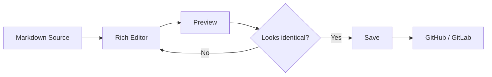
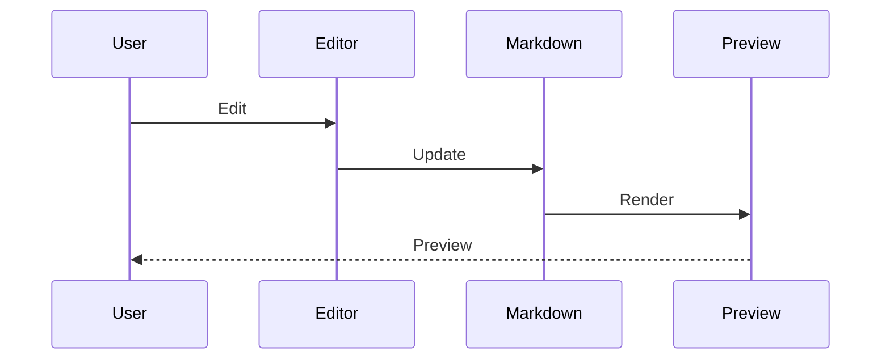

# Markdown Rich Editor Test

このファイルは **Markdownリッチエディター** の表示・編集・コピー＆ペースト・自動整形を確認するためのテスト文書です。

---

## 1. Text Formatting

通常のテキストです。

**太字**

*斜体*

***太字 + 斜体***

~~取り消し線~~

これは `inline code` を含む文章です。

太字の途中に **日本語と English と `code` と [リンク](https://example.com)** を混在させます。

特殊文字テスト: `& < > " ' | \ * _ #`

絵文字テスト: 😀 🚀 ✅ ⚠️ 🎉

---

## 2. Headings

# Heading 1

## Heading 2

### Heading 3

#### Heading 4

##### Heading 5

###### Heading 6

---

## 3. Paragraphs and Line Breaks

これは1つ目の段落です。
同じ段落内の次の行です。

これは空行を挟んだ別の段落です。

これは行末にスペースを2個入れた強制改行です。
この行は直前の文章から改行されます。

---

## 4. Links

通常のリンク:

[Example](https://example.com)

URL:

https://example.com

相対リンク:

[README](./README.md)

同じページ内のリンク:

[Tablesへ移動](#8-tables)

---

## 5. Images

通常の画像:


リンク付き画像:

[](https://example.com)

---

## 6. Lists

### Unordered List

- Apple
- Banana
- Orange
  - Small
  - Medium
    - Nested Level 3
  - Large
- Grape

### Ordered List

1. First
2. Second
3. Third
   1. Nested First
   2. Nested Second
4. Fourth

### Mixed List

- Parent A
  1. Child 1
  2. Child 2
- Parent B
  - Child A
  - Child B

---

## 7. Task Lists

- [x] Markdownファイルを作成する
- [x] リッチエディターを起動する
- [ ] 表の操作を確認する
- [ ] プレビューとの一致を確認する
  - [x] 基本文字装飾
  - [ ] Mermaid
  - [ ] Math
  - [ ] Alerts

---

## 8. Tables

### Basic Table

| Name | Status | Owner |
| --- | --- | --- |
| Editor | Done | Alice |
| Preview | WIP | Bob |
| Formatter | Todo | Charlie |

### Alignment

| Left | Center | Right |
| :--- | :---: | ---: |
| Apple | 100 | ¥1,000 |
| Banana | 200 | ¥2,000 |
| Orange | 300 | ¥3,000 |

### Rich Content

| Feature | Example | Status |
| --- | --- | --- |
| Bold | **Bold text** | ✅ |
| Italic | *Italic text* | ✅ |
| Code | `npm install` | ✅ |
| Link | [Example](https://example.com) | ✅ |
| Japanese | 日本語テスト | ✅ |
| Emoji | 🚀 🎉 | ✅ |
| Empty |  | ✅ |
| Escaped Pipe | A \| B | ✅ |

### Copy & Paste Test

この表は**矩形選択・コピー・貼り付けのテスト用**です。

| A | B | C | D | E |
| --- | --- | --- | --- | --- |
| A1 | B1 | C1 | D1 | E1 |
| A2 | B2 | C2 | D2 | E2 |
| A3 | B3 | C3 | D3 | E3 |
| A4 | B4 | C4 | D4 | E4 |
| A5 | B5 | C5 | D5 | E5 |

テスト例:

1. `B2:D4` をマウスドラッグで選択
2. `Ctrl/Cmd + C`
3. `A1` を選択
4. `Ctrl/Cmd + V`
5. 3×3の構造を維持して貼り付けられることを確認
6. Undo一回で貼り付け前に戻ることを確認

---

## 9. Blockquotes

> これは通常の引用です。

> 引用の中に **太字** や `code` を含めます。
>
> 複数段落にも対応します。

> Level 1
>
>> Level 2
>>
>>> Level 3

---

## 10. Alerts

> [!NOTE]
> これはNOTEです。

> [!TIP]
> これはTIPです。

> [!IMPORTANT]
> **重要な情報**をここに表示します。

> [!WARNING]
> この操作には注意が必要です。

> [!CAUTION]
> この操作を実行すると元に戻せない可能性があります。

---

## 11. Inline Code

`npm install`

`git status`

文章の途中にも `const value = 42` のようにコードを配置できます。

---

## 12. Code Blocks

### JavaScript

```javascript
function greet(name) {
  console.log(`Hello, ${name}!`);
}

greet("Markdown");
```

### TypeScript

```typescript
interface User {
  id: number;
  name: string;
}

const user: User = {
  id: 1,
  name: "Alice",
};
```

### Python

```python
def fibonacci(n: int) -> int:
    if n <= 1:
        return n

    return fibonacci(n - 1) + fibonacci(n - 2)


print(fibonacci(10))
```

### Shell

```bash
git status
git add .
git commit -m "test: markdown editor"
```

### JSON

```json
{
  "name": "markdown-editor",
  "enabled": true,
  "features": [
    "rich-editor",
    "preview",
    "formatter"
  ]
}
```

### Plain Text

```text
Markdown記法 **をここに書いても**
コードブロックなので装飾されません。

| A | B |
|---|---|
| 1 | 2 |
```

---

## 13. Mermaid



### Sequence Diagram



---

## 14. Math

Inline math:

$E = mc^2$

Another expression:

$a^2 + b^2 = c^2$

Block math:

$$
f(x) = \int_{-\infty}^{\infty} e^{-x^2} dx
$$

---

## 15. Footnotes

Markdownはプレーンテキスト形式です。[^markdown]

GitHubとGitLabではMarkdownを拡張した仕様が利用されています。[^platform]

[^markdown]: これは脚注のテストです。
[^platform]: これは2つ目の脚注です。

---

## 16. Collapsible Section

<details>
<summary>クリックして開く</summary>

ここは折りたたまれたコンテンツです。

- List A
- List B
- List C

```javascript
console.log("inside details");
```

</details>

---

## 17. Inline HTML

<strong>HTML strong element</strong>

<em>HTML emphasis element</em>

<kbd>Ctrl</kbd> + <kbd>C</kbd>

<details>
<summary>HTML Details</summary>

HTMLとMarkdownの混在テストです。

</details>

---

## 18. HTML Comments

この下にHTMLコメントがあります。

<!--
この文章はプレビューには表示されない想定です。
エディターで勝手に削除されないことを確認します。
-->

この文章は表示されます。

---

## 19. Escaping

\*これは斜体にならない\*

\# これは見出しにならない

\[これはリンクではない\]

Escaped pipe:

A \| B

---

## 20. Long Text

これは長い文章の折り返しを確認するためのテストです。Markdownリッチエディターでは編集画面とプレビュー画面の本文幅、フォント、行間、文字サイズ、折り返し位置などが一致していることが重要です。この文章を利用してウィンドウサイズを変更した場合にも編集画面とプレビュー画面で同じ位置で折り返されるか確認します。

**太字を含む非常に長い文章でも同様に、編集画面とプレビュー画面のレイアウトが一致していることを確認します。日本語 English 123456789 `inline-code` を混在させてフォント幅の違いについても確認します。**

---

## 21. Japanese IME Test

日本語入力テスト用:

ここを編集して日本語を入力してください。

変換候補表示中に、

- 太字ボタン
- プレビュー更新
- 自動保存
- 外部ファイル変更

などが発生しても、変換中の文字列が失われないことを確認します。

例:

東京都江東区でMarkdownエディターを開発しています。

---

## 22. Formatting Stress Test

**Bold *with italic* inside.**

*Italic **with bold** inside.*

~~Strikethrough with **bold** text.~~

**Bold with `inline code` and [a link](https://example.com).**

> Quote containing **bold**, *italic*, `code`, and [link](https://example.com).

- List containing **bold**
  - Nested list containing *italic*
    - Deep list containing `code`

---

## 23. Empty Structures

以下は空セルを含む表です。

| A | B | C |
| --- | --- | --- |
| 1 |  | 3 |
|  | 2 |  |
| 1 | 2 | 3 |

---

## 24. Formatter Test

このセクションでは保存時の自動整形を確認します。

- リスト
- の
- 整形

|Column A|Column B|Column C|
|---|:---:|---:|
|Left|Center|Right|
|日本語|English|123|

整形後にも、

**意味が変わらないこと。**

**プレビューが変わらないこと。**

**2回目のFormatで差分が発生しないこと。**

を確認します。

---

## 25. Editor Interaction Checklist

- [ ] 太字ボタン
- [ ] 斜体ボタン
- [ ] 取り消し線ボタン
- [ ] 見出し変更
- [ ] リンク挿入
- [ ] 画像挿入
- [ ] リスト作成
- [ ] タスクリスト作成
- [ ] 引用作成
- [ ] Alert作成
- [ ] コードブロック作成
- [ ] Mermaid挿入
- [ ] 数式挿入
- [ ] 表挿入
- [ ] 行追加
- [ ] 行削除
- [ ] 列追加
- [ ] 列削除
- [ ] 行移動
- [ ] 列移動
- [ ] 複数セルのドラッグ選択
- [ ] セル範囲コピー
- [ ] セル範囲切り取り
- [ ] セル範囲貼り付け
- [ ] Deleteでセル内容消去
- [ ] Ctrl/Cmd + Z
- [ ] Ctrl/Cmd + Shift + Z
- [ ] Excel / Google Sheetsから貼り付け
- [ ] 画像ドラッグ＆ドロップ
- [ ] 右クリックメニュー
- [ ] 日本語IME
- [ ] Format Document
- [ ] Format on Save
- [ ] Previewとの表示一致
- [ ] 保存 → 再読み込み後の表示一致

---

## 26. End-of-Document Test

このセクションは文書末尾の操作確認用です。

下に表を置きます。

| Last | Table |
| --- | --- |
| A | B |

**表の後ろをクリックして、新しい段落を追加できることを確認してください。**