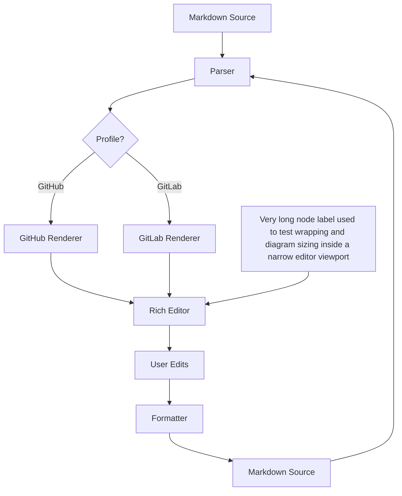
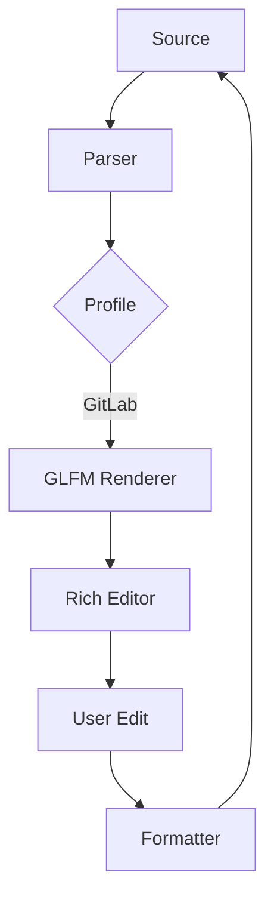
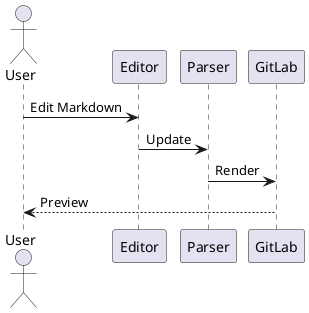

# GitHub Markdown Torture Test

> This document intentionally contains large, deeply nested, long, mixed, and awkward Markdown structures.
>
> Purpose: test rendering, rich editing, mouse interactions, keyboard shortcuts, clipboard behavior, formatting, undo/redo, source preservation, and GitHub-compatible preview.

---

## 1. Mixed Inline Formatting

Plain text.

**Bold**

*Italic*

***Bold Italic***

~~Strikethrough~~

`inline code`

**Bold with *italic*, ~~strike~~, `code`, and [link](https://example.com?q=markdown&lang=ja#section).**

Text immediately touching formatting:abc**bold**def*italic*ghi`code`jkl.

日本語**太字の途中**日本語*斜体の途中*日本語。

Emoji: 😀 🚀 ✅ ⚠️ 🧪 🧑‍💻 🇯🇵

Combining text:

* café
* naïve
* résumé
* Ångström
* Ελληνικά
* Русский
* العربية
* 한국어
* 中文
* 日本語

---

## 2. Very Long Paragraph

これは非常に長い段落です。Markdownのリッチエディターではウィンドウ幅を狭くしたり広くしたりした場合でも編集画面とプレビュー画面で折り返し位置が不自然に変化しないことを確認する必要があります。さらに **Bold text**、*italic text*、`inline-code-with-a-long-name`、[a very long link label that should wrap naturally without breaking layout](https://example.com/path/to/a/very/long/resource?foo=bar&hello=world&markdown=true#section) を同じ段落に混在させた場合でも、行高、ベースライン、余白、文字サイズ、カーソル位置が安定していることを確認します。日本語、English、1234567890、記号 !@#$%^&*()_+-=[]{};':",./<>? を混在させても正常に編集できる必要があります。

VeryLongUnbrokenStringForHorizontalOverflowTesting_ABCDEFGHIJKLMNOPQRSTUVWXYZ_abcdefghijklmnopqrstuvwxyz_0123456789_ABCDEFGHIJKLMNOPQRSTUVWXYZ_abcdefghijklmnopqrstuvwxyz_0123456789_END

---

## 3. Deeply Nested Lists

* Level 1

  * Level 2

    * Level 3

      * Level 4

        * Level 5

          * Level 6

            * Level 7

              * Level 8

                * Level 9

                  * Level 10
* Back to Level 1

1. Ordered 1

   1. Ordered 2

      1. Ordered 3

         1. Ordered 4

            1. Ordered 5

               * Mixed unordered

                 1. Ordered again

                    * Deep mixed child

---

## 4. Task List Stress Test

* [x] Completed
* [ ] Pending
* [x] Parent completed

  * [ ] Child pending
  * [x] Child completed

    * [ ] Grandchild

      * [x] Deep task
* [ ] (Optional) Escaped parentheses
* [ ] Task containing **bold**
* [ ] Task containing *italic*
* [ ] Task containing `code`
* [ ] Task containing [link](https://example.com)
* [ ] 日本語のタスク
* [ ] Emoji task 🚀

---

## 5. Deep Blockquotes

> Level 1
>
> > Level 2
> >
> > > Level 3
> > >
> > > > Level 4
> > > >
> > > > > Level 5
> > > > >
> > > > > > Level 6
> > > > > >
> > > > > > > Level 7

---

## 6. Alerts

> [!NOTE]
> This alert contains **bold**, *italic*, `code`, and a [link](https://example.com).
>
> It also contains multiple lines.

> [!TIP]
> 日本語のTIPです。
>
> * Item A
> * Item B
> * Item C

> [!IMPORTANT]
> Important information with `inline code`.

> [!WARNING]
> Warning with a very long line that should wrap without changing the width of the document or causing the editor toolbar to jump unexpectedly when the alert becomes selected.

> [!CAUTION]
> 危険性を示すテストです。

---

## 7. Code Span Edge Cases

Normal: `code`

Backtick inside code:

`` `backtick` ``

Multiple backticks:

` ``inside`` `

Markdown inside code:

`**not bold**`

`[not a link](https://example.com)`

`| not | a | table |`

---

## 8. Nested Code Fence Test

````markdown
# Markdown inside a code block

```typescript
const value = "**not bold**";
console.log(value);
```

| Not | A | Table |
| --- | --- | --- |
| A | B | C |
````

---

## 9. Long Code Block

```typescript
interface User {
  id: number;
  name: string;
  email: string;
  roles: string[];
}

const users: User[] = Array.from({ length: 100 }, (_, index) => ({
  id: index + 1,
  name: `User ${index + 1}`,
  email: `user-${index + 1}@example.com`,
  roles: index % 2 === 0 ? ["admin", "editor"] : ["viewer"],
}));

for (const user of users) {
  console.log(
    `id=${user.id}, name=${user.name}, email=${user.email}, roles=${user.roles.join(",")}`,
  );
}
```

---

# 10. Huge Table

この表は**横幅・縦幅・スクロール・矩形選択・コピー＆貼り付け・行列操作・Undo/Redo**のテスト用です。

推奨テスト:

1. `C5:F15` をドラッグ選択
2. Cmd/Ctrl+C
3. `B20` を選択
4. Cmd/Ctrl+V
5. Undo
6. Redo
7. 5行まとめて削除
8. 列をドラッグ移動
9. 表の途中でFormat
10. 表の一番下までドラッグ選択

|  ID | Name       | Japanese | Status | Number | Long Text                                                                                                   | Markdown                          | URL                                                  | Empty | Special |
| --: | :--------- | :------- | :----: | -----: | :---------------------------------------------------------------------------------------------------------- | :-------------------------------- | :--------------------------------------------------- | :---- | :------ |
| 001 | Alpha      | 東京       |    ✅   |      1 | Short                                                                                                       | **Bold**                          | https://example.com/1                                |       | A       |
| 002 | Bravo      | 大阪       |   🚧   |     20 | Medium length text                                                                                          | *Italic*                          | https://example.com/2?q=test                         |       | B       |
| 003 | Charlie    | 名古屋      |    ❌   |    300 | This is a considerably longer table cell used for wrapping tests.                                           | `code`                            | https://example.com/3                                |       | C       |
| 004 | Delta      | 福岡       |    ✅   |   4000 | 日本語の長い文章をセル内に入れて折り返しを確認します。                                                                                 | ~~Strike~~                        | https://example.com/4                                |       | D       |
| 005 | Echo       | 札幌       |   🚧   |  50000 | AAAAAAAAAAAAAAAAAAAAAAAAAAAAAAAAAAAAAAAAAAAAAAAA                                                            | [Link](https://example.com)       | https://example.com/5                                |       | E       |
| 006 | Foxtrot    | 仙台       |    ❌   |      6 | Escaped pipe A | B                                                                                          | **B** + *I*                       | https://example.com/6                                |       | `\|`    |
| 007 | Golf       | 広島       |    ✅   |     70 | Emoji 🚀🎉✅⚠️                                                                                               | `x = 1`                           | https://example.com/7                                |       | G       |
| 008 | Hotel      | 横浜       |   🚧   |    800 | café naïve résumé                                                                                           | **日本語**                           | https://example.com/8                                |       | H       |
| 009 | India      | 神戸       |    ❌   |   9000 | 中文 한국어 العربية                                                                                              | *mixed*                           | https://example.com/9                                |       | I       |
| 010 | Juliet     | 京都       |    ✅   | 100000 | Lorem ipsum dolor sit amet consectetur adipiscing elit.                                                     | `code-10`                         | https://example.com/10                               |       | J       |
| 011 | Kilo       | 千葉       |   🚧   |     11 | Row eleven                                                                                                  | **Bold 11**                       | https://example.com/11                               |       | K       |
| 012 | Lima       | 埼玉       |    ❌   |    120 | Row twelve                                                                                                  | *Italic 12*                       | https://example.com/12                               |       | L       |
| 013 | Mike       | 川崎       |    ✅   |   1300 | Row thirteen with a longer sentence to test table layout stability.                                         | `Code 13`                         | https://example.com/13                               |       | M       |
| 014 | November   | 相模原      |   🚧   |  14000 | Row fourteen                                                                                                | [Link 14](https://example.com/14) | https://example.com/14                               |       | N       |
| 015 | Oscar      | 新潟       |    ❌   | 150000 | Row fifteen                                                                                                 | ~~Strike 15~~                     | https://example.com/15                               |       | O       |
| 016 | Papa       | 静岡       |    ✅   |     16 | Row sixteen                                                                                                 | **Bold**                          | https://example.com/16                               |       | P       |
| 017 | Quebec     | 浜松       |   🚧   |    170 | Row seventeen                                                                                               | *Italic*                          | https://example.com/17                               |       | Q       |
| 018 | Romeo      | 岡山       |    ❌   |   1800 | Row eighteen                                                                                                | `code`                            | https://example.com/18                               |       | R       |
| 019 | Sierra     | 熊本       |    ✅   |  19000 | Row nineteen                                                                                                | [Link](https://example.com/19)    | https://example.com/19                               |       | S       |
| 020 | Tango      | 鹿児島      |   🚧   | 200000 | Row twenty                                                                                                  | **20**                            | https://example.com/20                               |       | T       |
| 021 | Uniform    | 金沢       |    ❌   |     21 | Row twenty one                                                                                              | *21*                              | https://example.com/21                               |       | U       |
| 022 | Victor     | 長野       |    ✅   |    220 | Row twenty two                                                                                              | `22`                              | https://example.com/22                               |       | V       |
| 023 | Whiskey    | 高松       |   🚧   |   2300 | Row twenty three                                                                                            | ~~23~~                            | https://example.com/23                               |       | W       |
| 024 | X-ray      | 松山       |    ❌   |  24000 | Row twenty four                                                                                             | **24**                            | https://example.com/24                               |       | X       |
| 025 | Yankee     | 長崎       |    ✅   | 250000 | Row twenty five                                                                                             | *25*                              | https://example.com/25                               |       | Y       |
| 026 | Zulu       | 大分       |   🚧   |     26 | Row twenty six                                                                                              | `26`                              | https://example.com/26                               |       | Z       |
| 027 | Alpha-2    | 宮崎       |    ❌   |    270 | Row twenty seven                                                                                            | [27](https://example.com/27)      | https://example.com/27                               |       | AA      |
| 028 | Bravo-2    | 那覇       |    ✅   |   2800 | Row twenty eight                                                                                            | ~~28~~                            | https://example.com/28                               |       | AB      |
| 029 | Charlie-2  | 青森       |   🚧   |  29000 | Row twenty nine                                                                                             | **29**                            | https://example.com/29                               |       | AC      |
| 030 | Delta-2    | 盛岡       |    ❌   | 300000 | Row thirty                                                                                                  | *30*                              | https://example.com/30                               |       | AD      |
| 031 | Echo-2     | 秋田       |    ✅   |     31 | Row thirty one                                                                                              | `31`                              | https://example.com/31                               |       | AE      |
| 032 | Foxtrot-2  | 山形       |   🚧   |    320 | Row thirty two                                                                                              | [32](https://example.com/32)      | https://example.com/32                               |       | AF      |
| 033 | Golf-2     | 福島       |    ❌   |   3300 | Row thirty three                                                                                            | ~~33~~                            | https://example.com/33                               |       | AG      |
| 034 | Hotel-2    | 水戸       |    ✅   |  34000 | Row thirty four                                                                                             | **34**                            | https://example.com/34                               |       | AH      |
| 035 | India-2    | 宇都宮      |   🚧   | 350000 | Row thirty five                                                                                             | *35*                              | https://example.com/35                               |       | AI      |
| 036 | Juliet-2   | 前橋       |    ❌   |     36 | Row thirty six                                                                                              | `36`                              | https://example.com/36                               |       | AJ      |
| 037 | Kilo-2     | さいたま     |    ✅   |    370 | Row thirty seven                                                                                            | [37](https://example.com/37)      | https://example.com/37                               |       | AK      |
| 038 | Lima-2     | 甲府       |   🚧   |   3800 | Row thirty eight                                                                                            | ~~38~~                            | https://example.com/38                               |       | AL      |
| 039 | Mike-2     | 富山       |    ❌   |  39000 | Row thirty nine                                                                                             | **39**                            | https://example.com/39                               |       | AM      |
| 040 | November-2 | 福井       |    ✅   | 400000 | Final row with intentionally long content to test scrolling and selection near the bottom of a large table. | *40*                              | https://example.com/40?very=long&query=value&foo=bar |       | AN      |

---

## 11. Empty Cell Matrix

| A  | B  | C  | D  | E  | F  |
| -- | -- | -- | -- | -- | -- |
| A1 |    | C1 |    | E1 |    |
|    | B2 |    | D2 |    | F2 |
| A3 | B3 |    |    | E3 | F3 |
|    |    | C4 | D4 |    |    |
| A5 |    |    | D5 | E5 |    |

---

## 12. Cell Content Edge Cases

| Case      | Value                                |      |
| --------- | ------------------------------------ | ---- |
| Pipe      | A | B | C                            |      |
| Backslash | `C:\\Users\\example`                 |      |
| URL Query | https://example.com?a=1&b=2&c=3      |      |
| Code      | `foo                                 | bar` |
| Bold      | **A | B**                            |      |
| Link      | [A | B](https://example.com?a=1&b=2) |      |
| Japanese  | `表の中の日本語`                            |      |
| Emoji     | 😀 | 🚀 | ✅                          |      |
| Empty     |                                      |      |
| Spaces    | text with multiple spaces            |      |

---

## 13. Mermaid Stress Test



---

## 14. Math Stress Test

Inline: $E = mc^2$

Inline complex:

$\frac{-b \pm \sqrt{b^2 - 4ac}}{2a}$

Block:

$$
\sum_{n=1}^{100}
\frac{1}{n^2}
=
\frac{\pi^2}{6}
$$

Matrix:

$$
A =
\begin{bmatrix}
1 & 2 & 3 \\
4 & 5 & 6 \\
7 & 8 & 9
\end{bmatrix}
$$

---

## 15. Footnotes

First.[^1]

Second.[^long]

Third.[^日本語]

[^1]: Short footnote.

[^long]: This is a very long footnote containing **bold**, *italic*, `code`, a [link](https://example.com), 日本語, emoji 🚀, and enough text to wrap across several lines in narrow layouts.

[^日本語]: 日本語の脚注です。

---

## 16. Details Inside Details-Like Content

<details>
<summary>Level 1</summary>

This section contains Markdown.

* Item A
* Item B

```text
Code inside details.
```

<details>
<summary>Level 2</summary>

Nested details test.

**Bold content**

</details>

</details>

---

## 17. Relative Links and Anchors

[Top](#github-markdown-torture-test)

[Huge Table](#10-huge-table)

[Relative README](./README.md)

[Parent](../README.md)

---

## 18. HTML Comment Preservation

Before.

<!--
DO NOT DELETE THIS COMMENT.

This comment intentionally contains Markdown:

# Heading

| A | B |
|---|---|
| 1 | 2 |

**bold**
-->

After.

---

## 19. Escaping Torture Test

# Not a heading

*Not italic*

**Not bold**

> Not a quote

- Not a list

`Not code`

A | B | C

---

## 20. Formatter Idempotency Test

| A |  B  |  C | D |
| - | :-: | -: | - |
| 1 |  2  |  3 | 4 |
| 5 |  6  |  7 | 8 |

* Item A

  * Child A

    * Grandchild A
* Item B

1. First
2. Second

   1. Nested
   2. Nested

Format once.

Format again.

**The second format operation must produce no additional changes.**

---

## 21. Clipboard Torture Test

Use the huge table above.

Test all of the following:

* Copy one cell.
* Copy 2×2.
* Copy 3×7.
* Copy 10×4.
* Cut 5×5.
* Paste into a single cell.
* Paste into the same-sized selection.
* Paste near the final row.
* Paste beyond the existing table boundary.
* Undo once.
* Redo once.
* Paste copied spreadsheet data.
* Paste tab-separated text.
* Paste multiline text into one cell.
* Copy cells containing empty values.
* Copy cells containing escaped pipes.

---

## 22. End-of-Document Cursor Test

| Final A | Final B | Final C |
| ------- | ------- | ------- |
| 1       | 2       | 3       |
| 4       | 5       | 6       |

The editor must allow placing the cursor **after this table** and creating another paragraph.

# GitLab Markdown Torture Test

[[*TOC*]]

This file intentionally stresses GitLab Flavored Markdown, rich editing, formatting, clipboard handling, rendering, and source preservation.

---

## 1. Mixed Inline Formatting

**Bold**

*Italic*

***Bold Italic***

~~Strike~~

`inline code`

**Bold + *italic* + ~~strike~~ + `code` + [link](https://gitlab.com).**

日本語 **太字** *斜体* `コード`。

Emoji: ✅ 🚧 ❌ ⚠️ 🚀 🧪

---

## 2. Description Lists

Editor
: Rich Markdown editing
: Mouse-based interactions
: Keyboard shortcuts
: Preview synchronization

Formatter
: Format on save
: Manual format
: Idempotent output

Compatibility

: GitLab Flavored Markdown
: GitHub Flavored Markdown
: Service-specific rendering

Very Long Term Name Used To Check Description List Layout And Wrapping

: This is a long description used to check wrapping, spacing, selection, cursor behavior, and source preservation when the editor switches between rich mode and plain Markdown mode.

---

## 3. Deep Mixed Lists

* Level 1

  * Level 2

    * Level 3

      * Level 4

        1. Ordered 5

           1. Ordered 6

              * Mixed Level 7

                * Level 8

                  * Level 9

1. Root

   * Mixed A

     1. Mixed B

        * Mixed C

          1. Mixed D

---

## 4. Task Lists

* [x] Completed
* [ ] Pending
* [~] Inapplicable
* [ ] Parent

  * [x] Child completed
  * [ ] Child pending
  * [~] Child inapplicable

    * [ ] Deep child

      * [x] Very deep child

---

## 5. Alerts

> [!note]
> NOTE with **bold**, *italic*, `code`, 日本語, and 🚀.

> [!tip]
> TIP containing:
>
> * Item A
> * Item B
> * Item C

> [!important]
> Important information.

> [!warning]
> This warning intentionally contains a very long sentence to check line wrapping and ensure that selecting or hovering the alert does not change the document layout.

> [!caution]
> Caution.

---

## 6. Multiline Blockquote Stress Test

> > >

This is a multiline blockquote.

It contains multiple paragraphs.

* List A
* List B
* List C

**Bold text**

```text
Code block inside multiline blockquote test.
```

> > >

---

# 7. Huge Table

この表はGitLab向けの**巨大表操作ストレステスト**です。

試験:

* 10行以上を一気に選択
* 5列以上を一気に選択
* Shift+Click
* ドラッグ選択
* Copy
* Cut
* Paste
* Delete
* Undo
* Redo
* 行移動
* 列移動
* Format
* Sort相当の操作を将来追加した場合の確認

|  ID | Name       | City | State |  Value | Description                                                           | Markdown                     | Task | URL                                | Special |
| --: | :--------- | :--- | :---: | -----: | :-------------------------------------------------------------------- | :--------------------------- | :--: | :--------------------------------- | :------ |
| 001 | Alpha      | 東京   |   ✅   |      1 | Short                                                                 | **Bold**                     |  [x] | https://example.com/1              | A       |
| 002 | Bravo      | 大阪   |   🚧  |     22 | Medium                                                                | *Italic*                     |  [ ] | https://example.com/2              | B       |
| 003 | Charlie    | 名古屋  |   ❌   |    333 | Long table content used for wrapping behavior.                        | `code`                       |  [~] | https://example.com/3              | C       |
| 004 | Delta      | 福岡   |   ✅   |   4444 | 日本語の長い文章を入れてセル内の折り返しを確認します。                                           | ~~strike~~                   |  [x] | https://example.com/4              | D       |
| 005 | Echo       | 札幌   |   🚧  |  55555 | AAAAAAAAAAAAAAAAAAAAAAAAAAAAAAAAAAAAAAAAAAAA                          | **bold**                     |  [ ] | https://example.com/5              | E       |
| 006 | Foxtrot    | 仙台   |   ❌   |      6 | Pipe A | B                                                            | `A\|B`                       |  [~] | https://example.com/6              | F       |
| 007 | Golf       | 広島   |   ✅   |     77 | Emoji 🚀🎉✅⚠️                                                         | [Link](https://example.com)  |  [x] | https://example.com/7              | G       |
| 008 | Hotel      | 横浜   |   🚧  |    888 | café résumé naïve                                                     | *Unicode*                    |  [ ] | https://example.com/8              | H       |
| 009 | India      | 神戸   |   ❌   |   9999 | 中文 한국어 العربية                                                        | `Unicode`                    |  [~] | https://example.com/9              | I       |
| 010 | Juliet     | 京都   |   ✅   | 100000 | Lorem ipsum dolor sit amet consectetur adipiscing elit.               | **10**                       |  [x] | https://example.com/10             | J       |
| 011 | Kilo       | 千葉   |   🚧  |     11 | Eleven                                                                | *11*                         |  [ ] | https://example.com/11             | K       |
| 012 | Lima       | 埼玉   |   ❌   |    122 | Twelve                                                                | `12`                         |  [~] | https://example.com/12             | L       |
| 013 | Mike       | 川崎   |   ✅   |   1333 | Thirteen long long long text.                                         | **13**                       |  [x] | https://example.com/13             | M       |
| 014 | November   | 相模原  |   🚧  |  14444 | Fourteen                                                              | [14](https://example.com/14) |  [ ] | https://example.com/14             | N       |
| 015 | Oscar      | 新潟   |   ❌   | 155555 | Fifteen                                                               | ~~15~~                       |  [~] | https://example.com/15             | O       |
| 016 | Papa       | 静岡   |   ✅   |     16 | Sixteen                                                               | **16**                       |  [x] | https://example.com/16             | P       |
| 017 | Quebec     | 浜松   |   🚧  |    177 | Seventeen                                                             | *17*                         |  [ ] | https://example.com/17             | Q       |
| 018 | Romeo      | 岡山   |   ❌   |   1888 | Eighteen                                                              | `18`                         |  [~] | https://example.com/18             | R       |
| 019 | Sierra     | 熊本   |   ✅   |  19999 | Nineteen                                                              | [19](https://example.com/19) |  [x] | https://example.com/19             | S       |
| 020 | Tango      | 鹿児島  |   🚧  | 200000 | Twenty                                                                | **20**                       |  [ ] | https://example.com/20             | T       |
| 021 | Uniform    | 金沢   |   ❌   |     21 | Twenty one                                                            | *21*                         |  [~] | https://example.com/21             | U       |
| 022 | Victor     | 長野   |   ✅   |    222 | Twenty two                                                            | `22`                         |  [x] | https://example.com/22             | V       |
| 023 | Whiskey    | 高松   |   🚧  |   2333 | Twenty three                                                          | ~~23~~                       |  [ ] | https://example.com/23             | W       |
| 024 | X-ray      | 松山   |   ❌   |  24444 | Twenty four                                                           | **24**                       |  [~] | https://example.com/24             | X       |
| 025 | Yankee     | 長崎   |   ✅   | 255555 | Twenty five                                                           | *25*                         |  [x] | https://example.com/25             | Y       |
| 026 | Zulu       | 大分   |   🚧  |     26 | Twenty six                                                            | `26`                         |  [ ] | https://example.com/26             | Z       |
| 027 | Alpha-2    | 宮崎   |   ❌   |    277 | Twenty seven                                                          | [27](https://example.com/27) |  [~] | https://example.com/27             | AA      |
| 028 | Bravo-2    | 那覇   |   ✅   |   2888 | Twenty eight                                                          | ~~28~~                       |  [x] | https://example.com/28             | AB      |
| 029 | Charlie-2  | 青森   |   🚧  |  29999 | Twenty nine                                                           | **29**                       |  [ ] | https://example.com/29             | AC      |
| 030 | Delta-2    | 盛岡   |   ❌   | 300000 | Thirty                                                                | *30*                         |  [~] | https://example.com/30             | AD      |
| 031 | Echo-2     | 秋田   |   ✅   |     31 | Thirty one                                                            | `31`                         |  [x] | https://example.com/31             | AE      |
| 032 | Foxtrot-2  | 山形   |   🚧  |    322 | Thirty two                                                            | [32](https://example.com/32) |  [ ] | https://example.com/32             | AF      |
| 033 | Golf-2     | 福島   |   ❌   |   3333 | Thirty three                                                          | ~~33~~                       |  [~] | https://example.com/33             | AG      |
| 034 | Hotel-2    | 水戸   |   ✅   |  34444 | Thirty four                                                           | **34**                       |  [x] | https://example.com/34             | AH      |
| 035 | India-2    | 宇都宮  |   🚧  | 355555 | Thirty five                                                           | *35*                         |  [ ] | https://example.com/35             | AI      |
| 036 | Juliet-2   | 前橋   |   ❌   |     36 | Thirty six                                                            | `36`                         |  [~] | https://example.com/36             | AJ      |
| 037 | Kilo-2     | さいたま |   ✅   |    377 | Thirty seven                                                          | [37](https://example.com/37) |  [x] | https://example.com/37             | AK      |
| 038 | Lima-2     | 甲府   |   🚧  |   3888 | Thirty eight                                                          | ~~38~~                       |  [ ] | https://example.com/38             | AL      |
| 039 | Mike-2     | 富山   |   ❌   |  39999 | Thirty nine                                                           | **39**                       |  [~] | https://example.com/39             | AM      |
| 040 | November-2 | 福井   |   ✅   | 400000 | Final long row for bottom-edge drag selection and scrolling behavior. | *40*                         |  [x] | https://example.com/40?a=1&b=2&c=3 | AN      |

---

## 8. Multiline Table Cells

| Name      | Description                                                                                                  |
| --------- | ------------------------------------------------------------------------------------------------------------ |
| Simple    | One line                                                                                                     |
| Multiline | Line 1<br>Line 2<br>Line 3                                                                                   |
| List-like | Item A<br>Item B<br>Item C                                                                                   |
| Long      | This is a very long cell with multiple pieces of information.<br>Second logical line.<br>Third logical line. |
| Japanese  | 1行目<br>2行目<br>3行目                                                                                            |

---

## 9. Empty Cell Matrix

| A  | B  | C  | D  | E  | F  |
| -- | -- | -- | -- | -- | -- |
| A1 |    | C1 |    | E1 |    |
|    | B2 |    | D2 |    | F2 |
| A3 | B3 |    |    | E3 | F3 |
|    |    | C4 | D4 |    |    |
| A5 |    |    | D5 | E5 |    |

---

## 10. Table Task Items

| Complete | Task             |
| -------- | ---------------- |
| [x]      | Backend          |
| [ ]      | Frontend         |
| [~]      | Legacy migration |
| [x]      | Documentation    |
| [ ]      | Release          |

---

## 11. Inline Diff

Original sentence:

The system uses {-MongoDB-}{+SQLite+} for local persistence.

Another:

This feature is {-disabled-}{+enabled+} by default.

Japanese:

保存方式を{-手動-}{+自動+}に変更します。

---

## 12. Color Chips

`#FF0000`

`#00FF00`

`#0000FF`

`rgb(255, 0, 0)`

`rgb(0, 128, 255)`

`hsl(120, 100%, 50%)`

Escaped:

`\#FF0000`

---

## 13. Math Stress Test

Inline:

$E = mc^2$

Quadratic:

$\frac{-b \pm \sqrt{b^2 - 4ac}}{2a}$

Block:

$$
\sum_{n=1}^{100}
\frac{1}{n^2}
=
\frac{\pi^2}{6}
$$

Math block:

```math
\begin{aligned}
a &= b + c \\
d &= e + f
\end{aligned}
```

---

## 14. Mermaid



---

## 15. PlantUML



---

## 16. Kroki / Blockdiag

```blockdiag
blockdiag {
  Markdown -> Parser -> Editor -> Preview;
  Preview -> Markdown;
}
```

---

## 17. Image Dimension Syntax

{width=600}

{width=50%}

{width=300 height=100}

---

## 18. Footnotes

Normal footnote.[^1]

Long footnote.[^long]

Japanese footnote.[^日本語]

[^1]: Short footnote.

[^long]: This footnote contains **bold**, *italic*, `code`, a [link](https://example.com), 日本語, emoji 🚀, and intentionally long content for wrapping tests.

[^日本語]: 日本語脚注のテストです。

---

## 19. Collapsible Sections

<details>
<summary>Level 1</summary>

Rich content.

* A
* B
* C

<details>
<summary>Level 2</summary>

Nested content.

**Bold**

```text
code
```

</details>

</details>

---

## 20. Superscript and Subscript

2<sup>10</sup> = 1024

H<sub>2</sub>O

x<sup>2</sup> + y<sup>2</sup>

CO<sub>2</sub>

---

## 21. Keyboard Tags

<kbd>Ctrl</kbd> + <kbd>C</kbd>

<kbd>Ctrl</kbd> + <kbd>V</kbd>

<kbd>Cmd</kbd> + <kbd>Shift</kbd> + <kbd>P</kbd>

---

## 22. HTML Comment Preservation

Before.

<!--
GitLab preservation test.

[[_TOC_]]

{-old-}{+new+}

{width=50%}

Description
: value
-->

After.

---

## 23. Escaping Stress Test

# Not heading

*Not italic*

> Not quote

- Not list

A | B | C

`\#FF0000`

---

## 24. Formatter Torture Test

| A |  B  |  C | D |
| - | :-: | -: | - |
| 1 |  2  |  3 | 4 |
| 5 |  6  |  7 | 8 |

Description
: value 1
: value 2

* [x] Done
* [~] N/A
* [ ] Todo

Inline diff: {-old-}{+new+}

Image dimensions:

{width=50%}

The formatter must preserve:

* `[[_TOC_]]`
* Description lists
* `[~]`
* Inline diffs
* Image dimensions
* Alerts
* Mermaid
* PlantUML
* Kroki
* Math
* Footnotes

Run formatter twice.

The second run must produce **zero additional changes**.

---

## 25. Clipboard Torture Test

Use the huge table.

Test:

* 1×1 copy
* 2×2 copy
* 5×5 copy
* 10×6 copy
* Cut
* Paste
* Paste into a single cell
* Paste into a larger selected range
* Paste at the final row
* Paste requiring new rows
* Undo
* Redo
* Delete contents
* Insert rows
* Delete rows
* Insert columns
* Delete columns
* Drag rows
* Drag columns
* Spreadsheet TSV paste
* Empty cell preservation
* Task cell preservation
* Unicode preservation
* Escaped pipe preservation

---

## 26. Source Preservation Block

The following syntax must survive rich-editor round trips:

````text
[[_TOC_]]

Term
: Description

- [~] Inapplicable

{- old -}
{+ new +}

{width=50%}

```math
a^2+b^2=c^2
````

```

---

## 27. End-of-Document Test

| Final A | Final B | Final C |
| --- | --- | --- |
| 1 | 2 | 3 |
| 4 | 5 | 6 |

The user must be able to place the cursor after this table and continue typing.

特に見るべきなのは、**巨大表を編集している最中にプレビュー同期や自動整形が走っても選択範囲が飛ばないこと**です。GitLabは表セル内の改行に`<br>`を使えるほか、現行仕様ではテーブル内タスクや`[~]`、Description Listなども持つため、FormatterやAST変換の弱点を見つけやすいです。
```
