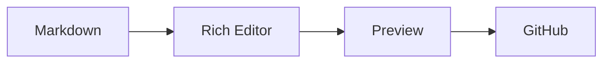
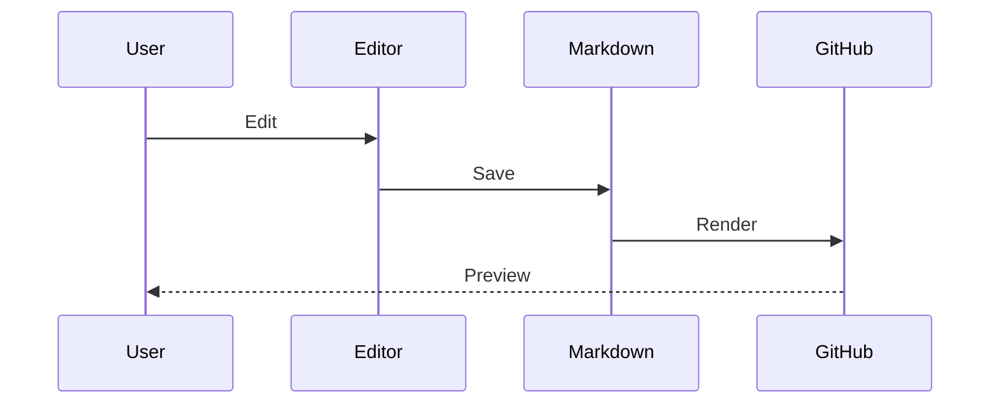

# GitHub Markdown Test

GitHub Flavored MarkdownおよびGitHub固有機能のテストファイルです。

---

## 1. Basic Formatting

**Bold**

*Italic*

***Bold + Italic***

~~Strikethrough~~

`inline code`

[GitHub](https://github.com)

> Blockquote

---

## 2. Task Lists

- [x] Completed
- [ ] Incomplete
- [ ] Parent task
  - [x] Child task A
  - [ ] Child task B

---

## 3. Table

| Feature | Status | Priority |
| :--- | :---: | ---: |
| Rich Editor | ✅ | 1 |
| Preview | 🚧 | 2 |
| Formatter | ⬜ | 3 |
| GitHub Profile | ✅ | 4 |

### Table Selection Test

| A | B | C | D |
| --- | --- | --- | --- |
| A1 | B1 | C1 | D1 |
| A2 | B2 | C2 | D2 |
| A3 | B3 | C3 | D3 |
| A4 | B4 | C4 | D4 |

`B2:C3`をドラッグ選択してコピーし、別セルへ貼り付けるテストに使用します。

---

## 4. Alerts

> [!NOTE]
> GitHub NOTE alert.

> [!TIP]
> GitHub TIP alert.

> [!IMPORTANT]
> GitHub IMPORTANT alert.

> [!WARNING]
> GitHub WARNING alert.

> [!CAUTION]
> GitHub CAUTION alert.

---

## 5. Code Block

```typescript
interface MarkdownEditor {
  richEditor: boolean;
  preview: boolean;
  formatter: boolean;
}

const editor: MarkdownEditor = {
  richEditor: true,
  preview: true,
  formatter: true,
};
```

---

## 6. Mermaid



### Sequence Diagram



---

## 7. Math

Inline:

$E = mc^2$

Block:

$$
f(x) = \int_{-\infty}^{\infty} e^{-x^2} dx
$$

Matrix:

$$
A =
\begin{bmatrix}
1 & 2 \\
3 & 4
\end{bmatrix}
$$

---

## 8. Footnotes

GitHub supports footnotes.[^1]

This is another footnote.[^github]

[^1]: Footnote number one.
[^github]: GitHub Markdown footnote test.

---

## 9. Collapsible Section

<details>
<summary>Click to expand</summary>

## Hidden Content

- Item A
- Item B
- Item C

```javascript
console.log("GitHub details test");
```

</details>

---

## 10. GitHub References

> These references require a real GitHub repository context.

Issue:

#123

Pull Request:

#456

User mention:

@octocat

Commit SHA example:

16c999e8c71134401a78d4d46435517b2271d6ac

---

## 11. Emoji

:tada:

:rocket:

:warning:

:white_check_mark:

Native emoji:

🎉 🚀 ⚠️ ✅

---

## 12. GeoJSON

```geojson
{
  "type": "Feature",
  "properties": {
    "name": "Tokyo Station"
  },
  "geometry": {
    "type": "Point",
    "coordinates": [139.7671, 35.6812]
  }
}
```

---

## 13. TopoJSON

```topojson
{
  "type": "Topology",
  "objects": {
    "example": {
      "type": "GeometryCollection",
      "geometries": [
        {
          "type": "Point",
          "coordinates": [139.7671, 35.6812]
        }
      ]
    }
  },
  "arcs": []
}
```

---

## 14. STL

```stl
solid triangle
  facet normal 0 0 1
    outer loop
      vertex 0 0 0
      vertex 1 0 0
      vertex 0 1 0
    endloop
  endfacet
endsolid triangle
```

---

## 15. Relative Links

[README](./README.md)

[Source](./src/)

---

## 16. HTML

<kbd>Ctrl</kbd> + <kbd>C</kbd>

<details>
<summary>HTML Test</summary>

Markdown **inside HTML**.

</details>

---

## 17. HTML Comment

Visible text.

<!-- This should not be visible in preview. -->

Visible text again.

---

## 18. Escaping

\*Not italic\*

\# Not heading

A \| B

---

## 19. Formatter Test

|Column A|Column B|Column C|
|---|:---:|---:|
|Left|Center|Right|
|GitHub|Markdown|Test|

- Item A
- Item B
  - Nested A
  - Nested B

Formatを2回実行し、2回目に差分が発生しないことを確認します。

---

## 20. End Test

| Last | Table |
| --- | --- |
| GitHub | Test |

表の後ろにカーソルを置き、新しい段落を追加できることを確認します。