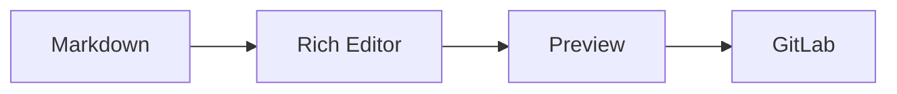

# GitLab Markdown Test

GitLab Flavored Markdown (GLFM)およびGitLab固有機能のテストファイルです。

[[_TOC_]]

---

## 1. Basic Formatting

**Bold**

*Italic*

***Bold + Italic***

~~Strikethrough~~

`inline code`

[GitLab](https://gitlab.com)

> Blockquote

---

## 2. Description List

Fruits
: Apple
: Orange
: Banana

Editor
: Rich Markdown editing
: Mouse operations
: Keyboard shortcuts

Preview
: GitLab-compatible rendering

---

## 3. Task Lists

- [x] Completed
- [~] Inapplicable
- [ ] Incomplete
- [ ] Parent
  - [x] Child A
  - [~] Child B
  - [ ] Child C

---

## 4. Table

| Feature | Status | Priority |
| :--- | :---: | ---: |
| Rich Editor | ✅ | 1 |
| Preview | 🚧 | 2 |
| Formatter | ⬜ | 3 |
| GitLab Profile | ✅ | 4 |

### Table Selection Test

| A | B | C | D |
| --- | --- | --- | --- |
| A1 | B1 | C1 | D1 |
| A2 | B2 | C2 | D2 |
| A3 | B3 | C3 | D3 |
| A4 | B4 | C4 | D4 |

`B2:C3`をドラッグ選択してコピーし、別セルへ貼り付けます。

---

## 5. Alerts

> [!note]
> GitLab NOTE alert.

> [!tip]
> GitLab TIP alert.

> [!important]
> GitLab IMPORTANT alert.

> [!warning]
> GitLab WARNING alert.

> [!caution]
> GitLab CAUTION alert.

---

## 6. Code Block

```rust
struct MarkdownEditor {
    rich_editor: bool,
    preview: bool,
    formatter: bool,
}

fn main() {
    let editor = MarkdownEditor {
        rich_editor: true,
        preview: true,
        formatter: true,
    };

    println!("{}", editor.preview);
}
```

---

## 7. Mermaid



---

## 8. PlantUML

> PlantUML integration must be enabled on the GitLab instance.

```plantuml
Alice -> Bob: Markdown
Bob -> Alice: Render
Alice -> Bob: Preview
```

---

## 9. Kroki

> Kroki integration must be enabled on the GitLab instance.

```blockdiag
blockdiag {
  Markdown -> Editor -> Preview -> GitLab;
}
```

---

## 10. Math

Inline:

$E = mc^2$

Block:

$$
a^2 + b^2 = c^2
$$

GitLab math code block:

```math
\sqrt{3x-1} + (1+x)^2
```

---

## 11. Footnotes

GitLab supports footnotes.[^1]

Another footnote.[^gitlab]

[^1]: GitLab footnote number one.
[^gitlab]: GitLab Flavored Markdown test.

---

## 12. GitLab References

> These references require a real GitLab project context.

Issue:

#123

Merge Request:

!456

User:

@example

Commit SHA:

16c999e8c71134401a78d4d46435517b2271d6ac

---

## 13. Image Dimensions

GitLab supports dimensions after Markdown images.

```text
{width=300px}

{width=50%}

{width=300 height=200}
```

実際の画像ファイルを用意した場合:

{width=300px}

---

## 14. Color Chips

HEX:

`#FF0000`

RGB:

`rgb(0, 128, 255)`

HSL:

`hsl(120, 100%, 50%)`

---

## 15. Collapsible Section

<details>
<summary>Click to expand</summary>

GitLab collapsed content.

- Item A
- Item B
- Item C

```python
print("GitLab details test")
```

</details>

---

## 16. Superscript and Subscript

Superscript:

2<sup>10</sup> = 1024

Subscript:

H<sub>2</sub>O

---

## 17. Keyboard Element

Press <kbd>Ctrl</kbd> + <kbd>C</kbd> to copy.

Press <kbd>Ctrl</kbd> + <kbd>V</kbd> to paste.

---

## 18. HTML Comment

Visible text.

<!-- This comment should be hidden. -->

Visible text again.

---

## 19. Inline Diff

GitLab inline diff test:

- {- Removed text -}
- {+ Added text +}

Sentence with {-old-} and {+new+} content.

---

## 20. Front Matter

> このセクションは構文保持テストです。
> 実際のfront matterは通常ファイル先頭に配置します。

```yaml
---
title: GitLab Markdown Test
description: GLFM feature test
author: Markdown Editor
---
```

エディターがfront matterを勝手に削除・変更しないことを確認します。

---

## 21. Escaping

\*Not italic\*

\# Not heading

A \| B

---

## 22. Formatter Test

|Column A|Column B|Column C|
|---|:---:|---:|
|Left|Center|Right|
|GitLab|Markdown|Test|

Fruits
: Apple
: Orange

- Item A
- Item B
  - Nested A
  - Nested B

Formatを2回実行し、2回目に差分が発生しないことを確認します。

特に以下のGitLab固有構文をFormatterが破壊しないこと:

- `[[_TOC_]]`
- Description List
- Alerts
- Inline Diff
- Image dimensions
- Math
- PlantUML
- Kroki

---

## 23. Rich Editor Preservation Test

以下をリッチエディターで編集したあと、未対応構文が消えないことを確認します。

```text
[[_TOC_]]

!123

{- removed -}

{+ added +}

{width=50%}
```

---

## 24. End Test

| Last | Table |
| --- | --- |
| GitLab | Test |

表の後ろにカーソルを置き、新しい段落を追加できることを確認します。