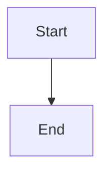

# aaa

ege

- [ ] tegegegewl

  - こんにちは。

---

---

```Rust
aa
```

aafege

**~~ege~~**

\[\[*TOC*\]\]

\[\[*TOC*\]\]

Term
\: Description

{\+ Selected text \+}


<details>
<summary>Details</summary>

Details content

</details>

**fee**

---

```
aege

ege
```


|   |   |   |   |
| --- | --- | --- | --- |
|   |   |   |   |
|   |   |   |   |
|   |   |   |   |
|   |   |   |   |

> [!TIP]
> Alert details

$$
x = y
$$





egegegjek


|   |   |   |   |   |   |   |   |   |   |   |   |   |   |   |   |   |   |   |   |
| --- | --- | --- | :---: | --- | --- | --- | --- | --- | --- | --- | --- | --- | --- | --- | --- | --- | --- | --- | --- |
|   |   |   |   |   |   |   |   |   |   |   |   |   |   |   |   |   |   |   |   |
|   |   |   |   |   |   |   |   |   |   |   |   |   |   |   |   |   |   |   |   |
|   |   |   |   |   |   |   |   |   |   |   |   |   |   |   |   |   |   |   |   |
|   |   |   |   |   |   |   |   |   |   |   |   |   |   |   |   |   |   |   |   |
|   |   |   |   |   |   |   |   |   |   |   |   |   |   |   |   |   |   |   |   |
|   |   |   |   |   |   |   |   |   |   |   |   |   |   |   |   |   |   |   |   |
|   |   |   |   |   |   |   |   |   |   |   |   |   |   |   |   |   |   |   |   |
|   |   |   |   |   |   |   |   |   |   |   |   |   |   |   |   |   |   |   |   |
|   |   |   |   |   |   |   |   |   |   |   |   |   |   |   |   |   |   |   |   |
|   |   |   |   |   |   |   |   |   |   |   |   |   |   |   |   |   |   |   |   |
|   |   |   |   |   |   |   |   |   |   |   |   |   |   |   |   |   |   |   |   |
|   |   |   |   |   |   |   |   |   |   |   |   |   |   |   |   |   |   |   |   |
|   |   |   |   |   |   |   |   |   |   |   |   |   |   |   |   |   |   |   |   |
|   |   |   |   |   |   |   |   |   |   |   |   |   |   |   |   |   |   |   |   |
|   |   |   |   |   |   |   |   |   |   |   |   |   |   |   |   |   |   |   |   |
|   |   |   |   |   |   |   |   |   |   |   |   |   |   |   |   |   |   |   |   |
|   |   |   |   |   |   |   |   |   |   |   |   |   |   |   |   |   |   |   |   |
|   |   |   |   |   |   |   |   |   |   |   |   |   |   |   |   |   |   |   |   |
|   |   |   |   |   |   |   |   |   |   |   |   |   |   |   |   |   |   |   |   |
|   |   |   |   |   |   |   |   |   |   |   |   |   |   |   |   |   |   |   |   |
|   |   |   |   |   |   |   |   |   |   |   |   |   |   |   |   |   |   |   |   |
|   |   |   |   |   |   |   |   |   |   |   |   |   |   |   |   |   |   |   |   |
|   |   |   |   |   |   |   |   |   |   |   |   |   |   |   |   |   |   |   |   |
|   |   |   |   |   |   |   |   |   |   |   |   |   |   |   |   |   |   |   |   |
|   |   |   |   |   |   |   |   |   |   |   |   |   |   |   |   |   |   |   |   |
|   |   |   |   |   |   |   |   |   |   |   |   |   |   |   |   |   |   |   |   |
|   |   |   |   |   |   |   |   |   |   |   |   |   |   |   |   |   |   |   |   |
|   |   |   |   |   |   |   |   |   |   |   |   |   |   |   |   |   |   |   |   |
|   |   |   |   |   |   |   |   |   |   |   |   |   |   |   |   |   |   |   |   |
|   |   |   |   |   |   |   |   |   |   |   |   |   |   |   |   |   |   |   |   |
|   |   |   |   |   |   |   |   |   |   |   |   |   |   |   |   |   |   |   |   |
|   |   |   |   |   |   |   |   |   |   |   |   |   |   |   |   |   |   |   |   |
|   |   |   |   |   |   |   |   |   |   |   |   |   |   |   |   |   |   |   |   |
|   |   |   |   |   |   |   |   |   |   |   |   |   |   |   |   |   |   |   |   |
|   |   |   |   |   |   |   |   |   |   |   |   |   |   |   |   |   |   |   |   |
|   |   |   |   |   |   |   |   |   |   |   |   |   |   |   |   |   |   |   |   |
|   |   |   |   |   |   |   |   |   |   |   |   |   |   |   |   |   |   |   |   |
|   |   |   |   |   |   |   |   |   |   |   |   |   |   |   |   |   |   |   |   |
|   |   |   |   |   |   |   |   |   |   |   |   |   |   |   |   |   |   |   |   |
|   |   |   |   |   |   |   |   |   |   |   |   |   |   |   |   |   |   |   |   |
|   |   |   |   |   |   |   |   |   |   |   |   |   |   |   |   |   |   |   |   |
|   |   |   |   |   |   |   |   |   |   |   |   |   |   |   |   |   |   |   |   |
|   |   |   |   |   |   |   |   |   |   |   |   |   |   |   |   |   |   |   |   |
|   |   |   |   |   |   |   |   |   |   |   |   |   |   |   |   |   |   |   |   |
|   |   |   | fege |   |   |   |   |   |   |   |   |   |   |   |   |   |   |   |   |
|   |   |   |   |   |   |   |   |   |   |   |   |   |   |   |   |   |   |   |   |
|   |   |   |   |   |   |   |   |   |   |   |   |   |   |   |   |   |   |   |   |
|   |   |   |   |   |   |   |   |   |   |   |   |   |   |   |   |   |   |   |   |
|   |   |   |   |   |   |   |   |   |   |   |   |   |   |   |   |   |   |   |   |


fefe

```
e
```
