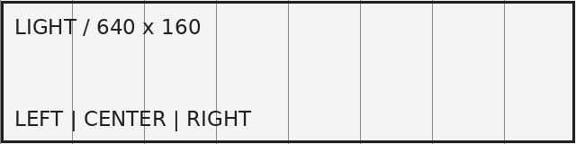

# PDF export fixture

Markdown Mint reuses one profile-aware renderer for both standalone HTML and PDF exports.

This fixture includes Unicode text for print layout: 日本語、Markdown Mint、そして 🧪 📄.

## Lists and page flow

- First list item
- Second list item with enough text to wrap naturally across a printed page.
- Third list item

1. Ordered item one
2. Ordered item two
3. Ordered item three

## Table

| Feature     | Expected output   | Status |
| ----------- | ----------------- | ------ |
| Local image | Embedded image    | Ready  |
| KaTeX       | Printed formula   | Ready  |
| Mermaid     | Rendered SVG      | Ready  |
| Footnotes   | Printed reference | Ready  |

## Long table

| Row | Japanese text                    | Value |
| --: | -------------------------------- | ----: |
|   1 | こんにちは                       |    10 |
|   2 | さようなら                       |    20 |
|   3 | 東京                             |    30 |
|   4 | 京都                             |    40 |
|   5 | 大阪                             |    50 |
|   6 | 札幌                             |    60 |
|   7 | 福岡                             |    70 |
|   8 | 名古屋                           |    80 |
|   9 | 横浜                             |    90 |
|  10 | 神戸                             |   100 |
|  11 | 仙台                             |   110 |
|  12 | 広島                             |   120 |
|  13 | 那覇                             |   130 |
|  14 | 金沢                             |   140 |
|  15 | 長崎                             |   150 |
|  16 | 奈良                             |   160 |
|  17 | 高松                             |   170 |
|  18 | 熊本                             |   180 |
|  19 | 静岡                             |   190 |
|  20 | 岡山                             |   200 |
|  21 | 甲府                             |   210 |
|  22 | 宇都宮                           |   220 |
|  23 | 新潟                             |   230 |
|  24 | 盛岡                             |   240 |
|  25 | 山形                             |   250 |
|  26 | 和歌山                           |   260 |
|  27 | 松山                             |   270 |
|  28 | 鹿児島                           |   280 |
|  29 | 鳥取                             |   290 |
|  30 | 徳島                             |   300 |
|  31 | 大分                             |   310 |
|  32 | 津                               |   320 |
|  33 | 青森                             |   330 |
|  34 | 秋田                             |   340 |
|  35 | 福井                             |   350 |
|  36 | 佐賀                             |   360 |
|  37 | 前橋                             |   370 |
|  38 | 水戸                             |   380 |
|  39 | 岐阜                             |   390 |
|  40 | 高知                             |   400 |
|  41 | 東京 印刷ページ 3                |   410 |
|  42 | 京都 印刷ページ 3                |   420 |
|  43 | 大阪 印刷ページ 3                |   430 |
|  44 | 札幌 印刷ページ 3                |   440 |
|  45 | 福岡 印刷ページ 3                |   450 |
|  46 | 名古屋 印刷ページ 3              |   460 |
|  47 | 横浜 印刷ページ 3                |   470 |
|  48 | 神戸 印刷ページ 3                |   480 |
|  49 | 仙台 印刷ページ 3                |   490 |
|  50 | 広島 印刷ページ 3                |   500 |
|  51 | 東京 印刷ページ 3                |   510 |
|  52 | 京都 印刷ページ 3                |   520 |
|  53 | 大阪 印刷ページ 3                |   530 |
|  54 | 札幌 印刷ページ 3                |   540 |
|  55 | 福岡 印刷ページ 4                |   550 |
|  56 | 名古屋 印刷ページ 4              |   560 |
|  57 | 横浜 印刷ページ 4                |   570 |
|  58 | 神戸 印刷ページ 4                |   580 |
|  59 | 仙台 印刷ページ 4                |   590 |
|  60 | 広島 印刷ページ 4                |   600 |
|  61 | 東京 印刷ページ 4                |   610 |
|  62 | 京都 印刷ページ 4                |   620 |
|  63 | 大阪 印刷ページ 4                |   630 |
|  64 | 札幌 印刷ページ 4                |   640 |
|  65 | 福岡 印刷ページ 4                |   650 |
|  66 | 名古屋 印刷ページ 4              |   660 |
|  67 | 横浜 印刷ページ 4                |   670 |
|  68 | 神戸 印刷ページ 4                |   680 |
|  69 | 仙台 印刷ページ 4                |   690 |
|  70 | 広島 印刷ページ 4                |   700 |
|  71 | 東京 印刷ページ 4                |   710 |
|  72 | 京都 印刷ページ 4                |   720 |
|  73 | 大阪 印刷ページ 5                |   730 |
|  74 | 札幌 印刷ページ 5                |   740 |
|  75 | 福岡 印刷ページ 5                |   750 |
|  76 | 名古屋 印刷ページ 5              |   760 |
|  77 | 横浜 印刷ページ 5                |   770 |
|  78 | 神戸 印刷ページ 5                |   780 |
|  79 | 仙台 印刷ページ 5                |   790 |
|  80 | 広島 印刷ページ 5                |   800 |
|  81 | 東京 印刷ページ 5                |   810 |
|  82 | 京都 印刷ページ 5                |   820 |
|  83 | 大阪 印刷ページ 5                |   830 |
|  84 | 札幌 印刷ページ 5                |   840 |
|  85 | 福岡 印刷ページ 5                |   850 |
|  86 | 名古屋 印刷ページ 5              |   860 |
|  87 | 横浜 印刷ページ 5                |   870 |
|  88 | 神戸 印刷ページ 5                |   880 |
|  89 | 仙台 印刷ページ 5                |   890 |
|  90 | 広島 印刷ページ 5                |   900 |
|  91 | 東京 印刷ページ 6                |   910 |
|  92 | 京都 印刷ページ 6                |   920 |
|  93 | 大阪 印刷ページ 6                |   930 |
|  94 | 札幌 印刷ページ 6                |   940 |
|  95 | 福岡 印刷ページ 6                |   950 |
|  96 | 名古屋 印刷ページ 6              |   960 |
|  97 | 横浜 印刷ページ 6                |   970 |
|  98 | 神戸 印刷ページ 6                |   980 |
|  99 | 仙台 印刷ページ 6                |   990 |
| 100 | 末尾識別行 PDF_TABLE_TAIL_MARKER |  1000 |

## Code

```ts
type ExportOptions = {
  format: "A4";
  landscape: false;
  printBackground: true;
};

const options: ExportOptions = {
  format: "A4",
  landscape: false,
  printBackground: true,
};

export async function renderMarkdownPdf(markdown: string): Promise<Uint8Array> {
  const html = await createExportHtml(markdown);
  return renderPdf(html, options);
}
```

## Long code block

```text
01  page one starts before this long code block
02  the print engine should split a block that is taller than one page
03  line content remains readable at the configured print width
04  A single source line longer than 150 characters must wrap inside the print area without clipping its right edge or the final identifier PDF_LONG_LINE_TAIL_MARKER.
05  PDF export must not leave a giant blank area before this block
06  the table above spans several printed pages
07  each page keeps the default A4 portrait size
08  margins come from the export stylesheet
09  background colors remain visible in print output
10  the source Markdown remains unchanged
11  the user can still undo edits after exporting
12  all output comes from the standalone HTML renderer
13  Mermaid becomes an SVG before the print call
14  KaTeX fonts finish loading before the print call
15  embedded local images finish loading before the print call
16  remote image assets are not downloaded by the extension host
17  a timeout reports which rendering step failed
18  every launched browser is closed on success and failure
19  this line exercises ordinary text wrapping on paper
20  Japanese glyphs stay available in the generated document
21  emoji glyphs stay available in the generated document 🧪
22  PDF bytes are returned directly to the extension host
23  workspace.fs.writeFile saves the selected destination
24  cancellation before browser startup causes no process to launch
25  a custom executable path takes precedence when it is valid
26  a missing custom executable path produces a clear error
27  system Chrome, Edge, and Chromium are checked in order
28  the managed Chrome version is fixed in the source tree
29  managed browser files live in extension global storage
30  the managed browser binary is excluded from the VSIX
31  normal extension install does not download a browser
32  an explicit install action is required for managed Chromium
33  PDF export is also available from the Command Palette
34  the editor Export menu offers HTML and PDF
35  unsent edits wait for their host acknowledgement
36  remote extension hosts need a browser on the remote machine
37  this content crosses the first printed page boundary
38  the browser uses the CSS page size before choosing defaults
39  printBackground preserves task list check marks
40  avoid rules keep short structures together when possible
41  elements taller than a page can still fragment
42  this content crosses the second printed page boundary
43  PDF generation does not use a Markdown-specific renderer
44  there is no second Markdown-to-HTML conversion path
45  the same HTML snapshot is passed to the PDF backend
46  conversion errors are surfaced as VS Code notifications
47  failed exports leave source and editor state untouched
48  temporary browser resources are cleaned up in all paths
49  the final page ends with regular text rather than clipped content
50  PDF export fixture complete
051  this source line must remain visible after Chromium splits the print block
052  this source line must remain visible after Chromium splits the print block
053  this source line must remain visible after Chromium splits the print block
054  this source line must remain visible after Chromium splits the print block
055  this source line must remain visible after Chromium splits the print block
056  this source line must remain visible after Chromium splits the print block
057  this source line must remain visible after Chromium splits the print block
058  this source line must remain visible after Chromium splits the print block
059  this source line must remain visible after Chromium splits the print block
060  this source line must remain visible after Chromium splits the print block
061  this source line must remain visible after Chromium splits the print block
062  this source line must remain visible after Chromium splits the print block
063  this source line must remain visible after Chromium splits the print block
064  this source line must remain visible after Chromium splits the print block
065  this source line must remain visible after Chromium splits the print block
066  this source line must remain visible after Chromium splits the print block
067  this source line must remain visible after Chromium splits the print block
068  this source line must remain visible after Chromium splits the print block
069  this source line must remain visible after Chromium splits the print block
070  this source line must remain visible after Chromium splits the print block
071  this source line must remain visible after Chromium splits the print block
072  this source line must remain visible after Chromium splits the print block
073  this source line must remain visible after Chromium splits the print block
074  this source line must remain visible after Chromium splits the print block
075  this source line must remain visible after Chromium splits the print block
076  this source line must remain visible after Chromium splits the print block
077  this source line must remain visible after Chromium splits the print block
078  this source line must remain visible after Chromium splits the print block
079  this source line must remain visible after Chromium splits the print block
080  this source line must remain visible after Chromium splits the print block
081  this source line must remain visible after Chromium splits the print block
082  this source line must remain visible after Chromium splits the print block
083  this source line must remain visible after Chromium splits the print block
084  this source line must remain visible after Chromium splits the print block
085  this source line must remain visible after Chromium splits the print block
086  this source line must remain visible after Chromium splits the print block
087  this source line must remain visible after Chromium splits the print block
088  this source line must remain visible after Chromium splits the print block
089  this source line must remain visible after Chromium splits the print block
090  this source line must remain visible after Chromium splits the print block
091  this source line must remain visible after Chromium splits the print block
092  this source line must remain visible after Chromium splits the print block
093  this source line must remain visible after Chromium splits the print block
094  this source line must remain visible after Chromium splits the print block
095  this source line must remain visible after Chromium splits the print block
096  this source line must remain visible after Chromium splits the print block
097  this source line must remain visible after Chromium splits the print block
098  this source line must remain visible after Chromium splits the print block
099  this source line must remain visible after Chromium splits the print block
100  this source line must remain visible after Chromium splits the print block
101  this source line must remain visible after Chromium splits the print block
102  this source line must remain visible after Chromium splits the print block
103  this source line must remain visible after Chromium splits the print block
104  this source line must remain visible after Chromium splits the print block
105  this source line must remain visible after Chromium splits the print block
106  this source line must remain visible after Chromium splits the print block
107  this source line must remain visible after Chromium splits the print block
108  this source line must remain visible after Chromium splits the print block
109  this source line must remain visible after Chromium splits the print block
110  this source line must remain visible after Chromium splits the print block
111  this source line must remain visible after Chromium splits the print block
112  this source line must remain visible after Chromium splits the print block
113  this source line must remain visible after Chromium splits the print block
114  this source line must remain visible after Chromium splits the print block
115  this source line must remain visible after Chromium splits the print block
116  this source line must remain visible after Chromium splits the print block
117  this source line must remain visible after Chromium splits the print block
118  this source line must remain visible after Chromium splits the print block
119  this source line must remain visible after Chromium splits the print block
120  this source line must remain visible after Chromium splits the print block  PDF_CODE_TAIL_MARKER
```

## Local image



## Math and Mermaid

Inline math is printed as $x^2 + y^2 = z^2$.

$$
\int_0^1 x^2\,dx = \frac{1}{3}
$$


> [!NOTE]
> This GitHub Alert should stay together when it fits on a page.

## Footnote

The renderer keeps footnote output in the document.[^layout]

[^layout]: Print layout should preserve this footnote reference and text.
